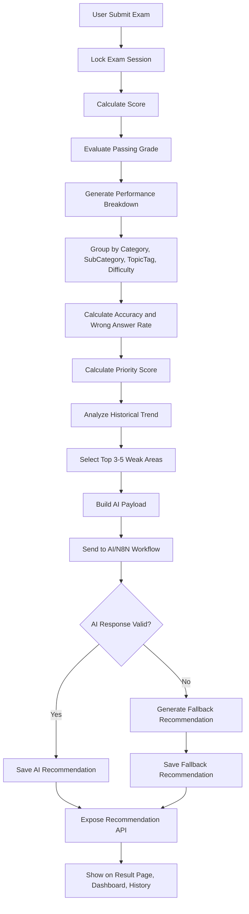

# AI Recommendation Algorithm Specification
# ExamCPNS — Platform Tryout CPNS Berbayar dengan AI Recommendation

---

| Field | Value |
|---|---|
| Document | AI Recommendation Algorithm Specification |
| Product | ExamCPNS — Platform Tryout CPNS Berbayar |
| Version | 1.1 |
| Date | 14 Mei 2026 |
| Author | System Analyst Pro |
| Status | Draft |
| Based On | BRD/PRD/SRS v1.2, ERD v1.2, System Architecture v1.2, API Specification v1.2 |

## Revision History

| Version | Date | Author | Description |
|---|---|---|---|
| 1.1 | 14 Mei 2026 | System Analyst Pro | Dedicated algorithm specification for post-exam AI Recommendation |

---

# 1. Purpose

Dokumen ini mendefinisikan algoritma AI Recommendation untuk ExamCPNS. Algoritma ini memastikan rekomendasi tidak bergantung pada asumsi bebas AI, tetapi berdasarkan data ujian yang dihitung oleh backend.

---

# 2. Core Principle

Backend adalah **source of truth**.

AI adalah **narrative generator**.

Backend menentukan:

1. Skor.
2. Passing grade.
3. Breakdown performa.
4. Weak areas.
5. Priority score.
6. Reason codes.
7. Trend.
8. Validasi output.
9. Fallback.

AI hanya menghasilkan:

1. Summary.
2. Overall assessment.
3. Reason.
4. Suggested focus.
5. Next tryout strategy.

---

# 3. End-to-End Flow



---

# 4. Input Requirements

Required question metadata:

| Field | Required | Purpose |
|---|---|---|
| category | Yes | TWK, TIU, TKP |
| subCategory | Yes | Area materi |
| topicTag | Yes | Topik spesifik |
| difficulty | Yes | Level kesulitan |
| answerKey / tkpWeight | Yes | Scoring |

---

# 5. Performance Breakdown

Backend groups by:

```text
category + subCategory + topicTag + difficulty
```

Breakdown shape:

```json
{
  "category": "TWK",
  "subCategory": "Tata Negara",
  "topicTag": "Hak dan Kewajiban Warga Negara",
  "difficulty": "medium",
  "totalQuestions": 8,
  "correctAnswers": 2,
  "wrongAnswers": 6,
  "emptyAnswers": 0,
  "accuracy": 25,
  "wrongAnswerRate": 75,
  "dominantDifficulty": "medium",
  "scoreImpact": 30
}
```

Accuracy:

```text
accuracy = correctAnswers / totalQuestions * 100
```

Wrong answer rate:

```text
wrongAnswerRate = (wrongAnswers + emptyAnswers) / totalQuestions * 100
```

---

# 6. Weak Area Detection

A weak area is detected if:

```text
accuracy < 70
AND totalQuestions >= 3
```

If no weak area exists, system generates positive maintenance recommendation.

---

# 7. Priority Score

Formula:

```text
priorityScore =
  wrongAnswerRateScore * 40
+ questionWeightScore * 20
+ passingGradeImpactScore * 25
+ difficultyWeightScore * 10
+ historyTrendScore * 5
```

Priority level:

| Score | Level |
|---:|---|
| 75–100 | HIGH |
| 50–74 | MEDIUM |
| 0–49 | LOW |

---

# 8. Reason Codes

| Code | Description |
|---|---|
| LOW_ACCURACY | Accuracy below threshold |
| LOW_ACCURACY_AND_CATEGORY_NOT_PASSED | Low accuracy and category not passed |
| REPEATED_WEAKNESS | Same weakness appears repeatedly |
| DECLINING_TREND | Accuracy is declining |
| EASY_MEDIUM_FAILURE | Failed easy/medium questions |
| HIGH_SCORE_IMPACT | Significant score loss |
| NEW_WEAK_AREA | New weakness |
| NO_SIGNIFICANT_WEAKNESS | Positive recommendation |

---

# 9. Trend Analysis

Analyze latest 2–5 submitted exams.

| Trend | Definition |
|---|---|
| improving | Accuracy increased by at least 10 points |
| declining | Accuracy decreased by at least 10 points |
| stagnant | Accuracy change within ±10 points |
| new_weak_area | First-time weakness |
| no_history | No previous exams |

---

# 10. AI Payload

```json
{
  "examResultId": "result-001",
  "score": {
    "twk": 60,
    "tiu": 95,
    "tkp": 170,
    "total": 325
  },
  "passingStatus": {
    "twkPassed": false,
    "tiuPassed": true,
    "tkpPassed": true,
    "overallPassed": false
  },
  "weakAreas": [
    {
      "priority": 1,
      "priorityLevel": "HIGH",
      "priorityScore": 91,
      "category": "TWK",
      "subCategory": "Tata Negara",
      "topicTag": "Hak dan Kewajiban Warga Negara",
      "totalQuestions": 8,
      "wrongAnswers": 6,
      "accuracy": 25,
      "reasonCodes": [
        "LOW_ACCURACY",
        "LOW_ACCURACY_AND_CATEGORY_NOT_PASSED"
      ]
    }
  ],
  "instruction": {
    "language": "id",
    "outputFormat": "json",
    "maxRecommendations": 5,
    "doNotInventTopics": true,
    "doNotActAsChatbot": true,
    "doNotGuaranteePassing": true
  }
}
```

---

# 11. AI Output

```json
{
  "summary": "Area terlemah Anda berada pada TWK - Tata Negara.",
  "overallAssessment": "Skor total sudah cukup baik, tetapi TWK perlu diperkuat.",
  "recommendations": [
    {
      "priority": 1,
      "priorityLevel": "HIGH",
      "category": "TWK",
      "subCategory": "Tata Negara",
      "topicTag": "Hak dan Kewajiban Warga Negara",
      "reason": "Anda salah 6 dari 8 soal pada topik ini.",
      "suggestedFocus": [
        "Pelajari konsep hak dan kewajiban warga negara.",
        "Perkuat pemahaman pasal UUD 1945 terkait warga negara."
      ]
    }
  ],
  "nextTryoutStrategy": "Targetkan akurasi TWK Tata Negara minimal 70%."
}
```

---

# 12. Validation

Backend validates:

1. Valid JSON.
2. Required fields exist.
3. Category valid.
4. topicTag exists in weakAreas.
5. Recommendation count <= 5.
6. No invented topics.
7. No passing guarantee.
8. No chatbot language.
9. No sensitive data.

---

# 13. Fallback

Fallback template:

```text
Anda paling banyak salah pada {category} - {subCategory}, terutama topik {topicTag}. Dari {totalQuestions} soal, Anda menjawab salah {wrongAnswers} soal dengan akurasi {accuracy}%. Prioritaskan topik ini sebelum mengikuti tryout berikutnya.
```

---

# 14. Acceptance Criteria

| ID | Criteria |
|---|---|
| AI-AC-001 | Score is shown without waiting for AI. |
| AI-AC-002 | Weak area detection is done by backend. |
| AI-AC-003 | Priority score is calculated by backend. |
| AI-AC-004 | AI output is validated before saving. |
| AI-AC-005 | Fallback is generated if AI fails. |
| AI-AC-006 | Recommendation appears in result, dashboard, and history. |

---

*Document generated: 14 Mei 2026 | Version 1.1 | Status: Draft*
