# ERD & Entity Definition
# ExamCPNS — Platform Tryout CPNS Berbayar dengan AI Recommendation

---

| Field | Value |
|---|---|
| Document | ERD & Entity Definition |
| Product | ExamCPNS — Platform Tryout CPNS Berbayar |
| Version | 1.3 |
| Date | 14 Mei 2026 |
| Author | System Analyst Pro |
| Status | Draft |
| Based On | BRD/PRD/SRS ExamCPNS v1.1, Use Case Specification v1.1 |

## Revision History

| Version | Date | Author | Description |
|---|---|---|---|
| 1.0 | 13 Mei 2026 | System Analyst | Initial PRD and workflow draft |
| 1.1 | 14 Mei 2026 | System Analyst Pro | ERD aligned with paid tryout MVP, AI Recommendation after exam, PDF Parsing AI, and roles SUPER_ADMIN, ADMIN, USER |
| 1.2 | 14 Mei 2026 | System Analyst Pro | Integrated AI Recommendation algorithm fields into ERD and entity definitions. |
| 1.3 | 14 Mei 2026 | System Analyst Pro | Merged SaaS-ready Configurable Tryout Generation directly into existing sections; replaced simple Tryout Catalog with Tryout Catalog, Generation Rules, Manual Question Set, Question Selection Engine, and updated start exam flow. |

---

# 1. Overview

Dokumen ini mendefinisikan rancangan awal database untuk ExamCPNS v1.1. Database dirancang untuk mendukung MVP dengan fitur utama:

1. Authentication dan role-based access.
2. User trial dan subscription.
3. Payment gateway integration.
4. Bank soal manual.
5. Upload PDF dan AI parsing review.
6. Exam session, answer autosave, submit, scoring, dan result.
7. AI Recommendation after exam.
8. Admin dan Super Admin configuration.
9. Audit log.

Database direkomendasikan menggunakan PostgreSQL dengan ORM Prisma.

---

# 2. Design Principles

| ID | Principle | Description |
|---|---|---|
| DP-001 | Historical Integrity | Data hasil ujian historis tidak boleh berubah meskipun soal diedit setelah ujian selesai. |
| DP-002 | Soft Delete for Question | Soal tidak dihapus permanen agar histori ujian tetap valid. |
| DP-003 | Configurable Rules | Passing grade, trial rules, dan tryout cataloguration tidak boleh hardcoded. |
| DP-004 | RBAC Simplicity | MVP menggunakan role enum: SUPER_ADMIN, ADMIN, USER. |
| DP-005 | AI Scope Control | AI Recommendation disimpan per exam result dan hanya berdasarkan data ujian serta metadata soal. |
| DP-006 | Payment Safety | Data sensitif payment tidak disimpan; hanya metadata transaksi dan gateway reference. |
| DP-007 | Review Before Activation | Soal hasil PDF parsing tidak langsung aktif sebelum approval admin. |

---

# 3. High-Level Entity Groups

| Group | Entities |
|---|---|
| Identity & Access | User, UserSession, PasswordResetToken, EmailVerificationToken |
| Question Bank | Question, QuestionOption, QuestionTag, QuestionImportBatch, ParsedQuestionReview |
| Exam | ExamSession, ExamSessionQuestion, ExamAnswer, ExamResult, ExamIntegrityLog |
| AI Recommendation | AIRecommendation, AIRecommendationItem |
| Subscription & Payment | SubscriptionPlan, UserSubscription, PaymentTransaction, PaymentWebhookEvent |
| Configuration | SystemSetting, PassingGradeConfig, TrialConfig |
| Tryout Catalog & Generation | TryoutCatalog, TryoutGenerationRule, TryoutRuleSection, ManualQuestionSet, ManualQuestionSetItem |
| Audit | AuditLog |

---

# 4. ERD Diagram

```mermaid
erDiagram
    USER ||--o{ USER_SESSION : has
    USER ||--o{ PASSWORD_RESET_TOKEN : requests
    USER ||--o{ EMAIL_VERIFICATION_TOKEN : verifies
    USER ||--o{ EXAM_SESSION : takes
    USER ||--o{ USER_SUBSCRIPTION : owns
    USER ||--o{ PAYMENT_TRANSACTION : makes
    USER ||--o{ QUESTION_IMPORT_BATCH : uploads
    USER ||--o{ AUDIT_LOG : performs
    USER ||--o{ TRYOUT_CATALOG : creates

    QUESTION ||--o{ QUESTION_OPTION : has
    QUESTION ||--o{ QUESTION_TAG : has
    QUESTION ||--o{ EXAM_SESSION_QUESTION : selected_in
    QUESTION ||--o{ PARSED_QUESTION_REVIEW : created_from_optional
    QUESTION ||--o{ MANUAL_QUESTION_SET_ITEM : selected_in

    QUESTION_IMPORT_BATCH ||--o{ PARSED_QUESTION_REVIEW : contains
    PARSED_QUESTION_REVIEW }o--|| USER : reviewed_by

    TRYOUT_CATALOG ||--o{ TRYOUT_GENERATION_RULE : has
    TRYOUT_CATALOG ||--o{ MANUAL_QUESTION_SET : has
    TRYOUT_CATALOG ||--o{ EXAM_SESSION : used_by
    TRYOUT_GENERATION_RULE ||--o{ TRYOUT_RULE_SECTION : contains
    MANUAL_QUESTION_SET ||--o{ MANUAL_QUESTION_SET_ITEM : contains

    EXAM_SESSION ||--o{ EXAM_SESSION_QUESTION : contains
    EXAM_SESSION ||--o{ EXAM_ANSWER : records
    EXAM_SESSION ||--|| EXAM_RESULT : produces
    EXAM_SESSION ||--o{ EXAM_INTEGRITY_LOG : logs

    EXAM_SESSION_QUESTION ||--o{ EXAM_ANSWER : answered_as
    QUESTION_OPTION ||--o{ EXAM_ANSWER : selected_option

    EXAM_RESULT ||--o{ AI_RECOMMENDATION : has
    AI_RECOMMENDATION ||--o{ AI_RECOMMENDATION_ITEM : contains

    SUBSCRIPTION_PLAN ||--o{ USER_SUBSCRIPTION : used_by
    SUBSCRIPTION_PLAN ||--o{ PAYMENT_TRANSACTION : purchased_as
    PAYMENT_TRANSACTION ||--o{ PAYMENT_WEBHOOK_EVENT : receives
    PAYMENT_TRANSACTION ||--o| USER_SUBSCRIPTION : activates

    PASSING_GRADE_CONFIG ||--o{ EXAM_RESULT : snapshot_used
    TRIAL_CONFIG ||--o{ USER_SUBSCRIPTION : creates_trial

    USER {
        uuid id PK
        string full_name
        string email UK
        string phone
        string password_hash
        enum role
        enum status
        boolean email_verified
        datetime email_verified_at
        datetime last_login_at
        datetime created_at
        datetime updated_at
        datetime deleted_at
    }

    USER_SESSION {
        uuid id PK
        uuid user_id FK
        string refresh_token_hash
        string user_agent
        string ip_address
        datetime expires_at
        datetime revoked_at
        datetime created_at
    }

    EMAIL_VERIFICATION_TOKEN {
        uuid id PK
        uuid user_id FK
        string token_hash UK
        datetime expires_at
        datetime used_at
        datetime created_at
    }

    PASSWORD_RESET_TOKEN {
        uuid id PK
        uuid user_id FK
        string token_hash UK
        datetime expires_at
        datetime used_at
        datetime created_at
    }

    SUBSCRIPTION_PLAN {
        uuid id PK
        string name
        text description
        int duration_days
        decimal price
        string currency
        boolean is_active
        boolean is_trial
        int trial_tryout_limit
        int trial_day_limit
        datetime created_at
        datetime updated_at
    }

    PAYMENT_TRANSACTION {
        uuid id PK
        uuid user_id FK
        uuid subscription_plan_id FK
        uuid user_subscription_id FK
        string invoice_number UK
        string gateway_provider
        string gateway_transaction_id UK
        decimal amount
        string currency
        string payment_method
        enum status
        string payment_url
        datetime paid_at
        datetime expired_at
        datetime created_at
        datetime updated_at
    }

    USER_SUBSCRIPTION {
        uuid id PK
        uuid user_id FK
        uuid subscription_plan_id FK
        enum status
        datetime start_date
        datetime end_date
        int tryout_limit
        int tryout_used
        boolean is_trial
        string activation_source
        uuid activated_by FK
        datetime created_at
        datetime updated_at
    }

    QUESTION {
        uuid id PK
        text question_text
        enum category
        string sub_category
        string topic_tag
        string competency_area
        enum difficulty
        enum question_type
        enum source_type
        enum status
        text explanation
        uuid created_by FK
        uuid updated_by FK
        datetime created_at
        datetime updated_at
        datetime deleted_at
    }

    QUESTION_OPTION {
        uuid id PK
        uuid question_id FK
        string label
        text option_text
        boolean is_correct
        int tkp_weight
        int display_order
        datetime created_at
        datetime updated_at
    }

    QUESTION_TAG {
        uuid id PK
        uuid question_id FK
        string tag
        datetime created_at
    }

    QUESTION_IMPORT_BATCH {
        uuid id PK
        uuid uploaded_by FK
        string file_name
        string file_url
        int file_size_bytes
        enum status
        int total_detected
        int valid_count
        int invalid_count
        text error_message
        datetime created_at
        datetime completed_at
    }

    PARSED_QUESTION_REVIEW {
        uuid id PK
        uuid batch_id FK
        uuid question_id FK
        json raw_ai_output
        text question_text
        json options_json
        string detected_answer
        enum category
        string sub_category
        string topic_tag
        enum difficulty
        decimal confidence_score
        enum status
        text review_notes
        uuid reviewed_by FK
        datetime reviewed_at
        datetime created_at
        datetime updated_at
    }

    EXAM_INTEGRITY_LOG {
        uuid id PK
        uuid exam_session_id FK
        enum event_type
        json metadata
        datetime created_at
    }

    PASSING_GRADE_CONFIG {
        uuid id PK
        string name
        int twk_min_score
        int tiu_min_score
        int tkp_min_score
        int total_min_score
        boolean is_active
        datetime effective_from
        datetime created_at
        datetime updated_at
    }

    PAYMENT_WEBHOOK_EVENT {
        uuid id PK
        uuid payment_transaction_id FK
        string gateway_event_id UK
        string event_type
        json payload
        boolean signature_valid
        boolean processed
        datetime processed_at
        datetime created_at
    }

    TRYOUT_CATALOG {
        uuid id PK
        string name
        text description
        enum tryout_type
        enum access_type
        enum status
        boolean is_public
        boolean is_featured
        int sort_order
        int duration_minutes
        int total_questions
        uuid passing_grade_config_id FK
        boolean show_result_immediately
        boolean show_answer_review
        uuid created_by FK
        uuid approved_by FK
        datetime published_at
        datetime archived_at
        datetime created_at
        datetime updated_at
    }

    TRYOUT_GENERATION_RULE {
        uuid id PK
        uuid tryout_catalog_id FK
        enum randomization_mode
        enum question_order_mode
        boolean avoid_recent_questions
        int avoid_recent_exam_count
        json rules_json
        datetime created_at
        datetime updated_at
    }

    TRYOUT_RULE_SECTION {
        uuid id PK
        uuid tryout_generation_rule_id FK
        enum category
        int question_count
        json difficulty_distribution_json
        json topic_distribution_json
        int sort_order
        datetime created_at
        datetime updated_at
    }

    MANUAL_QUESTION_SET {
        uuid id PK
        uuid tryout_catalog_id FK
        string name
        text description
        enum status
        uuid created_by FK
        datetime created_at
        datetime updated_at
    }

    MANUAL_QUESTION_SET_ITEM {
        uuid id PK
        uuid manual_question_set_id FK
        uuid question_id FK
        int question_order
        datetime created_at
    }

    EXAM_SESSION {
        uuid id PK
        uuid user_id FK
        uuid tryout_catalog_id FK
        enum status
        datetime started_at
        datetime submitted_at
        datetime expires_at
        int duration_seconds
        enum generation_mode_snapshot
        json tryout_snapshot
        int tab_switch_count
        datetime created_at
        datetime updated_at
    }

    EXAM_SESSION_QUESTION {
        uuid id PK
        uuid exam_session_id FK
        uuid question_id FK
        int question_order
        json question_snapshot
        json options_snapshot
        enum category_snapshot
        string sub_category_snapshot
        string topic_tag_snapshot
        enum difficulty_snapshot
        datetime created_at
    }

    EXAM_ANSWER {
        uuid id PK
        uuid exam_session_id FK
        uuid exam_session_question_id FK
        uuid selected_option_id FK
        string selected_label
        boolean is_correct
        int score_awarded
        boolean is_flagged
        datetime answered_at
        datetime updated_at
    }

    TRIAL_CONFIG {
        uuid id PK
        string name
        int free_tryout_count
        int trial_duration_days
        boolean is_active
        datetime created_at
        datetime updated_at
    }

    EXAM_RESULT {
        uuid id PK
        uuid exam_session_id FK
        uuid user_id FK
        uuid passing_grade_config_id FK
        int twk_score
        int tiu_score
        int tkp_score
        int total_score
        boolean twk_passed
        boolean tiu_passed
        boolean tkp_passed
        boolean total_passed
        boolean overall_passed
        json breakdown_json
        datetime generated_at
        datetime created_at
    }

    AI_RECOMMENDATION {
        uuid id PK
        uuid exam_result_id FK
        enum status
        text summary
        text overall_assessment
        text next_tryout_strategy
        json raw_request_payload
        json raw_ai_response
        boolean is_fallback
        string model_name
        text error_message
        datetime generated_at
        datetime created_at
    }

    AI_RECOMMENDATION_ITEM {
        uuid id PK
        uuid ai_recommendation_id FK
        int priority_order
        enum priority_level
        decimal priority_score
        enum category
        string sub_category
        string topic_tag
        string reason_code
        json reason_codes
        enum trend
        text reason
        json suggested_focus
        decimal accuracy
        decimal wrong_answer_rate
        int total_questions
        int correct_answers
        int wrong_answers
        int empty_answers
        enum dominant_difficulty
        int score_impact
        datetime created_at
    }

     AUDIT_LOG {
        uuid id PK
        uuid actor_user_id FK
        string actor_role
        string action
        string module
        string target_type
        uuid target_id
        json metadata
        string ip_address
        string user_agent
        datetime created_at
    }
```



# 5.

# 5. Tryout Catalog & Generation Entity Definitions

## 5.1 TRYOUT_CATALOG

| Field | Type | Constraint | Description |
|---|---|---|---|
| id | UUID | PK | Tryout ID |
| name | VARCHAR(150) | NOT NULL | Nama tryout |
| description | TEXT | NULL | Deskripsi tryout |
| tryout_type | ENUM | NOT NULL | generated, manual, hybrid, adaptive |
| access_type | ENUM | NOT NULL | trial_only, paid_only, trial_and_paid, premium_only |
| status | ENUM | NOT NULL | draft, review, published, archived |
| is_public | BOOLEAN | DEFAULT false | Tampil ke user |
| is_featured | BOOLEAN | DEFAULT false | Featured card |
| sort_order | INT | DEFAULT 0 | Urutan tampil |
| duration_minutes | INT | NOT NULL | Durasi |
| total_questions | INT | NOT NULL | Total soal |
| passing_grade_config_id | UUID | FK | Passing grade |
| show_result_immediately | BOOLEAN | DEFAULT true | Hasil langsung tampil |
| show_answer_review | BOOLEAN | DEFAULT true | Review jawaban |
| created_by | UUID | FK USER.id | Pembuat |
| approved_by | UUID | FK USER.id NULL | Approver |
| published_at | TIMESTAMP | NULL | Publish time |
| archived_at | TIMESTAMP | NULL | Archive time |

## 5.2 TRYOUT_GENERATION_RULE

| Field | Type | Constraint | Description |
|---|---|---|---|
| id | UUID | PK | Rule ID |
| tryout_catalog_id | UUID | FK | Parent tryout |
| randomization_mode | ENUM | NOT NULL | Mode selection |
| question_order_mode | ENUM | NOT NULL | Mode urutan |
| avoid_recent_questions | BOOLEAN | DEFAULT false | Hindari soal terbaru user |
| avoid_recent_exam_count | INT | DEFAULT 0 | Jumlah exam terakhir |
| rules_json | JSONB | NULL | Advanced rules |

## 5.3 TRYOUT_RULE_SECTION

| Field | Type | Constraint | Description |
|---|---|---|---|
| id | UUID | PK | Section ID |
| tryout_generation_rule_id | UUID | FK | Parent rule |
| category | ENUM | NOT NULL | TWK/TIU/TKP |
| question_count | INT | NOT NULL | Jumlah soal |
| difficulty_distribution_json | JSONB | NULL | Distribusi difficulty |
| topic_distribution_json | JSONB | NULL | Distribusi topicTag |
| sort_order | INT | DEFAULT 0 | Urutan section |

## 5.4 MANUAL_QUESTION_SET

| Field | Type | Constraint | Description |
|---|---|---|---|
| id | UUID | PK | Manual set ID |
| tryout_catalog_id | UUID | FK | Parent tryout |
| name | VARCHAR(150) | NOT NULL | Nama set |
| description | TEXT | NULL | Deskripsi |
| status | ENUM | NOT NULL | draft, review, approved, archived |
| created_by | UUID | FK USER.id | Pembuat |

## 5.5 MANUAL_QUESTION_SET_ITEM

| Field | Type | Constraint | Description |
|---|---|---|---|
| id | UUID | PK | Item ID |
| manual_question_set_id | UUID | FK | Parent set |
| question_id | UUID | FK QUESTION.id | Selected question |
| question_order | INT | NOT NULL | Urutan soal |

## 5.6 Updated EXAM_SESSION Fields

| Field | Type | Constraint | Description |
|---|---|---|---|
| tryout_catalog_id | UUID | FK TRYOUT_CATALOG.id | Replaces legacy exam_config_id |
| generation_mode_snapshot | ENUM | NOT NULL | Mode used when session was created |
| tryout_snapshot | JSONB | NOT NULL | Snapshot of tryout rules at start exam |

## 5.7 Enumerations

```text
TryoutType:
- generated
- manual
- hybrid
- adaptive

AccessType:
- trial_only
- paid_only
- trial_and_paid
- premium_only

TryoutStatus:
- draft
- review
- published
- archived

RandomizationMode:
- random_by_category
- random_by_category_and_difficulty
- random_by_topic_distribution
- manual_question_set
- hybrid_manual_and_random
- adaptive_weak_area

QuestionOrderMode:
- category_order
- mixed_random
- manual_order
```
 Entity Definitions

---

## 5.1 User

### Purpose

Menyimpan data akun untuk USER, ADMIN, dan SUPER_ADMIN.

### Table: `users`

| Field | Type | Constraint | Description |
|---|---|---|---|
| id | UUID | PK, NOT NULL | Unique identifier user |
| full_name | VARCHAR(150) | NOT NULL | Nama lengkap |
| email | VARCHAR(255) | NOT NULL, UNIQUE | Email login |
| phone | VARCHAR(30) | NULL | Nomor telepon |
| password_hash | VARCHAR(255) | NOT NULL | Password hash |
| role | ENUM | NOT NULL | SUPER_ADMIN, ADMIN, USER |
| status | ENUM | NOT NULL | active, inactive, suspended |
| email_verified | BOOLEAN | NOT NULL, DEFAULT false | Status verifikasi email |
| email_verified_at | TIMESTAMP | NULL | Waktu verifikasi email |
| last_login_at | TIMESTAMP | NULL | Login terakhir |
| created_at | TIMESTAMP | NOT NULL | Created timestamp |
| updated_at | TIMESTAMP | NOT NULL | Updated timestamp |
| deleted_at | TIMESTAMP | NULL | Soft delete timestamp |

### Business Rules

| Rule ID | Rule |
|---|---|
| USER-BR-001 | Email harus unik. |
| USER-BR-002 | Role hanya boleh SUPER_ADMIN, ADMIN, atau USER. |
| USER-BR-003 | Password asli tidak boleh disimpan. |
| USER-BR-004 | USER baru harus email verified sebelum akses penuh. |

---

## 5.2 UserSession

### Purpose

Menyimpan refresh token aktif untuk session management.

### Table: `user_sessions`

| Field | Type | Constraint | Description |
|---|---|---|---|
| id | UUID | PK, NOT NULL | Unique session ID |
| user_id | UUID | FK users.id, NOT NULL | Pemilik session |
| refresh_token_hash | VARCHAR(255) | NOT NULL | Hash refresh token |
| user_agent | TEXT | NULL | Browser/device info |
| ip_address | VARCHAR(50) | NULL | IP address |
| expires_at | TIMESTAMP | NOT NULL | Waktu expired |
| revoked_at | TIMESTAMP | NULL | Waktu revoke/logout |
| created_at | TIMESTAMP | NOT NULL | Created timestamp |

### Relationship

| Relationship | Cardinality |
|---|---|
| User to UserSession | 1 to many |

---

## 5.3 EmailVerificationToken

### Purpose

Menyimpan token verifikasi email.

### Table: `email_verification_tokens`

| Field | Type | Constraint | Description |
|---|---|---|---|
| id | UUID | PK, NOT NULL | Token record ID |
| user_id | UUID | FK users.id, NOT NULL | User pemilik token |
| token_hash | VARCHAR(255) | NOT NULL, UNIQUE | Hash token |
| expires_at | TIMESTAMP | NOT NULL | Token expiry |
| used_at | TIMESTAMP | NULL | Waktu token digunakan |
| created_at | TIMESTAMP | NOT NULL | Created timestamp |

---

## 5.4 PasswordResetToken

### Purpose

Menyimpan token reset password.

### Table: `password_reset_tokens`

| Field | Type | Constraint | Description |
|---|---|---|---|
| id | UUID | PK, NOT NULL | Token record ID |
| user_id | UUID | FK users.id, NOT NULL | User pemilik token |
| token_hash | VARCHAR(255) | NOT NULL, UNIQUE | Hash token |
| expires_at | TIMESTAMP | NOT NULL | Token expiry |
| used_at | TIMESTAMP | NULL | Waktu token digunakan |
| created_at | TIMESTAMP | NOT NULL | Created timestamp |

---

## 5.5 Question

### Purpose

Menyimpan master data soal yang digunakan dalam ujian.

### Table: `questions`

| Field | Type | Constraint | Description |
|---|---|---|---|
| id | UUID | PK, NOT NULL | Unique question ID |
| question_text | TEXT | NOT NULL | Teks soal |
| category | ENUM | NOT NULL | TWK, TIU, TKP |
| sub_category | VARCHAR(100) | NOT NULL | Sub-kategori soal |
| topic_tag | VARCHAR(150) | NOT NULL | Topik spesifik untuk AI Recommendation |
| competency_area | VARCHAR(150) | NULL | Area kompetensi lebih luas |
| difficulty | ENUM | NOT NULL | easy, medium, hard |
| question_type | ENUM | NOT NULL | multiple_choice |
| source_type | ENUM | NOT NULL | manual, pdf_import |
| status | ENUM | NOT NULL | draft, pending_review, active, archived |
| explanation | TEXT | NULL | Pembahasan opsional |
| created_by | UUID | FK users.id, NOT NULL | Admin pembuat soal |
| updated_by | UUID | FK users.id, NULL | Admin terakhir update |
| created_at | TIMESTAMP | NOT NULL | Created timestamp |
| updated_at | TIMESTAMP | NOT NULL | Updated timestamp |
| deleted_at | TIMESTAMP | NULL | Soft delete timestamp |

### Business Rules

| Rule ID | Rule |
|---|---|
| Q-BR-001 | Soal active wajib memiliki category, sub_category, topic_tag, dan difficulty. |
| Q-BR-002 | Soal active wajib memiliki tepat 5 options. |
| Q-BR-003 | Soal TWK/TIU wajib memiliki satu option dengan is_correct = true. |
| Q-BR-004 | Soal TKP wajib memiliki tkp_weight pada setiap option. |
| Q-BR-005 | Soal yang sudah digunakan di ujian tidak boleh dihapus permanen. |

### Index Recommendation

| Index | Fields | Purpose |
|---|---|---|
| idx_questions_category | category | Filter soal |
| idx_questions_sub_category | sub_category | Filter sub-kategori |
| idx_questions_topic_tag | topic_tag | AI breakdown dan filter |
| idx_questions_status | status | Ambil soal active |
| idx_questions_difficulty | difficulty | Filter dan randomisasi |

---

## 5.6 QuestionOption

### Purpose

Menyimpan opsi jawaban untuk setiap soal.

### Table: `question_options`

| Field | Type | Constraint | Description |
|---|---|---|---|
| id | UUID | PK, NOT NULL | Unique option ID |
| question_id | UUID | FK questions.id, NOT NULL | Parent question |
| label | VARCHAR(1) | NOT NULL | A, B, C, D, E |
| option_text | TEXT | NOT NULL | Teks opsi |
| is_correct | BOOLEAN | NOT NULL, DEFAULT false | Correct answer untuk TWK/TIU |
| tkp_weight | INT | NULL | Bobot 1-5 untuk TKP |
| display_order | INT | NOT NULL | Urutan tampilan |
| created_at | TIMESTAMP | NOT NULL | Created timestamp |
| updated_at | TIMESTAMP | NOT NULL | Updated timestamp |

### Business Rules

| Rule ID | Rule |
|---|---|
| QO-BR-001 | Setiap question wajib memiliki tepat 5 options. |
| QO-BR-002 | Label harus A, B, C, D, atau E. |
| QO-BR-003 | TWK/TIU hanya boleh memiliki satu is_correct = true. |
| QO-BR-004 | TKP wajib memiliki tkp_weight antara 1 sampai 5. |

### Unique Constraints

| Constraint | Fields |
|---|---|
| uq_question_option_label | question_id, label |
| uq_question_option_order | question_id, display_order |

---

## 5.7 QuestionTag

### Purpose

Menyimpan tag tambahan opsional untuk soal. Field utama untuk rekomendasi tetap `topic_tag` pada Question, sedangkan QuestionTag digunakan untuk multi-tag atau pencarian tambahan.

### Table: `question_tags`

| Field | Type | Constraint | Description |
|---|---|---|---|
| id | UUID | PK, NOT NULL | Unique tag ID |
| question_id | UUID | FK questions.id, NOT NULL | Parent question |
| tag | VARCHAR(100) | NOT NULL | Tag text |
| created_at | TIMESTAMP | NOT NULL | Created timestamp |

### Unique Constraints

| Constraint | Fields |
|---|---|
| uq_question_tag | question_id, tag |

---

## 5.8 QuestionImportBatch

### Purpose

Menyimpan data batch upload PDF.

### Table: `question_import_batches`

| Field | Type | Constraint | Description |
|---|---|---|---|
| id | UUID | PK, NOT NULL | Batch ID |
| uploaded_by | UUID | FK users.id, NOT NULL | Admin uploader |
| file_name | VARCHAR(255) | NOT NULL | Nama file asli |
| file_url | TEXT | NULL | Lokasi file jika disimpan |
| file_size_bytes | INT | NOT NULL | Ukuran file |
| status | ENUM | NOT NULL | processing, completed, partial_failed, failed |
| total_detected | INT | NOT NULL, DEFAULT 0 | Total soal terdeteksi |
| valid_count | INT | NOT NULL, DEFAULT 0 | Total parsed valid |
| invalid_count | INT | NOT NULL, DEFAULT 0 | Total parsed invalid |
| error_message | TEXT | NULL | Error batch |
| created_at | TIMESTAMP | NOT NULL | Created timestamp |
| completed_at | TIMESTAMP | NULL | Completed timestamp |

### Business Rules

| Rule ID | Rule |
|---|---|
| QIB-BR-001 | PDF upload menghasilkan satu import batch. |
| QIB-BR-002 | Batch failed tidak menghasilkan question active. |
| QIB-BR-003 | Hasil parsing wajib masuk review queue. |

---

## 5.9 ParsedQuestionReview

### Purpose

Menyimpan hasil AI parsing dari PDF sebelum disetujui menjadi Question aktif.

### Table: `parsed_question_reviews`

| Field | Type | Constraint | Description |
|---|---|---|---|
| id | UUID | PK, NOT NULL | Review item ID |
| batch_id | UUID | FK question_import_batches.id, NOT NULL | Batch source |
| question_id | UUID | FK questions.id, NULL | Question hasil approve |
| raw_ai_output | JSONB | NULL | Output mentah AI |
| question_text | TEXT | NOT NULL | Parsed question text |
| options_json | JSONB | NOT NULL | Parsed options |
| detected_answer | VARCHAR(1) | NULL | Jawaban terdeteksi |
| category | ENUM | NULL | TWK, TIU, TKP |
| sub_category | VARCHAR(100) | NULL | Parsed sub-category |
| topic_tag | VARCHAR(150) | NULL | Parsed topic tag |
| difficulty | ENUM | NULL | easy, medium, hard |
| confidence_score | DECIMAL(5,2) | NULL | Confidence 0-100 |
| status | ENUM | NOT NULL | pending_review, approved, rejected, draft |
| review_notes | TEXT | NULL | Catatan admin |
| reviewed_by | UUID | FK users.id, NULL | Reviewer admin |
| reviewed_at | TIMESTAMP | NULL | Review timestamp |
| created_at | TIMESTAMP | NOT NULL | Created timestamp |
| updated_at | TIMESTAMP | NOT NULL | Updated timestamp |

### Business Rules

| Rule ID | Rule |
|---|---|
| PQR-BR-001 | Parsed question tidak boleh digunakan di ujian sebelum approved. |
| PQR-BR-002 | Approve parsed question wajib membuat atau menghubungkan ke Question active. |
| PQR-BR-003 | Low confidence item harus ditandai di UI review. |

---

## 5.10 TryoutCatalog

### Purpose

Menyimpan konfigurasi komposisi ujian.

### Table: `tryout_catalogs`

| Field | Type | Constraint | Description |
|---|---|---|---|
| id | UUID | PK, NOT NULL | Config ID |
| name | VARCHAR(100) | NOT NULL | Nama konfigurasi |
| twk_question_count | INT | NOT NULL | Default 30 |
| tiu_question_count | INT | NOT NULL | Default 35 |
| tkp_question_count | INT | NOT NULL | Default 45 |
| duration_minutes | INT | NOT NULL | Default 100 |
| is_active | BOOLEAN | NOT NULL, DEFAULT true | Status aktif |
| created_at | TIMESTAMP | NOT NULL | Created timestamp |
| updated_at | TIMESTAMP | NOT NULL | Updated timestamp |

### Business Rules

| Rule ID | Rule |
|---|---|
| EC-BR-001 | Config active digunakan saat membuat exam session baru. |
| EC-BR-002 | Perubahan config tidak mengubah exam session historis. |

---

## 5.11 ExamSession

### Purpose

Menyimpan sesi ujian user.

### Table: `exam_sessions`

| Field | Type | Constraint | Description |
|---|---|---|---|
| id | UUID | PK, NOT NULL | Exam session ID |
| user_id | UUID | FK users.id, NOT NULL | Peserta ujian |
| tryout_catalog_id | UUID | FK tryout_catalogs.id, NOT NULL | Config yang digunakan |
| status | ENUM | NOT NULL | in_progress, submitted, auto_submitted, expired, cancelled |
| started_at | TIMESTAMP | NOT NULL | Waktu mulai |
| submitted_at | TIMESTAMP | NULL | Waktu submit |
| expires_at | TIMESTAMP | NOT NULL | Waktu timer habis |
| duration_seconds | INT | NULL | Durasi aktual pengerjaan |
| tab_switch_count | INT | NOT NULL, DEFAULT 0 | Jumlah tab switch |
| created_at | TIMESTAMP | NOT NULL | Created timestamp |
| updated_at | TIMESTAMP | NOT NULL | Updated timestamp |

### Business Rules

| Rule ID | Rule |
|---|---|
| ES-BR-001 | User harus memiliki akses aktif untuk membuat exam session. |
| ES-BR-002 | Exam session submitted tidak dapat diubah jawabannya. |
| ES-BR-003 | Auto-submit berjalan ketika expires_at terlewati. |

---

## 5.12 ExamSessionQuestion

### Purpose

Menyimpan daftar soal yang dipilih untuk sesi ujian, termasuk snapshot soal dan opsi pada saat ujian dibuat.

### Table: `exam_session_questions`

| Field | Type | Constraint | Description |
|---|---|---|---|
| id | UUID | PK, NOT NULL | Session question ID |
| exam_session_id | UUID | FK exam_sessions.id, NOT NULL | Parent exam session |
| question_id | UUID | FK questions.id, NOT NULL | Original question |
| question_order | INT | NOT NULL | Urutan soal dalam sesi |
| question_snapshot | JSONB | NOT NULL | Snapshot teks soal |
| options_snapshot | JSONB | NOT NULL | Snapshot opsi |
| category_snapshot | ENUM | NOT NULL | Snapshot category |
| sub_category_snapshot | VARCHAR(100) | NOT NULL | Snapshot sub-category |
| topic_tag_snapshot | VARCHAR(150) | NOT NULL | Snapshot topic tag |
| difficulty_snapshot | ENUM | NOT NULL | Snapshot difficulty |
| created_at | TIMESTAMP | NOT NULL | Created timestamp |

### Business Rules

| Rule ID | Rule |
|---|---|
| ESQ-BR-001 | Snapshot wajib disimpan untuk menjaga histori ujian. |
| ESQ-BR-002 | question_order unik dalam satu exam session. |

### Unique Constraints

| Constraint | Fields |
|---|---|
| uq_exam_question_order | exam_session_id, question_order |
| uq_exam_question_original | exam_session_id, question_id |

---

## 5.13 ExamAnswer

### Purpose

Menyimpan jawaban user per soal dalam exam session.

### Table: `exam_answers`

| Field | Type | Constraint | Description |
|---|---|---|---|
| id | UUID | PK, NOT NULL | Answer ID |
| exam_session_id | UUID | FK exam_sessions.id, NOT NULL | Parent session |
| exam_session_question_id | UUID | FK exam_session_questions.id, NOT NULL | Soal pada session |
| selected_option_id | UUID | FK question_options.id, NULL | Option original terpilih jika masih ada |
| selected_label | VARCHAR(1) | NULL | Label jawaban A-E |
| is_correct | BOOLEAN | NULL | Benar/salah untuk TWK/TIU |
| score_awarded | INT | NOT NULL, DEFAULT 0 | Skor yang diberikan |
| is_flagged | BOOLEAN | NOT NULL, DEFAULT false | Ragu-ragu |
| answered_at | TIMESTAMP | NULL | Waktu jawaban pertama |
| updated_at | TIMESTAMP | NOT NULL | Waktu update terakhir |

### Business Rules

| Rule ID | Rule |
|---|---|
| EA-BR-001 | Satu soal pada satu session hanya memiliki satu answer record. |
| EA-BR-002 | Jawaban dapat diubah selama session belum submitted. |
| EA-BR-003 | score_awarded dihitung saat submit. |

### Unique Constraints

| Constraint | Fields |
|---|---|
| uq_exam_answer_question | exam_session_id, exam_session_question_id |

---

## 5.14 ExamResult

### Purpose

Menyimpan hasil akhir ujian.

### Table: `exam_results`

| Field | Type | Constraint | Description |
|---|---|---|---|
| id | UUID | PK, NOT NULL | Result ID |
| exam_session_id | UUID | FK exam_sessions.id, NOT NULL, UNIQUE | Parent exam session |
| user_id | UUID | FK users.id, NOT NULL | Peserta |
| passing_grade_config_id | UUID | FK passing_grade_configs.id, NOT NULL | Config passing grade yang digunakan |
| twk_score | INT | NOT NULL | Skor TWK |
| tiu_score | INT | NOT NULL | Skor TIU |
| tkp_score | INT | NOT NULL | Skor TKP |
| total_score | INT | NOT NULL | Total skor |
| twk_passed | BOOLEAN | NOT NULL | Status TWK |
| tiu_passed | BOOLEAN | NOT NULL | Status TIU |
| tkp_passed | BOOLEAN | NOT NULL | Status TKP |
| total_passed | BOOLEAN | NOT NULL | Status total score |
| overall_passed | BOOLEAN | NOT NULL | Status keseluruhan |
| breakdown_json | JSONB | NOT NULL | Breakdown category/subCategory/topicTag/difficulty |
| generated_at | TIMESTAMP | NOT NULL | Waktu result dibuat |
| created_at | TIMESTAMP | NOT NULL | Created timestamp |

### Business Rules

| Rule ID | Rule |
|---|---|
| ER-BR-001 | Satu exam session hanya memiliki satu exam result. |
| ER-BR-002 | Result tidak boleh berubah setelah dibuat kecuali melalui proses recalculation yang diaudit. |
| ER-BR-003 | breakdown_json menjadi input utama AI Recommendation. |

---

## 5.15 ExamIntegrityLog

### Purpose

Menyimpan event integritas ujian seperti tab switch.

### Table: `exam_integrity_logs`

| Field | Type | Constraint | Description |
|---|---|---|---|
| id | UUID | PK, NOT NULL | Integrity log ID |
| exam_session_id | UUID | FK exam_sessions.id, NOT NULL | Parent session |
| event_type | ENUM | NOT NULL | tab_switch, fullscreen_exit, reconnect, warning_shown |
| metadata | JSONB | NULL | Detail event |
| created_at | TIMESTAMP | NOT NULL | Event timestamp |

### Business Rules

| Rule ID | Rule |
|---|---|
| EIL-BR-001 | Integrity log MVP hanya untuk monitoring, bukan diskualifikasi otomatis. |

---

## 5.16 AIRecommendation

### Purpose

Menyimpan rekomendasi AI yang dihasilkan setelah ujian.

### Table: `ai_recommendations`

| Field | Type | Constraint | Description |
|---|---|---|---|
| id | UUID | PK, NOT NULL | Recommendation ID |
| exam_result_id | UUID | FK exam_results.id, NOT NULL | Parent result |
| status | ENUM | NOT NULL | processing, completed, failed, fallback |
| summary | TEXT | NULL | Ringkasan rekomendasi |
| overall_assessment | TEXT | NULL | Penilaian umum |
| next_tryout_strategy | TEXT | NULL | Strategi tryout berikutnya |
| raw_request_payload | JSONB | NULL | Payload ke AI |
| raw_ai_response | JSONB | NULL | Response mentah AI |
| is_fallback | BOOLEAN | NOT NULL, DEFAULT false | Apakah fallback statistik |
| model_name | VARCHAR(100) | NULL | Nama model AI |
| error_message | TEXT | NULL | Error jika gagal |
| generated_at | TIMESTAMP | NULL | Waktu selesai generate |
| created_at | TIMESTAMP | NOT NULL | Created timestamp |

### Business Rules

| Rule ID | Rule |
|---|---|
| AIR-BR-001 | AI Recommendation dibuat setelah ExamResult tersedia. |
| AIR-BR-002 | Jika AI gagal, sistem wajib membuat fallback recommendation. |
| AIR-BR-003 | Rekomendasi harus dapat dilihat ulang dari history. |

---

## 5.17 AIRecommendationItem

### Purpose

Menyimpan detail item rekomendasi per area kelemahan. Pada v1.2, entity ini juga menyimpan hasil algoritma rekomendasi backend seperti priorityScore, reasonCode, dan trend agar rekomendasi dapat diaudit dan dianalisis ulang.

### Table: `ai_recommendation_items`

| Field | Type | Constraint | Description |
|---|---|---|---|
| id | UUID | PK, NOT NULL | Item ID |
| ai_recommendation_id | UUID | FK ai_recommendations.id, NOT NULL | Parent recommendation |
| priority_order | INT | NOT NULL | Urutan prioritas |
| priority_level | ENUM | NOT NULL | HIGH, MEDIUM, LOW |
| priority_score | DECIMAL(5,2) | NOT NULL, DEFAULT 0 | Numeric priority score 0–100 |
| category | ENUM | NOT NULL | TWK, TIU, TKP |
| sub_category | VARCHAR(100) | NOT NULL | Sub-kategori lemah |
| topic_tag | VARCHAR(150) | NOT NULL | Topik lemah |
| reason_code | VARCHAR(100) | NOT NULL | Primary reason code |
| reason_codes | JSONB | NOT NULL, DEFAULT [] | List reason codes |
| trend | ENUM/VARCHAR | NOT NULL, DEFAULT no_history | improving, declining, stagnant, new_weak_area, no_history |
| reason | TEXT | NOT NULL | Alasan rekomendasi |
| suggested_focus | JSONB | NOT NULL | Daftar saran fokus belajar |
| accuracy | DECIMAL(5,2) | NULL | Akurasi area terkait |
| wrong_answer_rate | DECIMAL(5,2) | NULL | Persentase salah/kosong |
| total_questions | INT | NULL | Total soal area terkait |
| correct_answers | INT | NULL | Jumlah benar |
| wrong_answers | INT | NULL | Jumlah salah |
| empty_answers | INT | NULL | Jumlah kosong |
| dominant_difficulty | ENUM/VARCHAR | NULL | Difficulty dominan |
| score_impact | INT | NULL | Estimasi kehilangan skor |
| created_at | TIMESTAMP | NOT NULL | Created timestamp |

### Business Rules

| Rule ID | Rule |
|---|---|
| AII-BR-001 | Satu recommendation memiliki 3-5 recommendation items jika data cukup. |
| AII-BR-002 | priority_order unik dalam satu recommendation. |
| AII-BR-003 | priority_score harus berada pada rentang 0–100. |
| AII-BR-004 | priority_level diturunkan dari priority_score: 75–100 HIGH, 50–74 MEDIUM, 0–49 LOW. |
| AII-BR-005 | topic_tag harus berasal dari weak area payload, bukan invented topic AI. |
| AII-BR-006 | Fallback recommendation tetap harus membuat AIRecommendationItem. |

### Unique Constraints

| Constraint | Fields |
|---|---|
| uq_ai_recommendation_item_order | ai_recommendation_id, priority_order |
| uq_ai_recommendation_item_topic | ai_recommendation_id, category, sub_category, topic_tag |

## 5.18 SubscriptionPlan

### Purpose

Menyimpan paket subscription, termasuk trial plan jika diperlukan.

### Table: `subscription_plans`

| Field | Type | Constraint | Description |
|---|---|---|---|
| id | UUID | PK, NOT NULL | Plan ID |
| name | VARCHAR(100) | NOT NULL | Nama paket |
| description | TEXT | NULL | Deskripsi paket |
| duration_days | INT | NOT NULL | Durasi paket |
| price | DECIMAL(12,2) | NOT NULL | Harga |
| currency | VARCHAR(10) | NOT NULL, DEFAULT IDR | Currency |
| is_active | BOOLEAN | NOT NULL, DEFAULT true | Status aktif |
| is_trial | BOOLEAN | NOT NULL, DEFAULT false | Apakah plan trial |
| trial_tryout_limit | INT | NULL | Limit tryout trial |
| trial_day_limit | INT | NULL | Limit hari trial |
| created_at | TIMESTAMP | NOT NULL | Created timestamp |
| updated_at | TIMESTAMP | NOT NULL | Updated timestamp |

### Business Rules

| Rule ID | Rule |
|---|---|
| SP-BR-001 | Plan yang sudah memiliki transaksi tidak boleh dihapus permanen. |
| SP-BR-002 | Plan inactive tidak ditampilkan untuk pembelian baru. |

---

## 5.19 UserSubscription

### Purpose

Menyimpan subscription aktif atau historis milik user.

### Table: `user_subscriptions`

| Field | Type | Constraint | Description |
|---|---|---|---|
| id | UUID | PK, NOT NULL | Subscription ID |
| user_id | UUID | FK users.id, NOT NULL | Pemilik subscription |
| subscription_plan_id | UUID | FK subscription_plans.id, NOT NULL | Plan yang digunakan |
| status | ENUM | NOT NULL | active, expired, cancelled, pending |
| start_date | TIMESTAMP | NOT NULL | Mulai akses |
| end_date | TIMESTAMP | NOT NULL | Akhir akses |
| tryout_limit | INT | NULL | Limit tryout jika ada |
| tryout_used | INT | NOT NULL, DEFAULT 0 | Jumlah tryout terpakai |
| is_trial | BOOLEAN | NOT NULL, DEFAULT false | Subscription trial |
| activation_source | VARCHAR(50) | NOT NULL | payment, trial, manual |
| activated_by | UUID | FK users.id, NULL | Super admin jika manual |
| created_at | TIMESTAMP | NOT NULL | Created timestamp |
| updated_at | TIMESTAMP | NOT NULL | Updated timestamp |

### Business Rules

| Rule ID | Rule |
|---|---|
| US-BR-001 | User dapat memulai ujian jika memiliki subscription active atau trial active. |
| US-BR-002 | Trial berakhir ketika durasi habis atau tryout limit tercapai. |
| US-BR-003 | Manual activation wajib memiliki activated_by dan audit log. |

---

## 5.20 PaymentTransaction

### Purpose

Menyimpan transaksi pembayaran subscription.

### Table: `payment_transactions`

| Field | Type | Constraint | Description |
|---|---|---|---|
| id | UUID | PK, NOT NULL | Transaction ID |
| user_id | UUID | FK users.id, NOT NULL | Pembeli |
| subscription_plan_id | UUID | FK subscription_plans.id, NOT NULL | Plan yang dibeli |
| user_subscription_id | UUID | FK user_subscriptions.id, NULL | Subscription hasil payment |
| invoice_number | VARCHAR(100) | NOT NULL, UNIQUE | Nomor invoice internal |
| gateway_provider | VARCHAR(50) | NOT NULL | midtrans, xendit, etc. |
| gateway_transaction_id | VARCHAR(150) | NULL, UNIQUE | ID transaksi gateway |
| amount | DECIMAL(12,2) | NOT NULL | Nominal pembayaran |
| currency | VARCHAR(10) | NOT NULL, DEFAULT IDR | Currency |
| payment_method | VARCHAR(50) | NULL | QRIS, VA_BCA, GOPAY, etc. |
| status | ENUM | NOT NULL | pending, success, failed, expired, cancelled, refunded |
| payment_url | TEXT | NULL | URL pembayaran |
| paid_at | TIMESTAMP | NULL | Waktu pembayaran sukses |
| expired_at | TIMESTAMP | NULL | Waktu expiry pembayaran |
| created_at | TIMESTAMP | NOT NULL | Created timestamp |
| updated_at | TIMESTAMP | NOT NULL | Updated timestamp |

### Business Rules

| Rule ID | Rule |
|---|---|
| PT-BR-001 | Payment success harus mengaktifkan subscription. |
| PT-BR-002 | Payment webhook harus idempotent. |
| PT-BR-003 | Sistem tidak menyimpan data kartu/payment sensitif. |

---

## 5.21 PaymentWebhookEvent

### Purpose

Menyimpan event webhook dari payment gateway untuk idempotency dan audit.

### Table: `payment_webhook_events`

| Field | Type | Constraint | Description |
|---|---|---|---|
| id | UUID | PK, NOT NULL | Webhook event ID |
| payment_transaction_id | UUID | FK payment_transactions.id, NULL | Transaksi terkait |
| gateway_event_id | VARCHAR(150) | NOT NULL, UNIQUE | ID event dari gateway |
| event_type | VARCHAR(100) | NOT NULL | Jenis event |
| payload | JSONB | NOT NULL | Payload webhook |
| signature_valid | BOOLEAN | NOT NULL | Status validasi signature |
| processed | BOOLEAN | NOT NULL, DEFAULT false | Apakah sudah diproses |
| processed_at | TIMESTAMP | NULL | Waktu diproses |
| created_at | TIMESTAMP | NOT NULL | Waktu diterima |

### Business Rules

| Rule ID | Rule |
|---|---|
| PWE-BR-001 | gateway_event_id harus unik untuk mencegah double processing. |
| PWE-BR-002 | Webhook invalid signature tidak boleh mengubah transaksi. |

---

## 5.22 PassingGradeConfig

### Purpose

Menyimpan konfigurasi passing grade.

### Table: `passing_grade_configs`

| Field | Type | Constraint | Description |
|---|---|---|---|
| id | UUID | PK, NOT NULL | Config ID |
| name | VARCHAR(100) | NOT NULL | Nama konfigurasi |
| twk_min_score | INT | NOT NULL | Minimum TWK |
| tiu_min_score | INT | NOT NULL | Minimum TIU |
| tkp_min_score | INT | NOT NULL | Minimum TKP |
| total_min_score | INT | NOT NULL | Minimum total |
| is_active | BOOLEAN | NOT NULL, DEFAULT false | Config aktif |
| effective_from | TIMESTAMP | NOT NULL | Mulai berlaku |
| created_at | TIMESTAMP | NOT NULL | Created timestamp |
| updated_at | TIMESTAMP | NOT NULL | Updated timestamp |

### Business Rules

| Rule ID | Rule |
|---|---|
| PGC-BR-001 | Hanya satu passing grade config yang aktif pada satu waktu. |
| PGC-BR-002 | ExamResult wajib menyimpan config yang digunakan. |
| PGC-BR-003 | Perubahan config tidak mengubah hasil ujian historis. |

---

## 5.23 TrialConfig

### Purpose

Menyimpan konfigurasi trial.

### Table: `trial_configs`

| Field | Type | Constraint | Description |
|---|---|---|---|
| id | UUID | PK, NOT NULL | Trial config ID |
| name | VARCHAR(100) | NOT NULL | Nama config |
| free_tryout_count | INT | NOT NULL | Jumlah tryout gratis |
| trial_duration_days | INT | NOT NULL | Durasi trial dalam hari |
| is_active | BOOLEAN | NOT NULL, DEFAULT false | Config aktif |
| created_at | TIMESTAMP | NOT NULL | Created timestamp |
| updated_at | TIMESTAMP | NOT NULL | Updated timestamp |

### Business Rules

| Rule ID | Rule |
|---|---|
| TC-BR-001 | Hanya satu trial config yang aktif pada satu waktu. |
| TC-BR-002 | Trial user baru mengikuti config aktif saat email verified. |

---

## 5.24 SystemSetting

### Purpose

Menyimpan konfigurasi sistem berbasis key-value untuk kebutuhan fleksibel.

### Table: `system_settings`

| Field | Type | Constraint | Description |
|---|---|---|---|
| id | UUID | PK, NOT NULL | Setting ID |
| key | VARCHAR(100) | NOT NULL, UNIQUE | Setting key |
| value | JSONB | NOT NULL | Setting value |
| description | TEXT | NULL | Deskripsi setting |
| created_at | TIMESTAMP | NOT NULL | Created timestamp |
| updated_at | TIMESTAMP | NOT NULL | Updated timestamp |

### Example Keys

| Key | Example Value |
|---|---|
| ai_recommendation_timeout_seconds | 30 |
| pdf_upload_max_size_mb | 20 |
| maintenance_mode | false |
| ai_recommendation_enabled | true |

---

## 5.25 AuditLog

### Purpose

Mencatat aktivitas penting ADMIN dan SUPER_ADMIN.

### Table: `audit_logs`

| Field | Type | Constraint | Description |
|---|---|---|---|
| id | UUID | PK, NOT NULL | Audit log ID |
| actor_user_id | UUID | FK users.id, NULL | Actor |
| actor_role | VARCHAR(50) | NOT NULL | Role saat aksi dilakukan |
| action | VARCHAR(100) | NOT NULL | Nama aksi |
| module | VARCHAR(100) | NOT NULL | Modul terkait |
| target_type | VARCHAR(100) | NULL | Jenis target |
| target_id | UUID | NULL | ID target |
| metadata | JSONB | NULL | Detail tambahan |
| ip_address | VARCHAR(50) | NULL | IP address |
| user_agent | TEXT | NULL | Browser/device |
| created_at | TIMESTAMP | NOT NULL | Timestamp |

### Business Rules

| Rule ID | Rule |
|---|---|
| AL-BR-001 | Aksi administratif penting wajib dicatat. |
| AL-BR-002 | Audit log tidak dapat diedit dari UI. |
| AL-BR-003 | Manual subscription activation wajib memiliki audit log. |

---

# 6. Enumerations

## 6.1 UserRole

| Value | Description |
|---|---|
| SUPER_ADMIN | Pengelola utama sistem |
| ADMIN | Pengelola operasional |
| USER | Peserta tryout |

## 6.2 UserStatus

| Value | Description |
|---|---|
| active | Akun aktif |
| inactive | Akun nonaktif |
| suspended | Akun ditangguhkan |

## 6.3 QuestionCategory

| Value | Description |
|---|---|
| TWK | Tes Wawasan Kebangsaan |
| TIU | Tes Intelegensi Umum |
| TKP | Tes Karakteristik Pribadi |

## 6.4 QuestionDifficulty

| Value | Description |
|---|---|
| easy | Mudah |
| medium | Sedang |
| hard | Sulit |

## 6.5 QuestionStatus

| Value | Description |
|---|---|
| draft | Draft, belum aktif |
| pending_review | Menunggu review |
| active | Aktif untuk ujian |
| archived | Tidak digunakan lagi |

## 6.6 SourceType

| Value | Description |
|---|---|
| manual | Input manual admin |
| pdf_import | Hasil upload PDF |

## 6.7 ExamSessionStatus

| Value | Description |
|---|---|
| in_progress | Ujian sedang berlangsung |
| submitted | Disubmit manual |
| auto_submitted | Disubmit otomatis oleh timer |
| expired | Kedaluwarsa tanpa submit valid |
| cancelled | Dibatalkan |

## 6.8 AIRecommendationStatus

| Value | Description |
|---|---|
| processing | Sedang diproses |
| completed | Berhasil dibuat AI |
| failed | Gagal dibuat |
| fallback | Menggunakan fallback statistik |

## 6.9 SubscriptionStatus

| Value | Description |
|---|---|
| pending | Menunggu aktivasi |
| active | Aktif |
| expired | Kedaluwarsa |
| cancelled | Dibatalkan |

## 6.10 PaymentStatus

| Value | Description |
|---|---|
| pending | Menunggu pembayaran |
| success | Berhasil |
| failed | Gagal |
| expired | Kedaluwarsa |
| cancelled | Dibatalkan |
| refunded | Dikembalikan |

## 6.11 ImportBatchStatus

| Value | Description |
|---|---|
| processing | Sedang diproses |
| completed | Selesai |
| partial_failed | Sebagian gagal |
| failed | Gagal total |

## 6.12 ParsedQuestionStatus

| Value | Description |
|---|---|
| pending_review | Menunggu review |
| approved | Disetujui |
| rejected | Ditolak |
| draft | Disimpan sebagai draft |

## 6.13 ReasonCode

| Value | Description |
|---|---|
| LOW_ACCURACY | Accuracy below threshold |
| LOW_ACCURACY_AND_CATEGORY_NOT_PASSED | Low accuracy and category not passed |
| REPEATED_WEAKNESS | Repeated weakness |
| DECLINING_TREND | Declining accuracy trend |
| EASY_MEDIUM_FAILURE | User failed easy/medium questions |
| HIGH_SCORE_IMPACT | Significant score loss |
| NEW_WEAK_AREA | New weakness |
| NO_SIGNIFICANT_WEAKNESS | Positive recommendation |

## 6.14 TrendType

| Value | Description |
|---|---|
| improving | Accuracy improved |
| declining | Accuracy declined |
| stagnant | Accuracy stable |
| new_weak_area | First-time weakness |
| no_history | No previous exam data |

---

# 7. Key Data Flows

## 7.1 Register to Trial Creation

1. User mendaftar.
2. Data masuk ke `users`.
3. Token dibuat di `email_verification_tokens`.
4. User verifikasi email.
5. Sistem membaca `trial_configs` aktif.
6. Sistem membuat `user_subscriptions` dengan `is_trial = true`.

## 7.2 Start Exam

1. Sistem memeriksa `user_subscriptions` aktif.
2. Sistem membaca `tryout_catalogs` aktif.
3. Sistem memilih soal dari `questions` dengan status active.
4. Sistem membuat `exam_sessions`.
5. Sistem membuat `exam_session_questions` dengan snapshot soal.

## 7.3 Answer Autosave

1. User memilih jawaban.
2. Sistem upsert ke `exam_answers`.
3. Jika user mengganti jawaban, record yang sama diperbarui.

## 7.4 Submit and Scoring

1. Sistem mengunci `exam_sessions` menjadi submitted atau auto_submitted.
2. Sistem menghitung skor dari `exam_answers` dan `exam_session_questions` snapshot.
3. Sistem membaca `passing_grade_configs` aktif.
4. Sistem membuat `exam_results`.
5. Sistem menyimpan breakdown ke `breakdown_json`.

## 7.5 AI Recommendation

1. Sistem membaca `exam_results.breakdown_json`.
2. Sistem membuat payload weak areas.
3. AI service menghasilkan rekomendasi.
4. Sistem menyimpan ke `ai_recommendations` dan `ai_recommendation_items`.
5. Jika AI gagal, sistem membuat fallback.

## 7.6 PDF Parsing

1. Admin upload PDF.
2. Sistem membuat `question_import_batches`.
3. AI service mengembalikan hasil parsing.
4. Sistem menyimpan ke `parsed_question_reviews`.
5. Admin approve.
6. Sistem membuat `questions` dan `question_options`.

## 7.7 Payment Activation

1. User memilih plan.
2. Sistem membuat `payment_transactions` pending.
3. Gateway mengirim webhook.
4. Sistem menyimpan `payment_webhook_events`.
5. Sistem validasi idempotency dan signature.
6. Jika success, sistem membuat/memperbarui `user_subscriptions`.
7. Sistem menghubungkan `payment_transactions.user_subscription_id`.

---

# 8. Critical Constraints

| ID | Constraint |
|---|---|
| C-001 | Data soal pada hasil ujian harus menggunakan snapshot, bukan membaca langsung dari Question terbaru. |
| C-002 | Payment webhook harus idempotent menggunakan gateway_event_id dan/atau gateway_transaction_id. |
| C-003 | Passing grade harus disimpan sebagai config dan di-snapshot melalui foreign key pada ExamResult. |
| C-004 | Soal hasil PDF parsing tidak boleh menjadi active tanpa review admin. |
| C-005 | AI Recommendation tidak boleh menjadi dependency untuk menampilkan skor; skor harus tetap tampil walau AI gagal. |
| C-006 | Role authorization harus ditegakkan di backend. |
| C-007 | Soft delete wajib digunakan untuk Question dan User yang memiliki histori. |

---

# 9. Suggested Indexes

| Table | Index | Fields | Purpose |
|---|---|---|---|
| users | idx_users_email | email | Login lookup |
| users | idx_users_role | role | Admin filtering |
| questions | idx_questions_active_category | status, category | Generate exam |
| questions | idx_questions_topic | topic_tag | AI breakdown/filter |
| exam_sessions | idx_exam_sessions_user | user_id, created_at | User history |
| exam_answers | idx_exam_answers_session | exam_session_id | Scoring |
| exam_results | idx_exam_results_user | user_id, created_at | History |
| ai_recommendations | idx_ai_exam_result | exam_result_id | Result detail |
| payment_transactions | idx_payment_user | user_id, created_at | Payment history |
| payment_transactions | idx_payment_gateway_transaction | gateway_transaction_id | Webhook lookup |
| payment_webhook_events | idx_webhook_event_unique | gateway_event_id | Idempotency |
| user_subscriptions | idx_subscription_user_status | user_id, status | Access check |
| audit_logs | idx_audit_actor_date | actor_user_id, created_at | Audit search |

---

# 10. MVP vs Phase 2 Notes

## 10.1 MVP Included

| Area | Tables |
|---|---|
| Auth | users, user_sessions, email_verification_tokens, password_reset_tokens |
| Question Bank | questions, question_options, question_tags |
| PDF Parsing | question_import_batches, parsed_question_reviews |
| Exam | tryout_catalogs, exam_sessions, exam_session_questions, exam_answers, exam_results, exam_integrity_logs |
| AI Recommendation | ai_recommendations, ai_recommendation_items |
| Payment | subscription_plans, user_subscriptions, payment_transactions, payment_webhook_events |
| Config | passing_grade_configs, trial_configs, system_settings |
| Audit | audit_logs |

## 10.2 Phase 2 Candidates

| Feature | Possible Additional Tables |
|---|---|
| AI Explanation per Question | ai_question_explanations |
| Learning Materials | learning_materials, learning_material_chunks |
| Vector DB Metadata | embedding_documents, embedding_jobs |
| Leaderboard | leaderboards, leaderboard_entries |
| Coupon / Promo | coupons, coupon_redemptions |
| Notification Center | notifications, notification_preferences |
| Referral Program | referrals, referral_rewards |

---

# 11. Completeness Check

| Check Item | Status | Notes |
|---|---|---|
| User and role covered | Complete | SUPER_ADMIN, ADMIN, USER |
| Subscription and payment covered | Complete | Plan, user subscription, transaction, webhook event |
| Trial covered | Complete | TrialConfig + UserSubscription is_trial |
| Question bank covered | Complete | Question, options, tags |
| PDF parsing covered | Complete | Import batch and parsed review |
| Exam flow covered | Complete | Session, session question, answer, result |
| Historical integrity covered | Complete | Question and option snapshots in ExamSessionQuestion |
| AI recommendation covered | Complete | Recommendation header and items |
| Configurable passing grade covered | Complete | PassingGradeConfig linked to ExamResult |
| Auditability covered | Complete | AuditLog and webhook event log |

---

# 12. Next Recommended Documents

Dokumen berikutnya yang direkomendasikan:

1. System Architecture Document.
2. API Specification.
3. Prisma Schema Draft.
4. Product Backlog / User Stories.
5. Test Scenario & Acceptance Test Plan.

---

*Document generated: 14 Mei 2026 | Version 1.1 | Status: Draft*

