# Sequence Diagram Specification
# ExamCPNS — Platform Tryout CPNS Berbayar dengan AI Recommendation

---

| Field | Value |
|---|---|
| Document | Sequence Diagram Specification |
| Product | ExamCPNS — Platform Tryout CPNS Berbayar |
| Version | 1.1 |
| Date | 14 Mei 2026 |
| Author | System Analyst Pro |
| Status | Draft |
| Based On | BRD/PRD/SRS v1.2, ERD v1.2, System Architecture v1.2, API Specification v1.2, AI Recommendation Algorithm Specification v1.1 |

## Revision History

| Version | Date | Author | Description |
|---|---|---|---|
| 1.0 | 14 Mei 2026 | System Analyst Pro | Initial complete sequence diagram specification for ExamCPNS MVP |
| 1.1 | 14 Mei 2026 | System Analyst Pro | Replaced legacy Start Tryout sequence with SaaS Tryout Catalog and Question Selection Engine flow. |

---

# 1. Overview

Dokumen ini berisi sequence diagram lengkap untuk alur utama ExamCPNS. Diagram disusun menggunakan Mermaid `sequenceDiagram` agar dapat langsung digunakan pada dokumentasi Markdown, GitHub, Notion, atau tools yang mendukung Mermaid.

Dokumen ini mencakup:

1. User registration, email verification, dan trial activation.
2. Login, refresh token, dan logout.
3. User dashboard.
4. Start tryout.
5. Answer autosave.
6. Submit exam dan scoring.
7. AI Recommendation after exam.
8. AI Recommendation fallback.
9. View result dan recommendation.
10. Exam history.
11. Subscription checkout.
12. Payment webhook dan activation.
13. Admin manual question input.
14. Admin PDF upload dan AI parsing.
15. Admin parsed question review.
16. Super Admin manage passing grade.
17. Super Admin manage trial rules.
18. Super Admin manual subscription activation.
19. Super Admin manage subscription plan.
20. Audit log recording.
21. Error and edge case flows.

---

# 2. Actor and Service Legend

| Participant | Description |
|---|---|
| User | Peserta tryout CPNS |
| Admin | Pengelola soal dan operasional |
| SuperAdmin | Pengelola utama sistem |
| WebApp | Next.js frontend |
| API | NestJS Backend API |
| AuthService | Backend module untuk auth |
| UserService | Backend module untuk user |
| SubscriptionService | Backend module untuk trial/subscription |
| ExamService | Backend module untuk exam session |
| ScoringService | Backend module untuk scoring |
| RecommendationService | Backend module untuk AI Recommendation |
| QuestionService | Backend module untuk question bank |
| PdfImportService | Backend module untuk PDF import |
| PaymentService | Backend module untuk payment |
| ConfigService | Backend module untuk configuration |
| AuditService | Backend module untuk audit log |
| DB | PostgreSQL |
| Redis | Cache/rate limit/job state |
| EmailService | External email service |
| PaymentGateway | Midtrans/Xendit |
| N8N | N8N workflow |
| LLM | LLM provider |

---

# 3. USER Flows

---

## 3.1 Register Account + Email Verification + Trial Activation

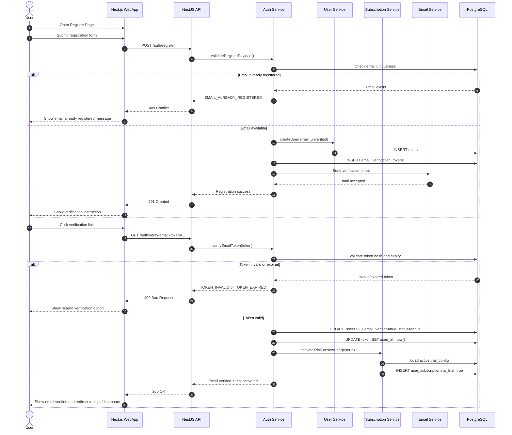
```mermaid
sequenceDiagram
    autonumber
    actor User
    participant WebApp as Next.js WebApp
    participant API as NestJS API
    participant AuthService as Auth Service
    participant UserService as User Service
    participant SubscriptionService as Subscription Service
    participant EmailService as Email Service
    participant DB as PostgreSQL

    User->>WebApp: Open Register Page
    User->>WebApp: Submit registration form
    WebApp->>API: POST /auth/register
    API->>AuthService: validateRegisterPayload()
    AuthService->>DB: Check email uniqueness
    alt Email already registered
        DB-->>AuthService: Email exists
        AuthService-->>API: EMAIL_ALREADY_REGISTERED
        API-->>WebApp: 409 Conflict
        WebApp-->>User: Show email already registered message
    else Email available
        AuthService->>UserService: createUser(email_unverified)
        UserService->>DB: INSERT users
        AuthService->>DB: INSERT email_verification_tokens
        AuthService->>EmailService: Send verification email
        EmailService-->>AuthService: Email accepted
        AuthService-->>API: Registration success
        API-->>WebApp: 201 Created
        WebApp-->>User: Show verification instruction
    end

    User->>WebApp: Click verification link
    WebApp->>API: GET /auth/verify-email?token=...
    API->>AuthService: verifyEmailToken(token)
    AuthService->>DB: Validate token hash and expiry
    alt Token invalid or expired
        DB-->>AuthService: Invalid/expired token
        AuthService-->>API: TOKEN_INVALID or TOKEN_EXPIRED
        API-->>WebApp: 400 Bad Request
        WebApp-->>User: Show resend verification option
    else Token valid
        AuthService->>DB: UPDATE users SET email_verified=true, status=active
        AuthService->>DB: UPDATE token SET used_at=now()
        AuthService->>SubscriptionService: activateTrialForNewUser(userId)
        SubscriptionService->>DB: Load active trial_config
        SubscriptionService->>DB: INSERT user_subscriptions is_trial=true
        AuthService-->>API: Email verified + trial activated
        API-->>WebApp: 200 OK
        WebApp-->>User: Show email verified and redirect to login/dashboard
    end
```

### Key Requirements

| ID | Requirement |
|---|---|
| SEQ-REG-001 | Trial dibuat setelah email verified, bukan hanya setelah register. |
| SEQ-REG-002 | Email verification token harus hashed dan time-limited. |
| SEQ-REG-003 | Email yang sudah terdaftar harus ditolak. |

---

## 3.2 Login + Token Issuance

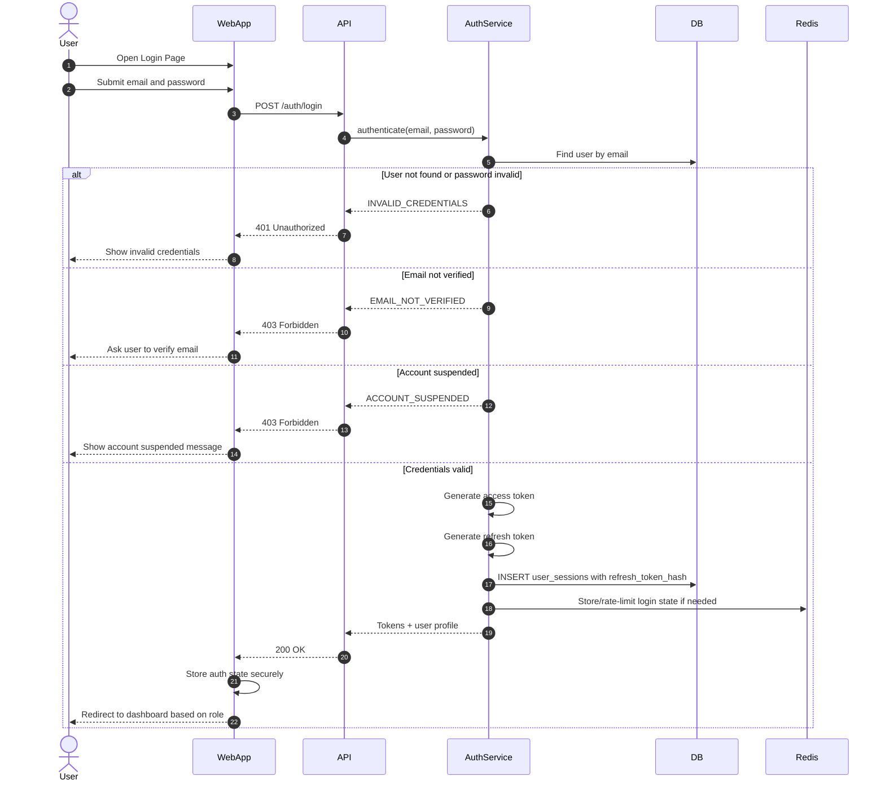
```mermaid
sequenceDiagram
    autonumber
    actor User
    participant WebApp
    participant API
    participant AuthService
    participant DB
    participant Redis

    User->>WebApp: Open Login Page
    User->>WebApp: Submit email and password
    WebApp->>API: POST /auth/login
    API->>AuthService: authenticate(email, password)
    AuthService->>DB: Find user by email

    alt User not found or password invalid
        AuthService-->>API: INVALID_CREDENTIALS
        API-->>WebApp: 401 Unauthorized
        WebApp-->>User: Show invalid credentials
    else Email not verified
        AuthService-->>API: EMAIL_NOT_VERIFIED
        API-->>WebApp: 403 Forbidden
        WebApp-->>User: Ask user to verify email
    else Account suspended
        AuthService-->>API: ACCOUNT_SUSPENDED
        API-->>WebApp: 403 Forbidden
        WebApp-->>User: Show account suspended message
    else Credentials valid
        AuthService->>AuthService: Generate access token
        AuthService->>AuthService: Generate refresh token
        AuthService->>DB: INSERT user_sessions with refresh_token_hash
        AuthService->>Redis: Store/rate-limit login state if needed
        AuthService-->>API: Tokens + user profile
        API-->>WebApp: 200 OK
        WebApp->>WebApp: Store auth state securely
        WebApp-->>User: Redirect to dashboard based on role
    end
```

---

## 3.3 Refresh Token

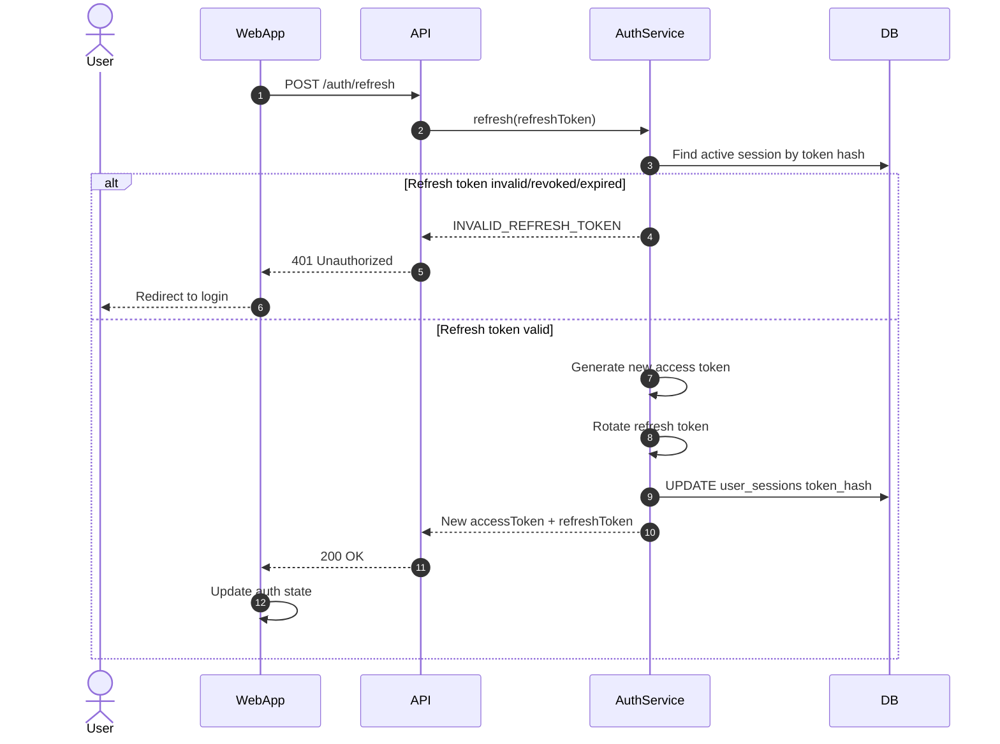
```mermaid
sequenceDiagram
    autonumber
    actor User
    participant WebApp
    participant API
    participant AuthService
    participant DB

    WebApp->>API: POST /auth/refresh
    API->>AuthService: refresh(refreshToken)
    AuthService->>DB: Find active session by token hash

    alt Refresh token invalid/revoked/expired
        AuthService-->>API: INVALID_REFRESH_TOKEN
        API-->>WebApp: 401 Unauthorized
        WebApp-->>User: Redirect to login
    else Refresh token valid
        AuthService->>AuthService: Generate new access token
        AuthService->>AuthService: Rotate refresh token
        AuthService->>DB: UPDATE user_sessions token_hash
        AuthService-->>API: New accessToken + refreshToken
        API-->>WebApp: 200 OK
        WebApp->>WebApp: Update auth state
    end
```

---

## 3.4 Logout

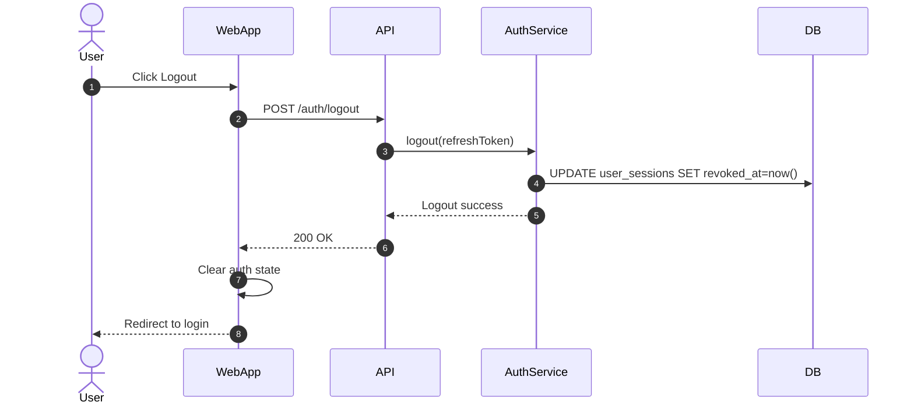
```mermaid
sequenceDiagram
    autonumber
    actor User
    participant WebApp
    participant API
    participant AuthService
    participant DB

    User->>WebApp: Click Logout
    WebApp->>API: POST /auth/logout
    API->>AuthService: logout(refreshToken)
    AuthService->>DB: UPDATE user_sessions SET revoked_at=now()
    AuthService-->>API: Logout success
    API-->>WebApp: 200 OK
    WebApp->>WebApp: Clear auth state
    WebApp-->>User: Redirect to login
```

---

## 3.5 View User Dashboard

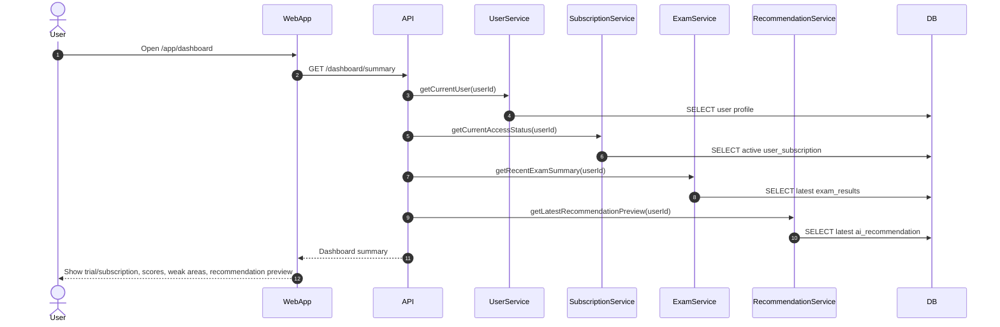
```mermaid
sequenceDiagram
    autonumber
    actor User
    participant WebApp
    participant API
    participant UserService
    participant SubscriptionService
    participant ExamService
    participant RecommendationService
    participant DB

    User->>WebApp: Open /app/dashboard
    WebApp->>API: GET /dashboard/summary
    API->>UserService: getCurrentUser(userId)
    UserService->>DB: SELECT user profile
    API->>SubscriptionService: getCurrentAccessStatus(userId)
    SubscriptionService->>DB: SELECT active user_subscription
    API->>ExamService: getRecentExamSummary(userId)
    ExamService->>DB: SELECT latest exam_results
    API->>RecommendationService: getLatestRecommendationPreview(userId)
    RecommendationService->>DB: SELECT latest ai_recommendation
    API-->>WebApp: Dashboard summary
    WebApp-->>User: Show trial/subscription, scores, weak areas, recommendation preview
```

---

# 4. Exam Flows

---

## 4.1 Start Tryout from Catalog

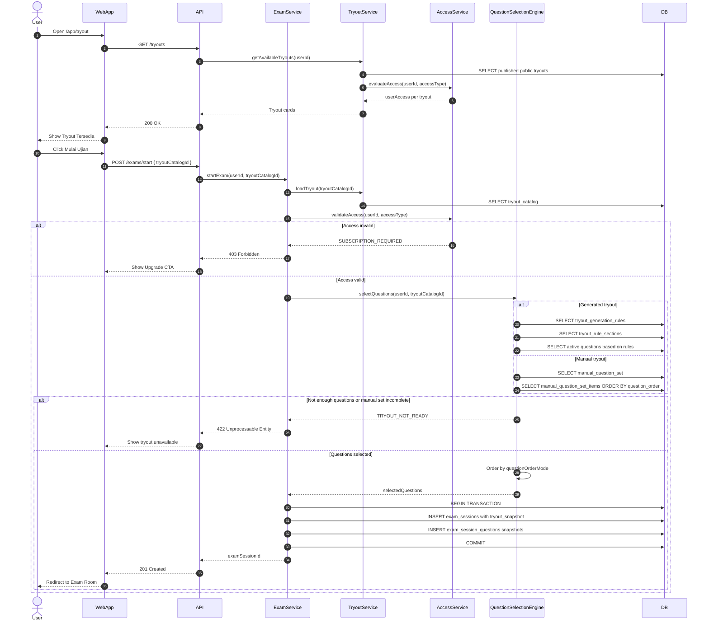
```mermaid
sequenceDiagram
    autonumber
    actor User
    participant WebApp
    participant API
    participant ExamService
    participant TryoutService
    participant AccessService
    participant QSE as QuestionSelectionEngine
    participant DB

    User->>WebApp: Open /app/tryout
    WebApp->>API: GET /tryouts
    API->>TryoutService: getAvailableTryouts(userId)
    TryoutService->>DB: SELECT published public tryouts
    TryoutService->>AccessService: evaluateAccess(userId, accessType)
    AccessService-->>TryoutService: userAccess per tryout
    TryoutService-->>API: Tryout cards
    API-->>WebApp: 200 OK
    WebApp-->>User: Show Tryout Tersedia

    User->>WebApp: Click Mulai Ujian
    WebApp->>API: POST /exams/start { tryoutCatalogId }
    API->>ExamService: startExam(userId, tryoutCatalogId)
    ExamService->>TryoutService: loadTryout(tryoutCatalogId)
    TryoutService->>DB: SELECT tryout_catalog
    ExamService->>AccessService: validateAccess(userId, accessType)

    alt Access invalid
        AccessService-->>ExamService: SUBSCRIPTION_REQUIRED
        ExamService-->>API: 403 Forbidden
        API-->>WebApp: Show Upgrade CTA
    else Access valid
        ExamService->>QSE: selectQuestions(userId, tryoutCatalogId)

        alt Generated tryout
            QSE->>DB: SELECT tryout_generation_rules
            QSE->>DB: SELECT tryout_rule_sections
            QSE->>DB: SELECT active questions based on rules
        else Manual tryout
            QSE->>DB: SELECT manual_question_set
            QSE->>DB: SELECT manual_question_set_items ORDER BY question_order
        end

        alt Not enough questions or manual set incomplete
            QSE-->>ExamService: TRYOUT_NOT_READY
            ExamService-->>API: 422 Unprocessable Entity
            API-->>WebApp: Show tryout unavailable
        else Questions selected
            QSE->>QSE: Order by questionOrderMode
            QSE-->>ExamService: selectedQuestions
            ExamService->>DB: BEGIN TRANSACTION
            ExamService->>DB: INSERT exam_sessions with tryout_snapshot
            ExamService->>DB: INSERT exam_session_questions snapshots
            ExamService->>DB: COMMIT
            ExamService-->>API: examSessionId
            API-->>WebApp: 201 Created
            WebApp-->>User: Redirect to Exam Room
        end
    end
```

### Key Requirements

| ID | Requirement |
|---|---|
| SEQ-TRYOUT-001 | User selects Tryout Catalog, not legacy Exam Config. |
| SEQ-TRYOUT-002 | Backend validates accessType before creating session. |
| SEQ-TRYOUT-003 | Question Selection Engine selects questions based on tryoutType and rules. |
| SEQ-TRYOUT-004 | Selected questions are snapshotted once. |
| SEQ-TRYOUT-005 | Refreshing exam does not rerun question selection. |

## 4.2 Resume Active Exam

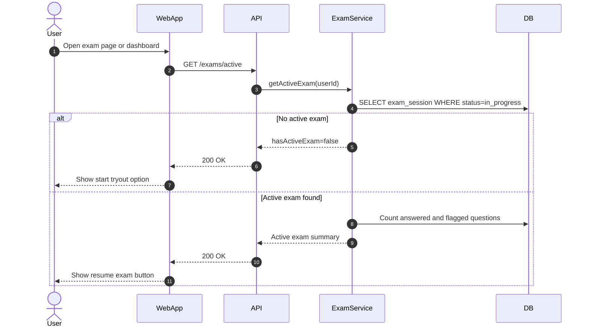
```mermaid
sequenceDiagram
    autonumber
    actor User
    participant WebApp
    participant API
    participant ExamService
    participant DB

    User->>WebApp: Open exam page or dashboard
    WebApp->>API: GET /exams/active
    API->>ExamService: getActiveExam(userId)
    ExamService->>DB: SELECT exam_session WHERE status=in_progress

    alt No active exam
        ExamService-->>API: hasActiveExam=false
        API-->>WebApp: 200 OK
        WebApp-->>User: Show start tryout option
    else Active exam found
        ExamService->>DB: Count answered and flagged questions
        ExamService-->>API: Active exam summary
        API-->>WebApp: 200 OK
        WebApp-->>User: Show resume exam button
    end
```

---

## 4.3 Load Exam Session Detail

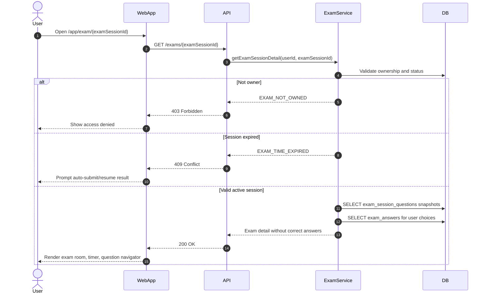
```mermaid
sequenceDiagram
    autonumber
    actor User
    participant WebApp
    participant API
    participant ExamService
    participant DB

    User->>WebApp: Open /app/exam/{examSessionId}
    WebApp->>API: GET /exams/{examSessionId}
    API->>ExamService: getExamSessionDetail(userId, examSessionId)
    ExamService->>DB: Validate ownership and status
    alt Not owner
        ExamService-->>API: EXAM_NOT_OWNED
        API-->>WebApp: 403 Forbidden
        WebApp-->>User: Show access denied
    else Session expired
        ExamService-->>API: EXAM_TIME_EXPIRED
        API-->>WebApp: 409 Conflict
        WebApp-->>User: Prompt auto-submit/resume result
    else Valid active session
        ExamService->>DB: SELECT exam_session_questions snapshots
        ExamService->>DB: SELECT exam_answers for user choices
        ExamService-->>API: Exam detail without correct answers
        API-->>WebApp: 200 OK
        WebApp-->>User: Render exam room, timer, question navigator
    end
```

### Security Note

Active exam detail SHALL NOT return:

1. correct answer,
2. TKP weights,
3. scoring key,
4. explanation if it reveals answer.

---

## 4.4 Answer Autosave

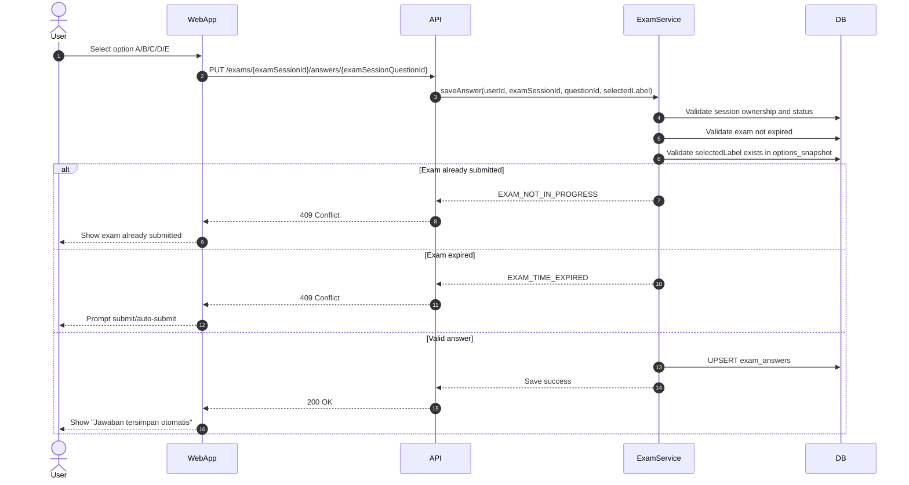
```mermaid
sequenceDiagram
    autonumber
    actor User
    participant WebApp
    participant API
    participant ExamService
    participant DB

    User->>WebApp: Select option A/B/C/D/E
    WebApp->>API: PUT /exams/{examSessionId}/answers/{examSessionQuestionId}
    API->>ExamService: saveAnswer(userId, examSessionId, questionId, selectedLabel)
    ExamService->>DB: Validate session ownership and status
    ExamService->>DB: Validate exam not expired
    ExamService->>DB: Validate selectedLabel exists in options_snapshot

    alt Exam already submitted
        ExamService-->>API: EXAM_NOT_IN_PROGRESS
        API-->>WebApp: 409 Conflict
        WebApp-->>User: Show exam already submitted
    else Exam expired
        ExamService-->>API: EXAM_TIME_EXPIRED
        API-->>WebApp: 409 Conflict
        WebApp-->>User: Prompt submit/auto-submit
    else Valid answer
        ExamService->>DB: UPSERT exam_answers
        ExamService-->>API: Save success
        API-->>WebApp: 200 OK
        WebApp-->>User: Show "Jawaban tersimpan otomatis"
    end
```

---

## 4.5 Flag Question

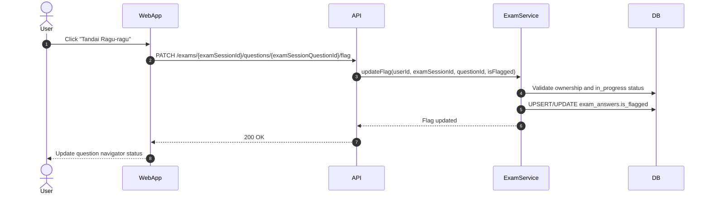
```mermaid
sequenceDiagram
    autonumber
    actor User
    participant WebApp
    participant API
    participant ExamService
    participant DB

    User->>WebApp: Click "Tandai Ragu-ragu"
    WebApp->>API: PATCH /exams/{examSessionId}/questions/{examSessionQuestionId}/flag
    API->>ExamService: updateFlag(userId, examSessionId, questionId, isFlagged)
    ExamService->>DB: Validate ownership and in_progress status
    ExamService->>DB: UPSERT/UPDATE exam_answers.is_flagged
    ExamService-->>API: Flag updated
    API-->>WebApp: 200 OK
    WebApp-->>User: Update question navigator status
```

---

## 4.6 Exam Integrity Event Logging

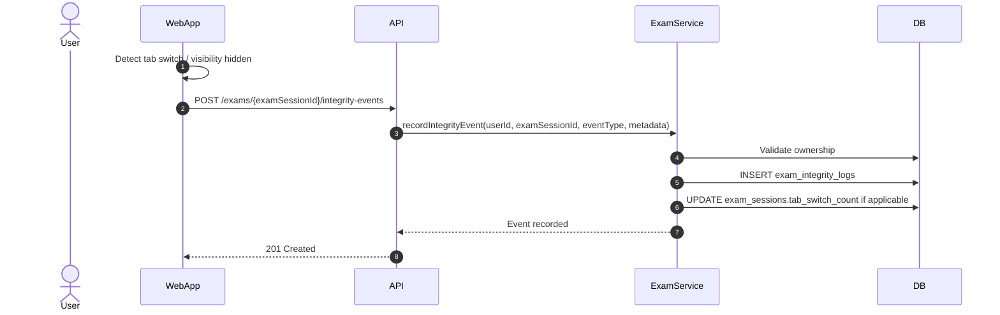
```mermaid
sequenceDiagram
    autonumber
    actor User
    participant WebApp
    participant API
    participant ExamService
    participant DB

    WebApp->>WebApp: Detect tab switch / visibility hidden
    WebApp->>API: POST /exams/{examSessionId}/integrity-events
    API->>ExamService: recordIntegrityEvent(userId, examSessionId, eventType, metadata)
    ExamService->>DB: Validate ownership
    ExamService->>DB: INSERT exam_integrity_logs
    ExamService->>DB: UPDATE exam_sessions.tab_switch_count if applicable
    ExamService-->>API: Event recorded
    API-->>WebApp: 201 Created
```

### MVP Rule

Integrity log hanya untuk monitoring pada MVP, bukan diskualifikasi otomatis.

---

# 5. Submit, Scoring, and Result Flows

---

## 5.1 Submit Exam + Scoring

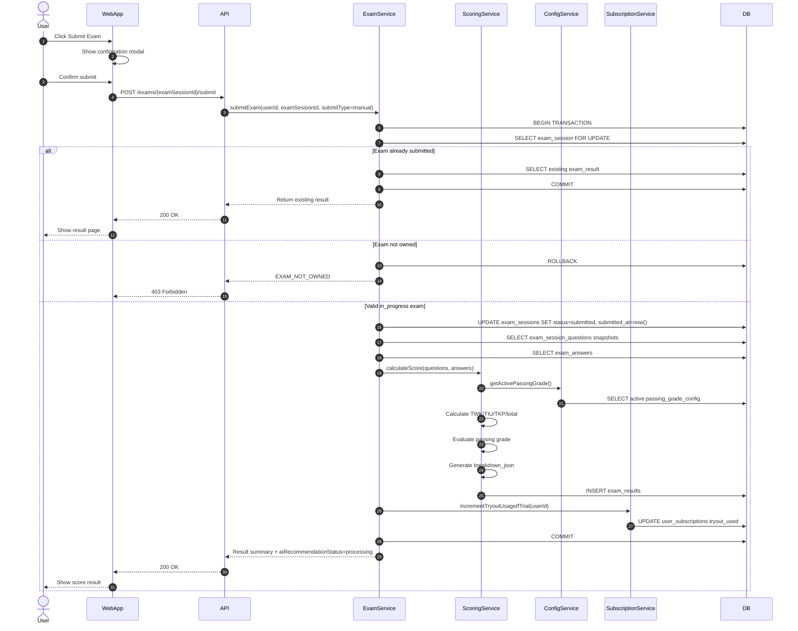
```mermaid
sequenceDiagram
    autonumber
    actor User
    participant WebApp
    participant API
    participant ExamService
    participant ScoringService
    participant ConfigService
    participant SubscriptionService
    participant DB

    User->>WebApp: Click Submit Exam
    WebApp->>WebApp: Show confirmation modal
    User->>WebApp: Confirm submit
    WebApp->>API: POST /exams/{examSessionId}/submit
    API->>ExamService: submitExam(userId, examSessionId, submitType=manual)

    ExamService->>DB: BEGIN TRANSACTION
    ExamService->>DB: SELECT exam_session FOR UPDATE
    alt Exam already submitted
        ExamService->>DB: SELECT existing exam_result
        ExamService->>DB: COMMIT
        ExamService-->>API: Return existing result
        API-->>WebApp: 200 OK
        WebApp-->>User: Show result page
    else Exam not owned
        ExamService->>DB: ROLLBACK
        ExamService-->>API: EXAM_NOT_OWNED
        API-->>WebApp: 403 Forbidden
    else Valid in_progress exam
        ExamService->>DB: UPDATE exam_sessions SET status=submitted, submitted_at=now()
        ExamService->>DB: SELECT exam_session_questions snapshots
        ExamService->>DB: SELECT exam_answers
        ExamService->>ScoringService: calculateScore(questions, answers)
        ScoringService->>ConfigService: getActivePassingGrade()
        ConfigService->>DB: SELECT active passing_grade_config
        ScoringService->>ScoringService: Calculate TWK/TIU/TKP/total
        ScoringService->>ScoringService: Evaluate passing grade
        ScoringService->>ScoringService: Generate breakdown_json
        ScoringService->>DB: INSERT exam_results
        ExamService->>SubscriptionService: incrementTryoutUsageIfTrial(userId)
        SubscriptionService->>DB: UPDATE user_subscriptions.tryout_used
        ExamService->>DB: COMMIT
        ExamService-->>API: Result summary + aiRecommendationStatus=processing
        API-->>WebApp: 200 OK
        WebApp-->>User: Show score result
    end
```

### Scoring Rule

| Category | Rule |
|---|---|
| TWK | Correct = 5, wrong/empty = 0 |
| TIU | Correct = 5, wrong/empty = 0 |
| TKP | Selected option weight = 1–5 |

---

## 5.2 Auto-Submit When Timer Ends

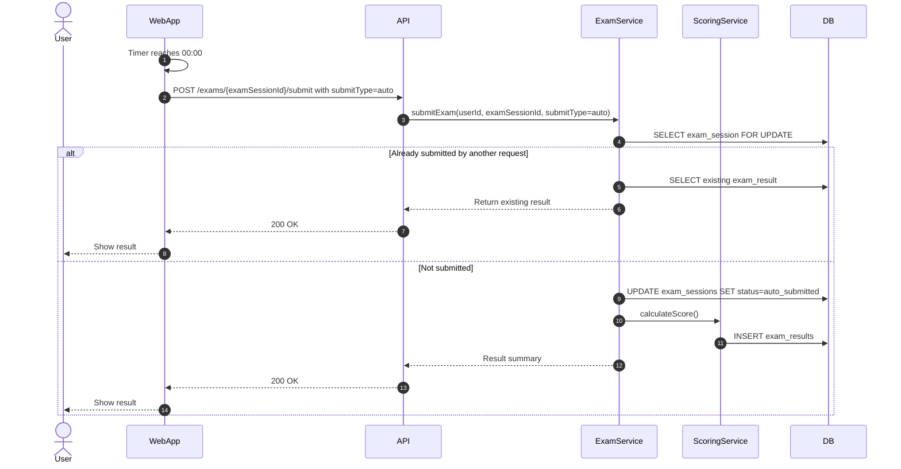
```mermaid
sequenceDiagram
    autonumber
    actor User
    participant WebApp
    participant API
    participant ExamService
    participant ScoringService
    participant DB

    WebApp->>WebApp: Timer reaches 00:00
    WebApp->>API: POST /exams/{examSessionId}/submit with submitType=auto
    API->>ExamService: submitExam(userId, examSessionId, submitType=auto)
    ExamService->>DB: SELECT exam_session FOR UPDATE
    alt Already submitted by another request
        ExamService->>DB: SELECT existing exam_result
        ExamService-->>API: Return existing result
        API-->>WebApp: 200 OK
        WebApp-->>User: Show result
    else Not submitted
        ExamService->>DB: UPDATE exam_sessions SET status=auto_submitted
        ExamService->>ScoringService: calculateScore()
        ScoringService->>DB: INSERT exam_results
        ExamService-->>API: Result summary
        API-->>WebApp: 200 OK
        WebApp-->>User: Show result
    end
```

---

# 6. AI Recommendation Flows

---

## 6.1 Submit Exam + Trigger AI Recommendation

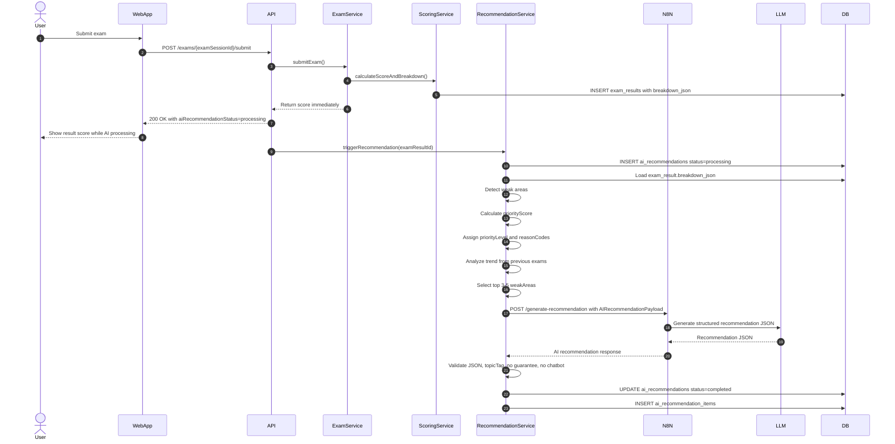
```mermaid
sequenceDiagram
    autonumber
    actor User
    participant WebApp
    participant API
    participant ExamService
    participant ScoringService
    participant RecommendationService
    participant N8N
    participant LLM
    participant DB

    User->>WebApp: Submit exam
    WebApp->>API: POST /exams/{examSessionId}/submit
    API->>ExamService: submitExam()
    ExamService->>ScoringService: calculateScoreAndBreakdown()
    ScoringService->>DB: INSERT exam_results with breakdown_json
    ExamService-->>API: Return score immediately
    API-->>WebApp: 200 OK with aiRecommendationStatus=processing
    WebApp-->>User: Show result score while AI processing

    API->>RecommendationService: triggerRecommendation(examResultId)
    RecommendationService->>DB: INSERT ai_recommendations status=processing
    RecommendationService->>DB: Load exam_result.breakdown_json
    RecommendationService->>RecommendationService: Detect weak areas
    RecommendationService->>RecommendationService: Calculate priorityScore
    RecommendationService->>RecommendationService: Assign priorityLevel and reasonCodes
    RecommendationService->>RecommendationService: Analyze trend from previous exams
    RecommendationService->>RecommendationService: Select top 3-5 weakAreas
    RecommendationService->>N8N: POST /generate-recommendation with AIRecommendationPayload
    N8N->>LLM: Generate structured recommendation JSON
    LLM-->>N8N: Recommendation JSON
    N8N-->>RecommendationService: AI recommendation response
    RecommendationService->>RecommendationService: Validate JSON, topicTag, no guarantee, no chatbot
    RecommendationService->>DB: UPDATE ai_recommendations status=completed
    RecommendationService->>DB: INSERT ai_recommendation_items
```

---

## 6.2 AI Recommendation Retrieval by Frontend

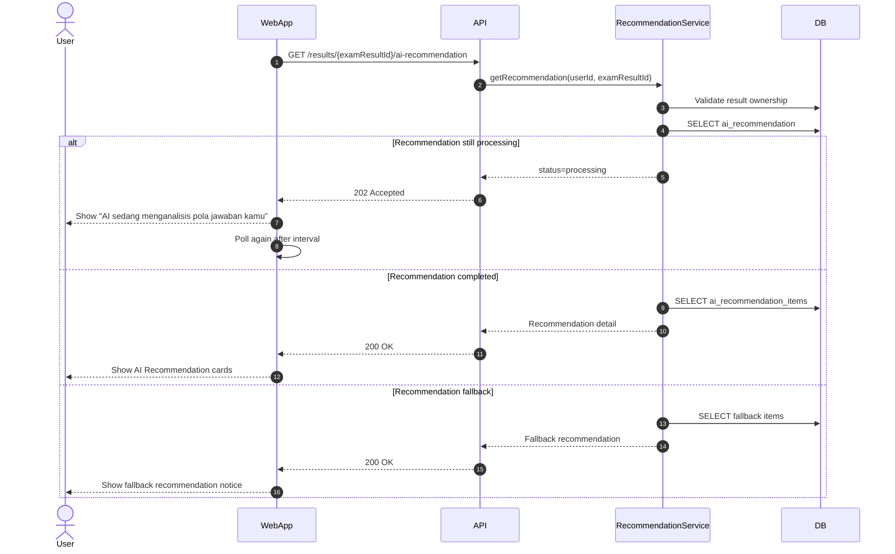
```mermaid
sequenceDiagram
    autonumber
    actor User
    participant WebApp
    participant API
    participant RecommendationService
    participant DB

    WebApp->>API: GET /results/{examResultId}/ai-recommendation
    API->>RecommendationService: getRecommendation(userId, examResultId)
    RecommendationService->>DB: Validate result ownership
    RecommendationService->>DB: SELECT ai_recommendation

    alt Recommendation still processing
        RecommendationService-->>API: status=processing
        API-->>WebApp: 202 Accepted
        WebApp-->>User: Show "AI sedang menganalisis pola jawaban kamu"
        WebApp->>WebApp: Poll again after interval
    else Recommendation completed
        RecommendationService->>DB: SELECT ai_recommendation_items
        RecommendationService-->>API: Recommendation detail
        API-->>WebApp: 200 OK
        WebApp-->>User: Show AI Recommendation cards
    else Recommendation fallback
        RecommendationService->>DB: SELECT fallback items
        RecommendationService-->>API: Fallback recommendation
        API-->>WebApp: 200 OK
        WebApp-->>User: Show fallback recommendation notice
    end
```

---

## 6.3 AI Recommendation Failure + Fallback

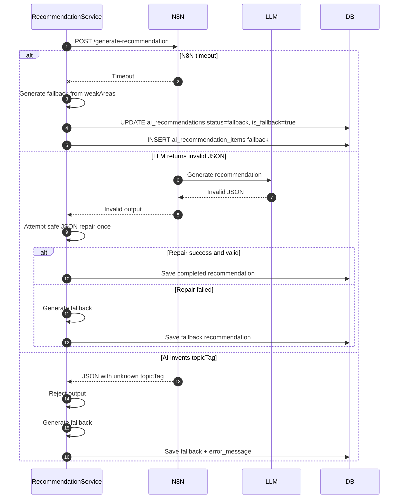
```mermaid
sequenceDiagram
    autonumber
    participant RecommendationService
    participant N8N
    participant LLM
    participant DB

    RecommendationService->>N8N: POST /generate-recommendation
    alt N8N timeout
        N8N--xRecommendationService: Timeout
        RecommendationService->>RecommendationService: Generate fallback from weakAreas
        RecommendationService->>DB: UPDATE ai_recommendations status=fallback, is_fallback=true
        RecommendationService->>DB: INSERT ai_recommendation_items fallback
    else LLM returns invalid JSON
        N8N->>LLM: Generate recommendation
        LLM-->>N8N: Invalid JSON
        N8N-->>RecommendationService: Invalid output
        RecommendationService->>RecommendationService: Attempt safe JSON repair once
        alt Repair success and valid
            RecommendationService->>DB: Save completed recommendation
        else Repair failed
            RecommendationService->>RecommendationService: Generate fallback
            RecommendationService->>DB: Save fallback recommendation
        end
    else AI invents topicTag
        N8N-->>RecommendationService: JSON with unknown topicTag
        RecommendationService->>RecommendationService: Reject output
        RecommendationService->>RecommendationService: Generate fallback
        RecommendationService->>DB: Save fallback + error_message
    end
```

---

## 6.4 Regenerate AI Recommendation by Admin

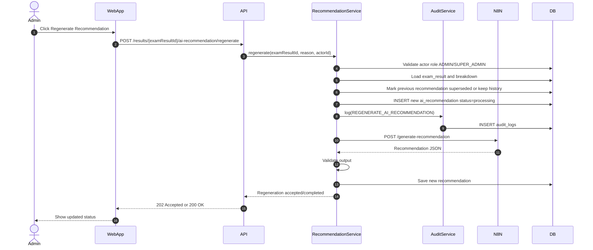
```mermaid
sequenceDiagram
    autonumber
    actor Admin
    participant WebApp
    participant API
    participant RecommendationService
    participant AuditService
    participant N8N
    participant DB

    Admin->>WebApp: Click Regenerate Recommendation
    WebApp->>API: POST /results/{examResultId}/ai-recommendation/regenerate
    API->>RecommendationService: regenerate(examResultId, reason, actorId)
    RecommendationService->>DB: Validate actor role ADMIN/SUPER_ADMIN
    RecommendationService->>DB: Load exam_result and breakdown
    RecommendationService->>DB: Mark previous recommendation superseded or keep history
    RecommendationService->>DB: INSERT new ai_recommendation status=processing
    RecommendationService->>AuditService: log(REGENERATE_AI_RECOMMENDATION)
    AuditService->>DB: INSERT audit_logs
    RecommendationService->>N8N: POST /generate-recommendation
    N8N-->>RecommendationService: Recommendation JSON
    RecommendationService->>RecommendationService: Validate output
    RecommendationService->>DB: Save new recommendation
    RecommendationService-->>API: Regeneration accepted/completed
    API-->>WebApp: 202 Accepted or 200 OK
    WebApp-->>Admin: Show updated status
```

---

# 7. Result and History Flows

---

## 7.1 View Exam Result Detail

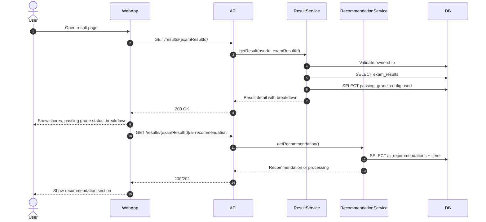
```mermaid
sequenceDiagram
    autonumber
    actor User
    participant WebApp
    participant API
    participant ResultService
    participant RecommendationService
    participant DB

    User->>WebApp: Open result page
    WebApp->>API: GET /results/{examResultId}
    API->>ResultService: getResult(userId, examResultId)
    ResultService->>DB: Validate ownership
    ResultService->>DB: SELECT exam_results
    ResultService->>DB: SELECT passing_grade_config used
    ResultService-->>API: Result detail with breakdown
    API-->>WebApp: 200 OK
    WebApp-->>User: Show scores, passing grade status, breakdown

    WebApp->>API: GET /results/{examResultId}/ai-recommendation
    API->>RecommendationService: getRecommendation()
    RecommendationService->>DB: SELECT ai_recommendations + items
    RecommendationService-->>API: Recommendation or processing
    API-->>WebApp: 200/202
    WebApp-->>User: Show recommendation section
```

---

## 7.2 View Answer Review

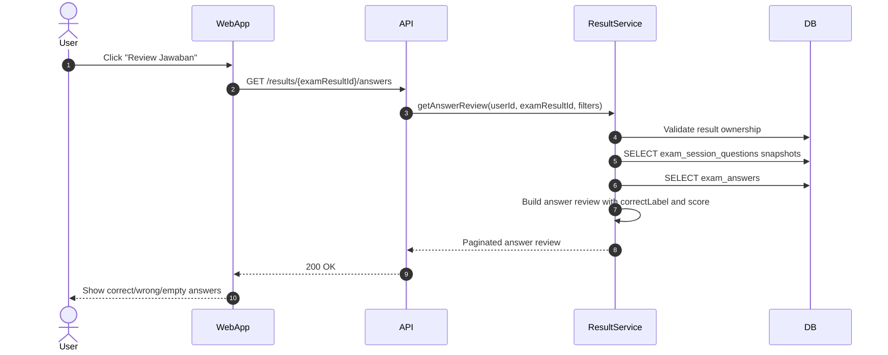
```mermaid
sequenceDiagram
    autonumber
    actor User
    participant WebApp
    participant API
    participant ResultService
    participant DB

    User->>WebApp: Click "Review Jawaban"
    WebApp->>API: GET /results/{examResultId}/answers
    API->>ResultService: getAnswerReview(userId, examResultId, filters)
    ResultService->>DB: Validate result ownership
    ResultService->>DB: SELECT exam_session_questions snapshots
    ResultService->>DB: SELECT exam_answers
    ResultService->>ResultService: Build answer review with correctLabel and score
    ResultService-->>API: Paginated answer review
    API-->>WebApp: 200 OK
    WebApp-->>User: Show correct/wrong/empty answers
```

### Security Rule

Correct answer MAY be shown only after exam is submitted and result exists.

---

## 7.3 View Exam History

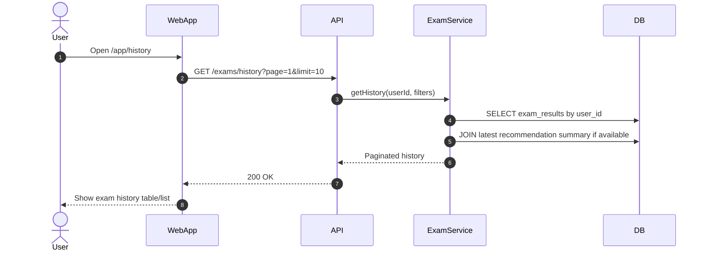
```mermaid
sequenceDiagram
    autonumber
    actor User
    participant WebApp
    participant API
    participant ExamService
    participant DB

    User->>WebApp: Open /app/history
    WebApp->>API: GET /exams/history?page=1&limit=10
    API->>ExamService: getHistory(userId, filters)
    ExamService->>DB: SELECT exam_results by user_id
    ExamService->>DB: JOIN latest recommendation summary if available
    ExamService-->>API: Paginated history
    API-->>WebApp: 200 OK
    WebApp-->>User: Show exam history table/list
```

---

# 8. Subscription and Payment Flows

---

## 8.1 View Subscription Plans

```mermaid
sequenceDiagram
    autonumber
    actor User
    participant WebApp
    participant API
    participant SubscriptionService
    participant DB

    User->>WebApp: Open pricing/subscription page
    WebApp->>API: GET /subscription-plans
    API->>SubscriptionService: getActivePlans()
    SubscriptionService->>DB: SELECT subscription_plans WHERE is_active=true
    SubscriptionService-->>API: Active plans
    API-->>WebApp: 200 OK
    WebApp-->>User: Show plan cards
```

---

## 8.2 Checkout Payment

```mermaid
sequenceDiagram
    autonumber
    actor User
    participant WebApp
    participant API
    participant PaymentService
    participant SubscriptionService
    participant PaymentGateway
    participant DB

    User->>WebApp: Select plan and payment method
    WebApp->>API: POST /payments/checkout
    API->>PaymentService: createCheckout(userId, planId, paymentMethod, idempotencyKey)
    PaymentService->>DB: Check idempotency key if stored
    PaymentService->>SubscriptionService: validatePlan(planId)
    SubscriptionService->>DB: SELECT subscription_plan active

    alt Plan inactive/not found
        SubscriptionService-->>PaymentService: PLAN_NOT_FOUND or PLAN_INACTIVE
        PaymentService-->>API: Error
        API-->>WebApp: 404/422
        WebApp-->>User: Show plan unavailable
    else Plan valid
        PaymentService->>DB: INSERT payment_transactions status=pending
        PaymentService->>PaymentGateway: Create payment request
        alt Gateway error
            PaymentGateway-->>PaymentService: Error
            PaymentService->>DB: UPDATE payment_transactions status=failed
            PaymentService-->>API: PAYMENT_GATEWAY_ERROR
            API-->>WebApp: 502 Bad Gateway
            WebApp-->>User: Show payment creation failed
        else Gateway success
            PaymentGateway-->>PaymentService: paymentUrl/instructions/gatewayTransactionId
            PaymentService->>DB: UPDATE payment_transactions with gateway refs
            PaymentService-->>API: Checkout response
            API-->>WebApp: 201 Created
            WebApp-->>User: Redirect/show payment instruction
        end
    end
```

---

## 8.3 Payment Webhook + Subscription Activation

```mermaid
sequenceDiagram
    autonumber
    participant PaymentGateway
    participant API
    participant PaymentService
    participant SubscriptionService
    participant AuditService
    participant DB

    PaymentGateway->>API: POST /webhooks/payment/{provider}
    API->>PaymentService: handleWebhook(provider, headers, payload)
    PaymentService->>PaymentService: Verify signature

    alt Invalid signature
        PaymentService->>DB: INSERT payment_webhook_events signature_valid=false
        PaymentService-->>API: Reject without updating transaction
        API-->>PaymentGateway: 401/400
    else Valid signature
        PaymentService->>DB: INSERT payment_webhook_events signature_valid=true
        PaymentService->>DB: Check gateway_event_id idempotency

        alt Duplicate webhook event
            PaymentService-->>API: Already processed
            API-->>PaymentGateway: 200 OK
        else New webhook event
            PaymentService->>DB: SELECT payment_transaction by invoice/gatewayTransactionId
            alt Transaction not found
                PaymentService->>DB: Mark webhook processed=false with error
                PaymentService-->>API: Transaction not found
                API-->>PaymentGateway: 200 OK
            else Payment success
                PaymentService->>DB: BEGIN TRANSACTION
                PaymentService->>DB: UPDATE payment_transactions SET status=success, paid_at=...
                PaymentService->>SubscriptionService: activateSubscriptionFromPayment(transaction)
                SubscriptionService->>DB: INSERT or UPDATE user_subscriptions status=active
                PaymentService->>DB: UPDATE payment_transactions.user_subscription_id
                PaymentService->>DB: UPDATE payment_webhook_events processed=true
                PaymentService->>AuditService: log(PAYMENT_SUBSCRIPTION_ACTIVATED)
                AuditService->>DB: INSERT audit_logs
                PaymentService->>DB: COMMIT
                PaymentService-->>API: Webhook processed
                API-->>PaymentGateway: 200 OK
            end
        end
    end
```

---

## 8.4 Payment Status Polling

```mermaid
sequenceDiagram
    autonumber
    actor User
    participant WebApp
    participant API
    participant PaymentService
    participant DB

    User->>WebApp: Open payment status page
    loop Until success/failed/expired or max polling reached
        WebApp->>API: GET /payments/{paymentTransactionId}
        API->>PaymentService: getPaymentStatus(userId, paymentTransactionId)
        PaymentService->>DB: Validate owner
        PaymentService->>DB: SELECT payment_transaction
        PaymentService-->>API: Payment status
        API-->>WebApp: 200 OK
        WebApp-->>User: Show pending/success/failed state
    end
```

---

# 9. Admin Question Bank Flows

---

## 9.1 Admin Create Manual Question

```mermaid
sequenceDiagram
    autonumber
    actor Admin
    participant WebApp
    participant API
    participant QuestionService
    participant AuditService
    participant DB

    Admin->>WebApp: Open Add Question Form
    Admin->>WebApp: Submit question data
    WebApp->>API: POST /admin/questions
    API->>QuestionService: createQuestion(actorId, payload)
    QuestionService->>QuestionService: Validate role ADMIN/SUPER_ADMIN
    QuestionService->>QuestionService: Validate required metadata
    QuestionService->>QuestionService: Validate exactly 5 options

    alt TWK/TIU without exactly one correct answer
        QuestionService-->>API: VALIDATION_ERROR
        API-->>WebApp: 422
        WebApp-->>Admin: Show validation error
    else TKP without valid weights
        QuestionService-->>API: VALIDATION_ERROR
        API-->>WebApp: 422
        WebApp-->>Admin: Show validation error
    else Valid question
        QuestionService->>DB: BEGIN TRANSACTION
        QuestionService->>DB: INSERT questions
        QuestionService->>DB: INSERT question_options
        QuestionService->>AuditService: log(CREATE_QUESTION)
        AuditService->>DB: INSERT audit_logs
        QuestionService->>DB: COMMIT
        QuestionService-->>API: Question created
        API-->>WebApp: 201 Created
        WebApp-->>Admin: Show success and question detail
    end
```

---

## 9.2 Admin Update Question

```mermaid
sequenceDiagram
    autonumber
    actor Admin
    participant WebApp
    participant API
    participant QuestionService
    participant AuditService
    participant DB

    Admin->>WebApp: Edit question
    WebApp->>API: PATCH /admin/questions/{questionId}
    API->>QuestionService: updateQuestion(actorId, questionId, payload)
    QuestionService->>DB: SELECT question
    QuestionService->>QuestionService: Validate metadata/options
    QuestionService->>DB: BEGIN TRANSACTION
    QuestionService->>DB: UPDATE questions
    QuestionService->>DB: UPSERT question_options
    QuestionService->>AuditService: log(UPDATE_QUESTION)
    AuditService->>DB: INSERT audit_logs
    QuestionService->>DB: COMMIT
    QuestionService-->>API: Question updated
    API-->>WebApp: 200 OK
    WebApp-->>Admin: Show update success
```

### Historical Integrity Note

Updating Question SHALL NOT modify existing `exam_session_questions.question_snapshot`.

---

## 9.3 Admin Soft Delete / Archive Question

```mermaid
sequenceDiagram
    autonumber
    actor Admin
    participant WebApp
    participant API
    participant QuestionService
    participant AuditService
    participant DB

    Admin->>WebApp: Click archive/delete question
    WebApp->>API: DELETE /admin/questions/{questionId}
    API->>QuestionService: archiveQuestion(actorId, questionId)
    QuestionService->>DB: UPDATE questions SET status=archived, deleted_at=now()
    QuestionService->>AuditService: log(ARCHIVE_QUESTION)
    AuditService->>DB: INSERT audit_logs
    QuestionService-->>API: Question archived
    API-->>WebApp: 200 OK
    WebApp-->>Admin: Show archived success
```

---

# 10. Admin PDF Import Flows

---

## 10.1 Admin Upload PDF + AI Parsing

```mermaid
sequenceDiagram
    autonumber
    actor Admin
    participant WebApp
    participant API
    participant PdfImportService
    participant FileStorage
    participant N8N
    participant LLM
    participant DB

    Admin->>WebApp: Upload PDF file
    WebApp->>API: POST /admin/pdf-imports multipart/form-data
    API->>PdfImportService: uploadPdf(actorId, file, categoryHint)
    PdfImportService->>PdfImportService: Validate role ADMIN/SUPER_ADMIN
    PdfImportService->>PdfImportService: Validate file type and size

    alt Invalid file
        PdfImportService-->>API: INVALID_FILE_TYPE or FILE_TOO_LARGE
        API-->>WebApp: 422
        WebApp-->>Admin: Show validation error
    else Valid PDF
        PdfImportService->>FileStorage: Store PDF
        FileStorage-->>PdfImportService: fileUrl
        PdfImportService->>DB: INSERT question_import_batches status=processing
        PdfImportService->>N8N: POST /parse-pdf with file and batchId
        N8N->>N8N: Extract PDF text
        N8N->>N8N: Chunk text
        N8N->>LLM: Parse questions into structured JSON
        LLM-->>N8N: Parsed questions
        N8N-->>PdfImportService: Parsed question list
        PdfImportService->>DB: INSERT parsed_question_reviews status=pending_review
        PdfImportService->>DB: UPDATE question_import_batches status=completed/partial_failed
        PdfImportService-->>API: Batch summary
        API-->>WebApp: 202/200
        WebApp-->>Admin: Show parsing result summary
    end
```

---

## 10.2 Admin View PDF Import Batch

```mermaid
sequenceDiagram
    autonumber
    actor Admin
    participant WebApp
    participant API
    participant PdfImportService
    participant DB

    Admin->>WebApp: Open batch detail
    WebApp->>API: GET /admin/pdf-imports/{batchId}
    API->>PdfImportService: getBatchDetail(actorId, batchId)
    PdfImportService->>DB: SELECT question_import_batch
    PdfImportService->>DB: SELECT parsed_question_reviews
    PdfImportService-->>API: Batch detail
    API-->>WebApp: 200 OK
    WebApp-->>Admin: Show parsed questions and review actions
```

---

## 10.3 Admin Review Parsed Question — Approve

```mermaid
sequenceDiagram
    autonumber
    actor Admin
    participant WebApp
    participant API
    participant PdfImportService
    participant QuestionService
    participant AuditService
    participant DB

    Admin->>WebApp: Open parsed question review
    WebApp->>API: GET /admin/parsed-questions/{parsedQuestionId}
    API->>PdfImportService: getParsedQuestionDetail()
    PdfImportService->>DB: SELECT parsed_question_review
    PdfImportService-->>API: Parsed detail
    API-->>WebApp: 200 OK
    WebApp-->>Admin: Show editable review form

    Admin->>WebApp: Click Approve
    WebApp->>API: POST /admin/parsed-questions/{parsedQuestionId}/approve
    API->>PdfImportService: approveParsedQuestion(actorId, parsedQuestionId, reviewNotes)
    PdfImportService->>DB: SELECT parsed_question_review FOR UPDATE
    PdfImportService->>QuestionService: validateQuestion(parsedPayload)

    alt Invalid parsed data
        QuestionService-->>PdfImportService: VALIDATION_ERROR
        PdfImportService-->>API: 422
        API-->>WebApp: Show validation error
    else Valid parsed data
        PdfImportService->>DB: BEGIN TRANSACTION
        PdfImportService->>DB: INSERT questions source_type=pdf_import
        PdfImportService->>DB: INSERT question_options
        PdfImportService->>DB: UPDATE parsed_question_reviews status=approved, question_id=...
        PdfImportService->>AuditService: log(APPROVE_PARSED_QUESTION)
        AuditService->>DB: INSERT audit_logs
        PdfImportService->>DB: COMMIT
        PdfImportService-->>API: Approved + questionId
        API-->>WebApp: 201 Created
        WebApp-->>Admin: Show approved success
    end
```

---

## 10.4 Admin Review Parsed Question — Edit then Approve

```mermaid
sequenceDiagram
    autonumber
    actor Admin
    participant WebApp
    participant API
    participant PdfImportService
    participant DB

    Admin->>WebApp: Edit parsed question fields
    WebApp->>API: PATCH /admin/parsed-questions/{parsedQuestionId}
    API->>PdfImportService: updateParsedQuestion(actorId, parsedQuestionId, payload)
    PdfImportService->>DB: UPDATE parsed_question_reviews
    PdfImportService-->>API: Updated
    API-->>WebApp: 200 OK
    WebApp-->>Admin: Show updated parsed question

    Admin->>WebApp: Click Approve
    WebApp->>API: POST /admin/parsed-questions/{parsedQuestionId}/approve
    API->>PdfImportService: approveParsedQuestion()
    PdfImportService->>DB: INSERT questions and options
    PdfImportService->>DB: UPDATE parsed_question_reviews status=approved
    PdfImportService-->>API: Approved
    API-->>WebApp: 201 Created
```

---

## 10.5 Admin Review Parsed Question — Reject

```mermaid
sequenceDiagram
    autonumber
    actor Admin
    participant WebApp
    participant API
    participant PdfImportService
    participant AuditService
    participant DB

    Admin->>WebApp: Click Reject
    WebApp->>API: POST /admin/parsed-questions/{parsedQuestionId}/reject
    API->>PdfImportService: rejectParsedQuestion(actorId, parsedQuestionId, reviewNotes)
    PdfImportService->>DB: UPDATE parsed_question_reviews status=rejected, review_notes=...
    PdfImportService->>AuditService: log(REJECT_PARSED_QUESTION)
    AuditService->>DB: INSERT audit_logs
    PdfImportService-->>API: Rejected
    API-->>WebApp: 200 OK
    WebApp-->>Admin: Show rejected success
```

---

# 11. Admin Monitoring Flows

---

## 11.1 Admin Dashboard Summary

```mermaid
sequenceDiagram
    autonumber
    actor Admin
    participant WebApp
    participant API
    participant AdminService
    participant DB

    Admin->>WebApp: Open admin dashboard
    WebApp->>API: GET /admin/dashboard/summary
    API->>AdminService: getDashboardSummary(actorId)
    AdminService->>DB: Count users
    AdminService->>DB: Count active subscribers
    AdminService->>DB: Count active questions
    AdminService->>DB: Count pending review questions
    AdminService->>DB: Sum monthly revenue
    AdminService->>DB: Load recent import batches and transactions
    AdminService-->>API: Dashboard summary
    API-->>WebApp: 200 OK
    WebApp-->>Admin: Show admin dashboard
```

---

## 11.2 Admin Monitor Users

```mermaid
sequenceDiagram
    autonumber
    actor Admin
    participant WebApp
    participant API
    participant AdminService
    participant DB

    Admin->>WebApp: Open user monitoring
    WebApp->>API: GET /admin/users?filters...
    API->>AdminService: getUsers(actorId, filters, pagination)
    AdminService->>DB: SELECT users with subscription summary
    AdminService-->>API: Paginated users
    API-->>WebApp: 200 OK
    WebApp-->>Admin: Show user list
```

---

## 11.3 Admin Monitor Transactions

```mermaid
sequenceDiagram
    autonumber
    actor Admin
    participant WebApp
    participant API
    participant AdminService
    participant DB

    Admin->>WebApp: Open transaction monitoring
    WebApp->>API: GET /admin/transactions?filters...
    API->>AdminService: getTransactions(actorId, filters, pagination)
    AdminService->>DB: SELECT payment_transactions with user and plan
    AdminService-->>API: Paginated transactions
    API-->>WebApp: 200 OK
    WebApp-->>Admin: Show transaction table
```

---

# 12. Super Admin Configuration Flows

---

## 12.1 Super Admin Create Admin Account

```mermaid
sequenceDiagram
    autonumber
    actor SuperAdmin
    participant WebApp
    participant API
    participant UserService
    participant AuthService
    participant AuditService
    participant EmailService
    participant DB

    SuperAdmin->>WebApp: Create Admin Account
    WebApp->>API: POST /super-admin/admins
    API->>UserService: createAdmin(actorId, payload)
    UserService->>DB: Validate actor role SUPER_ADMIN
    UserService->>DB: Check email uniqueness
    alt Email exists
        UserService-->>API: EMAIL_ALREADY_REGISTERED
        API-->>WebApp: 409 Conflict
        WebApp-->>SuperAdmin: Show error
    else Email available
        UserService->>DB: INSERT users role=ADMIN
        UserService->>AuthService: Create invitation/reset token
        AuthService->>DB: INSERT password_reset_tokens or invitation token
        AuthService->>EmailService: Send admin invitation
        UserService->>AuditService: log(CREATE_ADMIN)
        AuditService->>DB: INSERT audit_logs
        UserService-->>API: Admin created
        API-->>WebApp: 201 Created
        WebApp-->>SuperAdmin: Show admin created
    end
```

---

## 12.2 Super Admin Deactivate Admin

```mermaid
sequenceDiagram
    autonumber
    actor SuperAdmin
    participant WebApp
    participant API
    participant UserService
    participant AuditService
    participant DB

    SuperAdmin->>WebApp: Click deactivate admin
    WebApp->>API: PATCH /super-admin/admins/{adminId}/deactivate
    API->>UserService: deactivateAdmin(actorId, adminId, reason)
    UserService->>DB: Validate actor role SUPER_ADMIN
    UserService->>DB: UPDATE users SET status=inactive
    UserService->>AuditService: log(DEACTIVATE_ADMIN)
    AuditService->>DB: INSERT audit_logs
    UserService-->>API: Admin deactivated
    API-->>WebApp: 200 OK
    WebApp-->>SuperAdmin: Show success
```

---

## 12.3 Super Admin Update Passing Grade

```mermaid
sequenceDiagram
    autonumber
    actor SuperAdmin
    participant WebApp
    participant API
    participant ConfigService
    participant AuditService
    participant DB

    SuperAdmin->>WebApp: Open passing grade config
    WebApp->>API: GET /super-admin/passing-grade
    API->>ConfigService: getActivePassingGrade()
    ConfigService->>DB: SELECT active passing_grade_config
    ConfigService-->>API: Active config
    API-->>WebApp: 200 OK
    WebApp-->>SuperAdmin: Show config form

    SuperAdmin->>WebApp: Submit new passing grade
    WebApp->>API: PUT /super-admin/passing-grade
    API->>ConfigService: updatePassingGrade(actorId, payload)
    ConfigService->>DB: Validate actor role SUPER_ADMIN
    ConfigService->>DB: BEGIN TRANSACTION
    ConfigService->>DB: UPDATE old passing_grade_configs SET is_active=false
    ConfigService->>DB: INSERT new passing_grade_config is_active=true
    ConfigService->>AuditService: log(UPDATE_PASSING_GRADE)
    AuditService->>DB: INSERT audit_logs
    ConfigService->>DB: COMMIT
    ConfigService-->>API: Passing grade updated
    API-->>WebApp: 200 OK
    WebApp-->>SuperAdmin: Show success warning that historical results unchanged
```

### Historical Rule

Passing grade update SHALL apply only to new exams. Existing ExamResult keeps its original `passing_grade_config_id`.

---

## 12.4 Super Admin Update Trial Rules

```mermaid
sequenceDiagram
    autonumber
    actor SuperAdmin
    participant WebApp
    participant API
    participant ConfigService
    participant AuditService
    participant DB

    SuperAdmin->>WebApp: Open trial config
    WebApp->>API: GET /super-admin/trial-config
    API->>ConfigService: getActiveTrialConfig()
    ConfigService->>DB: SELECT active trial_config
    ConfigService-->>API: Active config
    API-->>WebApp: 200 OK

    SuperAdmin->>WebApp: Submit trial rules
    WebApp->>API: PUT /super-admin/trial-config
    API->>ConfigService: updateTrialConfig(actorId, payload)
    ConfigService->>DB: BEGIN TRANSACTION
    ConfigService->>DB: UPDATE old trial_configs SET is_active=false
    ConfigService->>DB: INSERT new trial_config is_active=true
    ConfigService->>AuditService: log(UPDATE_TRIAL_CONFIG)
    AuditService->>DB: INSERT audit_logs
    ConfigService->>DB: COMMIT
    ConfigService-->>API: Trial config updated
    API-->>WebApp: 200 OK
    WebApp-->>SuperAdmin: Show success
```

---

## 12.5 Super Admin Manage Subscription Plan

```mermaid
sequenceDiagram
    autonumber
    actor SuperAdmin
    participant WebApp
    participant API
    participant SubscriptionService
    participant AuditService
    participant DB

    SuperAdmin->>WebApp: Create/update subscription plan
    WebApp->>API: POST/PATCH /super-admin/subscription-plans
    API->>SubscriptionService: savePlan(actorId, payload)
    SubscriptionService->>DB: Validate actor role SUPER_ADMIN
    SubscriptionService->>SubscriptionService: Validate price/duration/status
    SubscriptionService->>DB: INSERT or UPDATE subscription_plans
    SubscriptionService->>AuditService: log(SAVE_SUBSCRIPTION_PLAN)
    AuditService->>DB: INSERT audit_logs
    SubscriptionService-->>API: Plan saved
    API-->>WebApp: 200/201
    WebApp-->>SuperAdmin: Show success
```

---

## 12.6 Super Admin Manual Subscription Activation

```mermaid
sequenceDiagram
    autonumber
    actor SuperAdmin
    participant WebApp
    participant API
    participant SubscriptionService
    participant AuditService
    participant DB

    SuperAdmin->>WebApp: Search user and select plan
    WebApp->>API: POST /super-admin/subscriptions/manual-activation
    API->>SubscriptionService: manualActivate(actorId, userId, planId, durationDays, reason)
    SubscriptionService->>DB: Validate actor role SUPER_ADMIN
    SubscriptionService->>DB: Validate reason is not empty
    SubscriptionService->>DB: Validate user exists
    SubscriptionService->>DB: Validate plan exists

    alt Invalid input
        SubscriptionService-->>API: VALIDATION_ERROR
        API-->>WebApp: 422
        WebApp-->>SuperAdmin: Show validation error
    else Valid input
        SubscriptionService->>DB: BEGIN TRANSACTION
        SubscriptionService->>DB: INSERT user_subscriptions status=active activation_source=manual
        SubscriptionService->>AuditService: log(MANUAL_SUBSCRIPTION_ACTIVATION)
        AuditService->>DB: INSERT audit_logs with reason
        SubscriptionService->>DB: COMMIT
        SubscriptionService-->>API: Subscription active
        API-->>WebApp: 201 Created
        WebApp-->>SuperAdmin: Show activation success
    end
```

---

## 12.7 Super Admin View Audit Log

```mermaid
sequenceDiagram
    autonumber
    actor SuperAdmin
    participant WebApp
    participant API
    participant AuditService
    participant DB

    SuperAdmin->>WebApp: Open audit log page
    WebApp->>API: GET /super-admin/audit-logs?filters...
    API->>AuditService: getAuditLogs(actorId, filters, pagination)
    AuditService->>DB: Validate actor role SUPER_ADMIN
    AuditService->>DB: SELECT audit_logs with filters
    AuditService-->>API: Paginated audit logs
    API-->>WebApp: 200 OK
    WebApp-->>SuperAdmin: Show audit log table
```

---

# 13. Audit Log Pattern

## 13.1 Generic Audit Logging Sequence

```mermaid
sequenceDiagram
    autonumber
    participant DomainService
    participant AuditService
    participant DB

    DomainService->>AuditService: log(actorId, action, module, targetType, targetId, metadata)
    AuditService->>DB: INSERT audit_logs
    DB-->>AuditService: Audit log saved
    AuditService-->>DomainService: Success
```

### Actions That SHALL Be Audited

| Action | Actor |
|---|---|
| CREATE_ADMIN | SUPER_ADMIN |
| DEACTIVATE_ADMIN | SUPER_ADMIN |
| UPDATE_PASSING_GRADE | SUPER_ADMIN |
| UPDATE_TRIAL_CONFIG | SUPER_ADMIN |
| MANUAL_SUBSCRIPTION_ACTIVATION | SUPER_ADMIN |
| CREATE_QUESTION | ADMIN/SUPER_ADMIN |
| UPDATE_QUESTION | ADMIN/SUPER_ADMIN |
| ARCHIVE_QUESTION | ADMIN/SUPER_ADMIN |
| APPROVE_PARSED_QUESTION | ADMIN/SUPER_ADMIN |
| REJECT_PARSED_QUESTION | ADMIN/SUPER_ADMIN |
| REGENERATE_AI_RECOMMENDATION | ADMIN/SUPER_ADMIN |
| PAYMENT_SUBSCRIPTION_ACTIVATED | System/PaymentService |

---

# 14. Error and Edge Case Flows

---

## 14.1 Expired Trial When Starting Exam

```mermaid
sequenceDiagram
    autonumber
    actor User
    participant WebApp
    participant API
    participant ExamService
    participant SubscriptionService
    participant DB

    User->>WebApp: Click Start Tryout
    WebApp->>API: POST /exams/start
    API->>ExamService: startExam(userId)
    ExamService->>SubscriptionService: checkUserAccess(userId)
    SubscriptionService->>DB: SELECT active subscription/trial
    SubscriptionService->>SubscriptionService: Evaluate trial days and tryout usage
    SubscriptionService-->>ExamService: ACCESS_EXPIRED
    ExamService-->>API: ACCESS_EXPIRED
    API-->>WebApp: 403 Forbidden
    WebApp-->>User: Show subscription plans/paywall
```

---

## 14.2 Duplicate Submit Request

```mermaid
sequenceDiagram
    autonumber
    actor User
    participant WebApp
    participant API
    participant ExamService
    participant DB

    User->>WebApp: Double click Submit
    WebApp->>API: POST /exams/{id}/submit
    WebApp->>API: POST /exams/{id}/submit duplicate
    API->>ExamService: submitExam first request
    ExamService->>DB: SELECT exam_session FOR UPDATE
    ExamService->>DB: Create exam_result
    ExamService-->>API: Result created

    API->>ExamService: submitExam duplicate request
    ExamService->>DB: SELECT exam_session already submitted
    ExamService->>DB: SELECT existing exam_result
    ExamService-->>API: Existing result
    API-->>WebApp: 200 OK same result
```

---

## 14.3 Duplicate Payment Webhook

```mermaid
sequenceDiagram
    autonumber
    participant PaymentGateway
    participant API
    participant PaymentService
    participant DB

    PaymentGateway->>API: Send webhook event evt-001
    API->>PaymentService: handleWebhook(evt-001)
    PaymentService->>DB: INSERT payment_webhook_events gateway_event_id=evt-001
    PaymentService->>DB: Activate subscription
    PaymentService-->>API: Processed
    API-->>PaymentGateway: 200 OK

    PaymentGateway->>API: Send duplicate webhook evt-001
    API->>PaymentService: handleWebhook(evt-001)
    PaymentService->>DB: Check gateway_event_id
    DB-->>PaymentService: Already exists and processed
    PaymentService-->>API: Already processed
    API-->>PaymentGateway: 200 OK
```

---

## 14.4 PDF Parsing Failure

```mermaid
sequenceDiagram
    autonumber
    actor Admin
    participant WebApp
    participant API
    participant PdfImportService
    participant N8N
    participant DB

    Admin->>WebApp: Upload PDF
    WebApp->>API: POST /admin/pdf-imports
    API->>PdfImportService: uploadPdf()
    PdfImportService->>DB: INSERT batch status=processing
    PdfImportService->>N8N: POST /parse-pdf

    alt N8N unavailable
        N8N--xPdfImportService: Connection/timeout error
        PdfImportService->>DB: UPDATE batch status=failed, error_message
        PdfImportService-->>API: AI_WORKFLOW_UNAVAILABLE
        API-->>WebApp: 503 Service Unavailable
        WebApp-->>Admin: Show parsing failed and retry option
    else Partial parsing failure
        N8N-->>PdfImportService: Some valid, some invalid
        PdfImportService->>DB: INSERT valid parsed_question_reviews
        PdfImportService->>DB: UPDATE batch status=partial_failed
        PdfImportService-->>API: Batch partial failed
        API-->>WebApp: 200/202
        WebApp-->>Admin: Show valid and invalid parsing results
    end
```

---

## 14.5 Question Metadata Missing When Activating Question

```mermaid
sequenceDiagram
    autonumber
    actor Admin
    participant WebApp
    participant API
    participant QuestionService

    Admin->>WebApp: Save question as active
    WebApp->>API: POST/PATCH /admin/questions
    API->>QuestionService: validateQuestion()
    QuestionService->>QuestionService: Check category, subCategory, topicTag, difficulty

    alt topicTag missing
        QuestionService-->>API: VALIDATION_ERROR topicTag required
        API-->>WebApp: 422
        WebApp-->>Admin: Show "Topic Tag wajib diisi untuk AI Recommendation"
    else Metadata complete
        QuestionService-->>API: Valid
        API-->>WebApp: Save success
    end
```

---

# 15. Traceability Matrix

| Sequence ID | Related Feature | Related API | Related Document |
|---|---|---|---|
| 3.1 | Register + Trial | `/auth/register`, `/auth/verify-email` | SRS, API Spec |
| 3.2 | Login | `/auth/login` | SRS, API Spec |
| 4.1 | Start Tryout | `/exams/start` | SRS, API Spec, Architecture |
| 4.4 | Autosave | `/exams/{id}/answers/{questionId}` | SRS, API Spec |
| 5.1 | Submit + Scoring | `/exams/{id}/submit` | SRS, API Spec, ERD |
| 6.1 | AI Recommendation | `/generate-recommendation` internal | AI Algorithm Spec |
| 6.2 | Get Recommendation | `/results/{id}/ai-recommendation` | API Spec |
| 8.2 | Checkout | `/payments/checkout` | API Spec |
| 8.3 | Payment Webhook | `/webhooks/payment/{provider}` | API Spec |
| 9.1 | Manual Question | `/admin/questions` | SRS, API Spec, ERD |
| 10.1 | PDF Parsing | `/admin/pdf-imports`, N8N `/parse-pdf` | N8N Spec |
| 12.3 | Passing Grade Config | `/super-admin/passing-grade` | SRS, API Spec |
| 12.6 | Manual Activation | `/super-admin/subscriptions/manual-activation` | SRS, API Spec |
| 13.1 | Audit Logging | Internal audit service | ERD, Architecture |

---

# 16. Completeness Check

| Check Item | Status |
|---|---|
| User auth flows covered | Complete |
| Trial activation covered | Complete |
| Exam start covered | Complete |
| Autosave covered | Complete |
| Submit and scoring covered | Complete |
| AI Recommendation covered | Complete |
| AI fallback covered | Complete |
| Result/history covered | Complete |
| Subscription/payment covered | Complete |
| Payment webhook idempotency covered | Complete |
| Admin question bank covered | Complete |
| PDF parsing and review covered | Complete |
| Super admin config covered | Complete |
| Audit log covered | Complete |
| Edge cases covered | Complete |

---

# 17. Next Recommended Documents

1. Test Scenario & Acceptance Test Plan.
2. Prisma Schema Draft.
3. Product Backlog / User Stories.
4. Deployment Runbook.

---

*Document generated: 14 Mei 2026 | Version 1.0 | Status: Draft*
