# System Architecture Document
# ExamCPNS — Platform Tryout CPNS Berbayar dengan AI Recommendation

---

| Field | Value |
|---|---|
| Document | System Architecture Document |
| Product | ExamCPNS — Platform Tryout CPNS Berbayar |
| Version | 1.3 |
| Date | 14 Mei 2026 |
| Author | System Analyst Pro |
| Status | Draft |
| Based On | BRD/PRD/SRS v1.2, Use Case Specification v1.1, ERD v1.2 |

## Revision History

| Version | Date | Author | Description |
|---|---|---|---|
| 1.0 | 13 Mei 2026 | System Analyst | Initial product and workflow draft |
| 1.1 | 14 Mei 2026 | System Analyst Pro | Architecture aligned with MVP scope: paid CPNS tryout platform, AI Recommendation after exam, PDF Parsing AI, roles SUPER_ADMIN, ADMIN, USER |
| 1.2 | 14 Mei 2026 | System Analyst Pro | Integrated detailed AI Recommendation processing pipeline and ADR updates. |
| 1.3 | 14 Mei 2026 | System Analyst Pro | Merged SaaS-ready Configurable Tryout Generation directly into existing sections; replaced simple Tryout Catalog with Tryout Catalog, Generation Rules, Manual Question Set, Question Selection Engine, and updated start exam flow. |

---

# 1. Executive Summary

ExamCPNS adalah platform tryout CPNS berbayar berbasis web. Arsitektur sistem dirancang untuk mendukung fitur MVP berikut:

1. Authentication dan role-based access control.
2. Trial dan subscription access control.
3. Payment gateway integration.
4. Bank soal manual.
5. Upload PDF dan AI parsing review.
6. Exam engine dengan timer, autosave, submit, dan scoring.
7. AI Recommendation setelah ujian berdasarkan hasil benar/salah, category, subCategory, topicTag, difficulty, dan histori ujian.
8. Admin panel dan super admin configuration.
9. Audit log dan monitoring dasar.
10. SaaS-ready Tryout Catalog dan Configurable Tryout Generation.
11. Question Selection Engine untuk generated/manual tryout.

Arsitektur menggunakan pendekatan modular monolith pada backend agar MVP dapat dibangun cepat tetapi tetap maintainable. Integrasi AI dan PDF parsing dapat dilakukan melalui N8N workflow atau service adapter pada backend.

---

# 2. Architecture Goals

| ID | Goal | Description |
|---|---|---|
| AG-001 | Fast MVP Delivery | Arsitektur harus cukup sederhana untuk delivery MVP tanpa microservice complexity. |
| AG-002 | Maintainability | Backend dipisahkan per module agar mudah dikembangkan. |
| AG-003 | Historical Data Integrity | Hasil ujian historis tidak berubah meskipun soal diedit. |
| AG-004 | Secure Payment Handling | Sistem tidak menyimpan data payment sensitif dan memverifikasi webhook. |
| AG-005 | AI Failure Resilience | Skor ujian tetap tampil walau AI recommendation gagal. |
| AG-006 | Configurable Business Rules | Passing grade, trial rules, dan tryout catalog dapat diubah oleh SUPER_ADMIN. |
| AG-007 | Scalable Foundation | Arsitektur mendukung scaling horizontal di masa depan tanpa refactor besar. |

---

# 3. Architecture Style

## 3.1 Recommended Style

Untuk MVP, sistem direkomendasikan menggunakan:

> Modular Monolith Backend + Server-Side/Client-Side Web Frontend + External AI/Payment Integrations

## 3.2 Rationale

| Option | Decision | Reason |
|---|---|---|
| Modular Monolith | Selected | Lebih cepat untuk MVP, deployment lebih sederhana, namun tetap rapi melalui module boundary. |
| Microservices | Not Selected for MVP | Terlalu kompleks untuk scope awal dan meningkatkan overhead deployment/observability. |
| Serverless Full Stack | Not Selected | Payment webhook, exam autosave, dan AI workflow lebih mudah dikontrol di backend service. |
| N8N AI Workflow | Selected/Optional | Cocok untuk PDF parsing dan AI Recommendation orchestration. |

---

# 4. Technology Stack Recommendation

| Layer | Technology | Rationale |
|---|---|---|
| Frontend | Next.js | Cocok untuk landing page, dashboard, routing, SSR/CSR hybrid, dan UI modern. |
| UI | Tailwind CSS + component system | Cepat untuk membuat UI responsive dan konsisten. |
| Backend | NestJS | Modular, TypeScript, dependency injection, guard/interceptor, cocok untuk enterprise-style backend. |
| ORM | Prisma | Type-safe schema, migration, PostgreSQL support. |
| Database | PostgreSQL | Relational integrity kuat, JSONB support, cocok untuk exam/result/payment data. |
| Cache/Queue | Redis | Session/token support, AI job state, rate limiting, cache recommendation. |
| AI Workflow | N8N self-hosted or backend AI adapter | Orchestration PDF parsing dan AI Recommendation. |
| LLM Provider | OpenAI / Anthropic | PDF parsing dan recommendation generation. |
| Payment Gateway | Midtrans or Xendit | Mendukung metode pembayaran Indonesia dan webhook. |
| Email | SMTP provider / transactional email API | Email verification dan reset password. |
| Deployment | Docker + Docker Compose on VPS | Cost-effective untuk MVP. |
| Reverse Proxy | Nginx / Traefik | TLS termination dan routing service. |
| Monitoring | Basic logs + uptime + error notification | Cukup untuk MVP, dapat ditingkatkan Phase 2. |

---

# 5. System Context Diagram

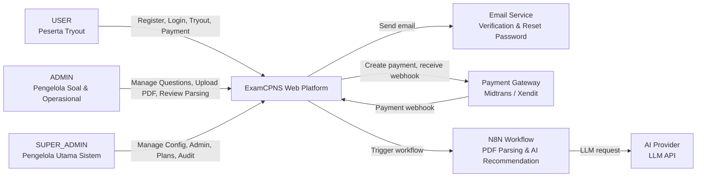

---

# 6. Container Diagram

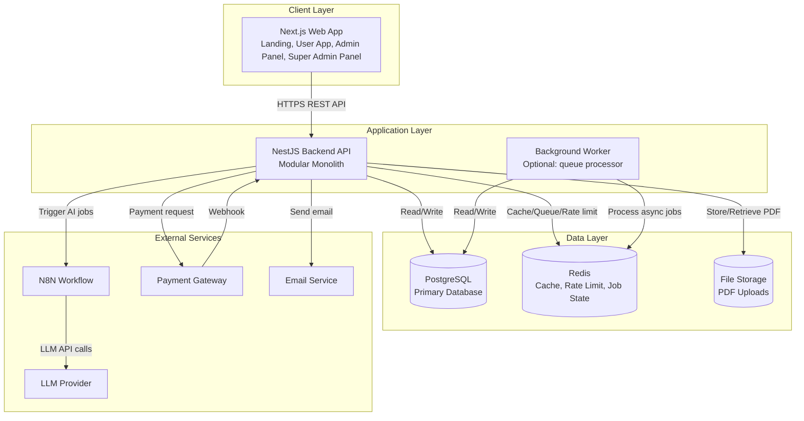

---

# 7. Backend Module Architecture


## 7.1 Module Diagram

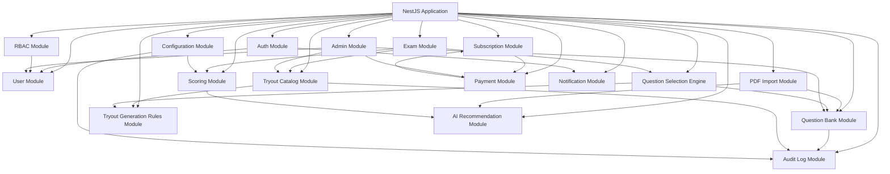

## 7.2 Module Responsibilities

| Module | Responsibility |
|---|---|
| Auth Module | Register, login, refresh token, logout, email verification, reset password. |
| RBAC Module | Role guard, permission checking, route protection. |
| User Module | User profile, user status, user listing for admin. |
| Question Bank Module | CRUD soal manual, options, metadata, soft delete, filtering. |
| PDF Import Module | Upload PDF, create batch, call AI parsing workflow, manage parsed review. |
| Exam Module | Create exam session, select questions, timer state, autosave answer, submit exam. |
| Scoring Module | Calculate TWK/TIU/TKP score, passing grade check, breakdown generation. |
| AI Recommendation Module | Build weak areas, call AI workflow, validate AI output, fallback recommendation. |
| Subscription Module | Trial creation, subscription status, access control, plan usage. |
| Payment Module | Payment transaction, payment gateway request, webhook verification, idempotency. |
| Admin Module | Admin dashboard data, monitoring user/transaction. |
| Configuration Module | Passing grade, trial rules, tryout catalog, system settings. |
| Audit Log Module | Record admin/super admin actions. |
| Notification Module | Email verification, reset password, subscription notification. |

---

# 8.

# 8.X SaaS Tryout Generation Architecture

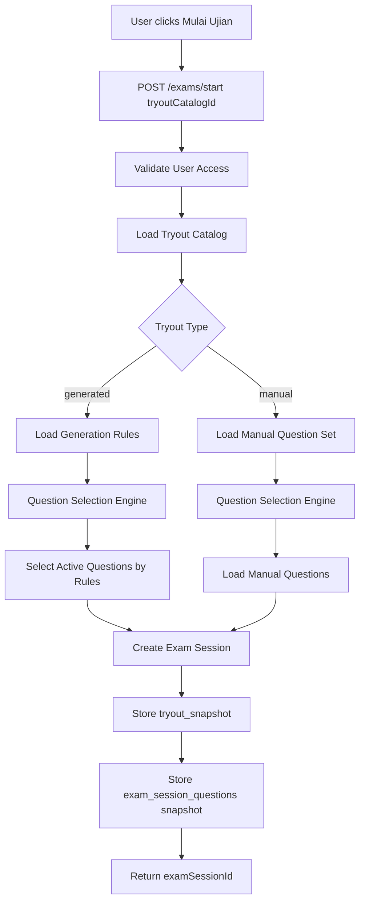

## Question Selection Engine Strategy

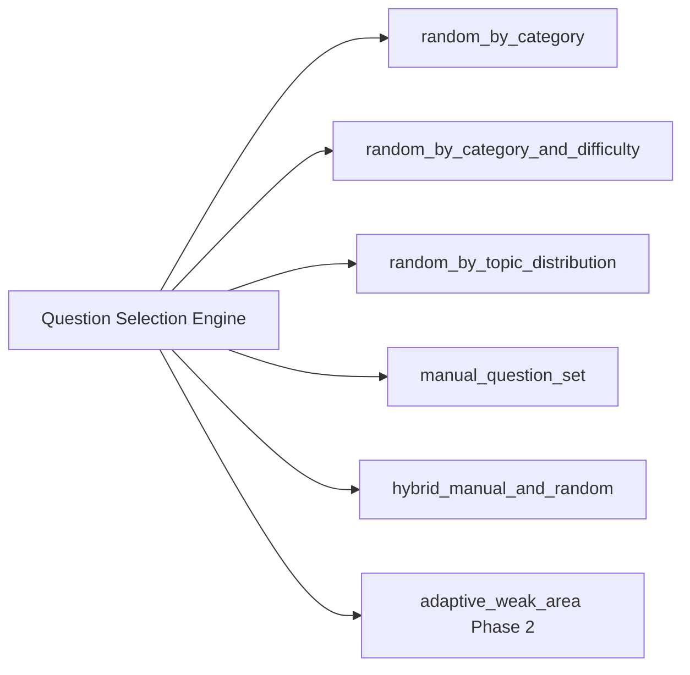

## Architecture Decision Records

### ADR-009 — Replace Simple Exam Config with Tryout Catalog

| Field | Decision |
|---|---|
| Status | Accepted |
| Context | Product is now SaaS-ready and must support multiple tryout offerings. |
| Decision | Replace simple Exam Config with Tryout Catalog + Generation Rules. |
| Consequence | More flexible product model with generated/manual tryout support. |

### ADR-010 — Introduce Question Selection Engine

| Field | Decision |
|---|---|
| Status | Accepted |
| Context | Different tryout types need different selection logic. |
| Decision | Encapsulate all question selection in Question Selection Engine. |
| Consequence | Easier to add topic distribution, manual set, hybrid, and adaptive modes. |
 Frontend Architecture

## 8.1 Frontend Areas

| Area | Routes | Description |
|---|---|---|
| Public | `/`, `/pricing`, `/login`, `/register`, `/forgot-password` | Landing, pricing, auth. |
| User App | `/app/*` | Dashboard, tryout, exam, result, history, subscription, profile. |
| Admin App | `/admin/*` | Dashboard, question bank, PDF import, user and transaction monitoring. |
| Super Admin App | `/super-admin/*` | Admin accounts, subscription plans, passing grade, trial rules, audit log. |

## 8.2 Frontend Component Groups

| Component Group | Examples |
|---|---|
| Layout | PublicLayout, AppLayout, AdminLayout, SuperAdminLayout |
| Navigation | Sidebar, Topbar, Breadcrumb, MobileNav |
| Auth | LoginForm, RegisterForm, ForgotPasswordForm |
| Dashboard | MetricCard, ScoreSummaryCard, AIRecommendationPreview, HistoryTable |
| Exam | ExamTimer, QuestionCard, OptionCard, QuestionNavigator, SubmitModal |
| Result | ScoreBreakdown, PassingGradeStatus, WeakAreaTable, AIRecommendationCard |
| Payment | PlanCard, CheckoutSummary, PaymentMethodSelector, PaymentStatusCard |
| Admin | QuestionTable, QuestionForm, PDFUploadCard, ParsedQuestionReviewCard |
| Super Admin | ConfigForm, AdminAccountTable, AuditLogTable |

## 8.3 State Management Recommendation

| State Type | Recommendation |
|---|---|
| Server state | React Query / TanStack Query |
| Form state | React Hook Form + schema validation |
| Auth state | Secure token handling + user context |
| Exam local state | Local component state + periodic/backend autosave |
| UI state | Local state or lightweight store |

---

# 9. Deployment Architecture

## 9.1 MVP Deployment View

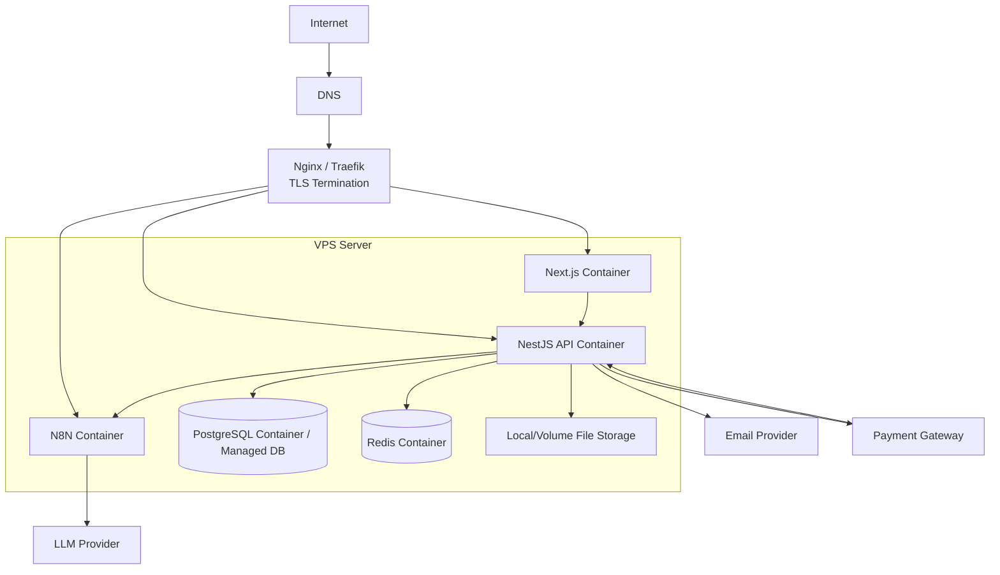

## 9.2 Environment Separation

| Environment | Purpose |
|---|---|
| Local | Developer machine, local database, local test data. |
| Staging | QA, integration testing, payment sandbox, AI sandbox/test mode. |
| Production | Live user data and real payment. |

## 9.3 Domain Recommendation

| Service | Example Domain |
|---|---|
| Web App | `https://examcpns.com` |
| API | `https://api.examcpns.com` |
| N8N | `https://n8n.examcpns.com` |
| Admin | `https://examcpns.com/admin` |
| Super Admin | `https://examcpns.com/super-admin` |

---

# 10. Core Runtime Flows

---

## 10.1 Register and Trial Creation Flow

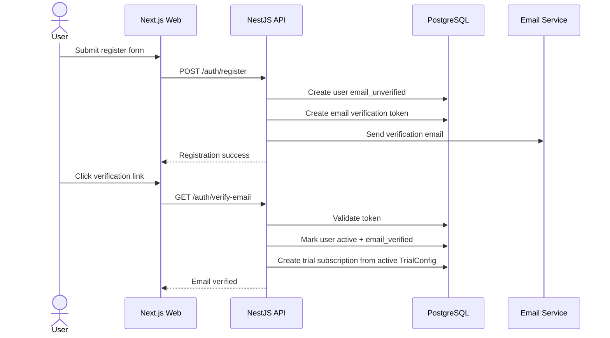

---

## 10.2 Start Exam Flow

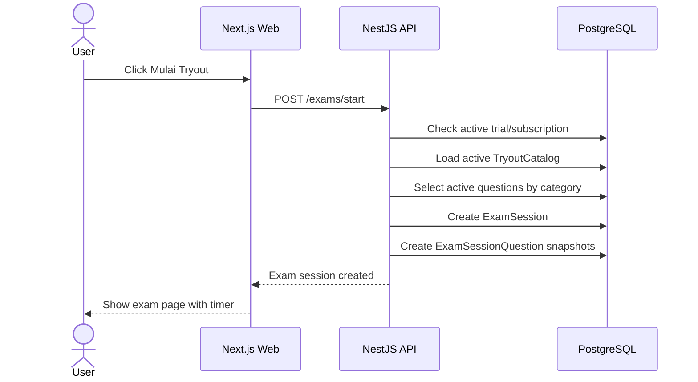

---

## 10.3 Answer Autosave Flow

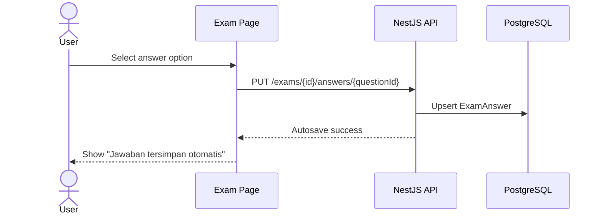

---

## 10.4 Submit, Scoring, and AI Recommendation Flow

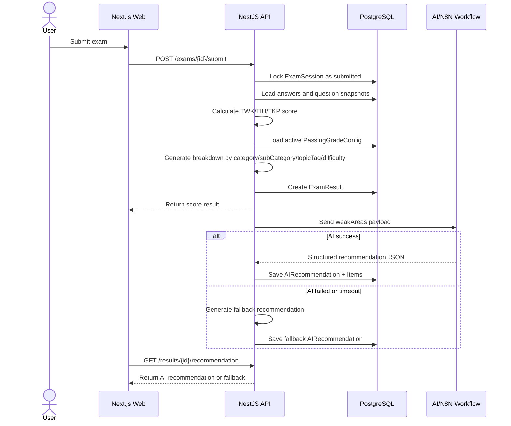

---

## 10.5 PDF Upload and Parsing Flow

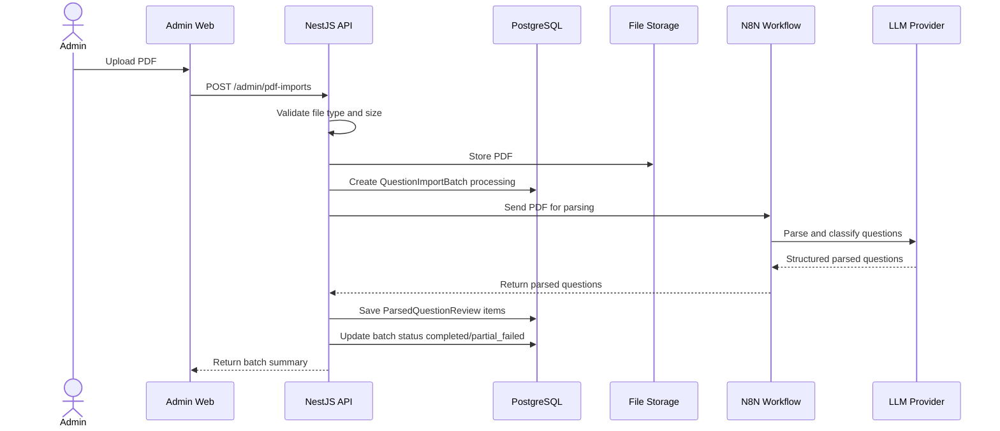

---

## 10.6 Payment Flow

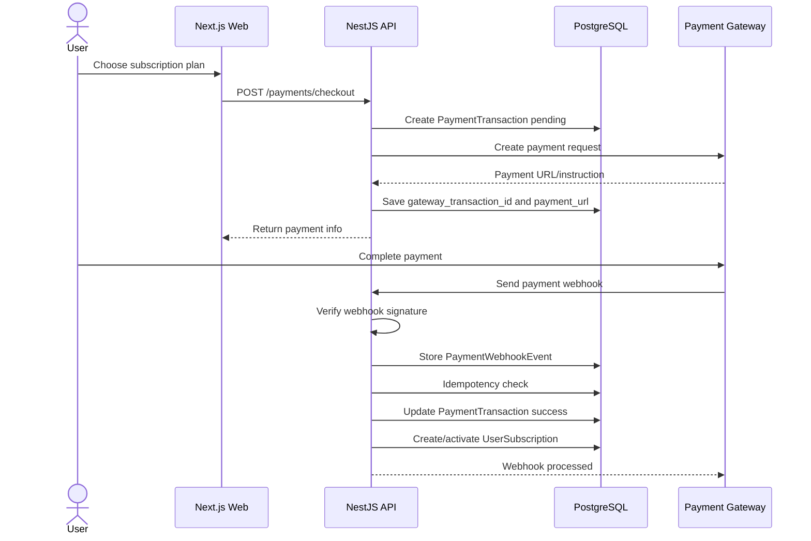

---

# 11. AI Architecture

## 11.1 AI Feature Boundaries

AI in MVP SHALL support only:

1. PDF Parsing and question classification for admin.
2. AI Recommendation after exam for user.

AI in MVP SHALL NOT support:

1. Chatbot.
2. Free-form question answering.
3. AI-generated explanation per question.
4. Learning module generation.
5. Vector database retrieval from learning materials.

## 11.2 AI Recommendation Processing Pipeline

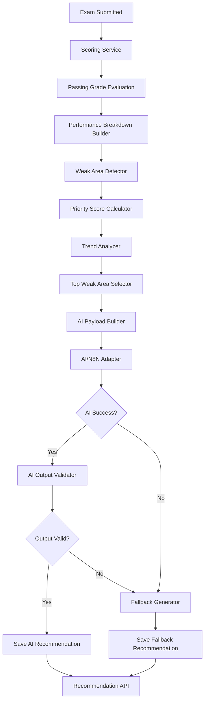

## 11.3 Recommendation Module Responsibilities

| Component | Responsibility |
|---|---|
| Performance Breakdown Builder | Group by category, subCategory, topicTag, difficulty |
| Weak Area Detector | Detect area with accuracy < 70 and totalQuestions >= 3 |
| Priority Score Calculator | Calculate priorityScore 0–100 |
| Trend Analyzer | Analyze latest 2–5 submitted exams |
| AI Payload Builder | Build minimized payload for N8N/AI |
| AI Output Validator | Validate JSON, topicTag, and business constraints |
| Fallback Generator | Generate template-based fallback |
| Persistence Handler | Save recommendation header and items |

## 11.4 Backend vs AI Responsibility

| Responsibility | Backend | AI/N8N |
|---|---|---|
| Score calculation | Yes | No |
| Passing grade evaluation | Yes | No |
| Correct/wrong detection | Yes | No |
| Weak area detection | Yes | No |
| Priority score | Yes | No |
| Trend analysis | Yes | No |
| Narrative recommendation | No | Yes |
| Output validation | Yes | No |
| Fallback generation | Yes | No |

## 11.5 AI Recommendation Input

Backend SHALL build payload from ExamResult and breakdown data. AI payload SHALL contain only selected weakAreas, not all raw answers.

```json
{
  "examResultId": "result-001",
  "score": {
    "twk": 60,
    "tiu": 95,
    "tkp": 170,
    "total": 325
  },
  "passingStatus": {
    "twkPassed": false,
    "tiuPassed": true,
    "tkpPassed": true,
    "totalPassed": true,
    "overallPassed": false
  },
  "weakAreas": [
    {
      "priority": 1,
      "priorityLevel": "HIGH",
      "priorityScore": 91,
      "category": "TWK",
      "subCategory": "Tata Negara",
      "topicTag": "Hak dan Kewajiban Warga Negara",
      "totalQuestions": 8,
      "correctAnswers": 2,
      "wrongAnswers": 6,
      "emptyAnswers": 0,
      "accuracy": 25,
      "wrongAnswerRate": 75,
      "dominantDifficulty": "medium",
      "reasonCodes": [
        "LOW_ACCURACY",
        "LOW_ACCURACY_AND_CATEGORY_NOT_PASSED"
      ],
      "trend": {
        "type": "declining",
        "last3ExamAccuracy": [35, 30, 25]
      }
    }
  ],
  "instruction": {
    "language": "id",
    "outputFormat": "json",
    "maxRecommendations": 5,
    "doNotInventTopics": true,
    "doNotActAsChatbot": true,
    "doNotGuaranteePassing": true
  }
}
```

## 11.6 AI Recommendation Output

AI workflow SHALL return structured JSON.

```json
{
  "summary": "Area terlemah Anda berada pada TWK - Tata Negara.",
  "overallAssessment": "Skor total Anda sudah cukup baik, tetapi TWK belum memenuhi passing grade sehingga perlu menjadi prioritas utama.",
  "recommendations": [
    {
      "priority": 1,
      "priorityLevel": "HIGH",
      "category": "TWK",
      "subCategory": "Tata Negara",
      "topicTag": "Hak dan Kewajiban Warga Negara",
      "reason": "Anda salah 6 dari 8 soal pada topik ini dengan akurasi 25%.",
      "suggestedFocus": [
        "Pelajari kembali konsep hak, kewajiban, dan tanggung jawab warga negara.",
        "Perkuat pemahaman pasal-pasal UUD 1945 yang berkaitan dengan warga negara."
      ]
    }
  ],
  "nextTryoutStrategy": "Targetkan akurasi TWK Tata Negara minimal 70% pada tryout berikutnya."
}
```

## 11.7 AI Output Validation

Recommendation Service SHALL validate:

| Check | Required |
|---|---|
| Valid JSON | Yes |
| Required fields exist | Yes |
| Category is TWK/TIU/TKP | Yes |
| topicTag exists in input weakAreas | Yes |
| Recommendation count <= 5 | Yes |
| No invented topic | Yes |
| No guarantee of passing | Yes |
| No chatbot-like UI/copy | Yes |

## 11.8 AI Failure Handling

| Failure Scenario | Handling |
|---|---|
| AI timeout | Save fallback recommendation based on weakAreas. |
| Invalid JSON | Attempt clean/parse once, then fallback. |
| AI provider down | Fallback and log error. |
| N8N unavailable | Fallback for recommendation; PDF import marked failed. |
| Hallucinated topic | Reject output if topic not in request payload. |

## 11.9 Fallback Recommendation

Fallback Generator SHALL produce recommendation using backend template if AI fails.

```text
Anda paling banyak salah pada {category} - {subCategory}, terutama topik {topicTag}. Dari {totalQuestions} soal, Anda menjawab salah {wrongAnswers} soal dengan akurasi {accuracy}%. Prioritaskan topik ini sebelum mengikuti tryout berikutnya.
```

## 11.10 Architecture Decision Records for AI

### ADR-006 — Backend Owns Weak Area Detection

| Field | Decision |
|---|---|
| Status | Accepted |
| Context | AI may inconsistently rank weaknesses or hallucinate topics. |
| Decision | Backend calculates weak areas, priority score, and reason codes. |
| Consequence | Recommendation remains deterministic and testable. |

### ADR-007 — AI Only Generates Narrative

| Field | Decision |
|---|---|
| Status | Accepted |
| Context | AI is useful for natural-language recommendation but should not be scoring authority. |
| Decision | AI produces summary, reason, suggestedFocus, and strategy only. |
| Consequence | Lower risk and easier validation. |

### ADR-008 — Fallback Recommendation Required

| Field | Decision |
|---|---|
| Status | Accepted |
| Context | AI/N8N/LLM can fail or timeout. |
| Decision | Backend generates fallback recommendation from weakAreas. |
| Consequence | User always receives actionable recommendation. |

# 12. Data Architecture

## 12.1 Primary Data Store

PostgreSQL stores all transactional and historical data.

Primary data domains:

| Domain | Tables |
|---|---|
| Identity | users, user_sessions, tokens |
| Question Bank | questions, question_options, question_tags |
| PDF Import | question_import_batches, parsed_question_reviews |
| Exam | exam_sessions, exam_session_questions, exam_answers, exam_results |
| AI Recommendation | ai_recommendations, ai_recommendation_items |
| Payment | subscription_plans, user_subscriptions, payment_transactions, payment_webhook_events |
| Config | passing_grade_configs, trial_configs, tryout_catalogs, system_settings |
| Audit | audit_logs |

## 12.2 Historical Integrity Strategy

ExamSessionQuestion SHALL store snapshots:

1. question text snapshot.
2. options snapshot.
3. category snapshot.
4. subCategory snapshot.
5. topicTag snapshot.
6. difficulty snapshot.

This ensures historical results remain accurate even if admin edits the question later.

## 12.3 JSONB Usage

| Field | Reason |
|---|---|
| exam_results.breakdown_json | Flexible breakdown by category/subCategory/topicTag/difficulty. |
| ai_recommendations.raw_request_payload | Debugging and traceability. |
| ai_recommendations.raw_ai_response | Debugging AI output. |
| parsed_question_reviews.raw_ai_output | Review and debugging parsing results. |
| payment_webhook_events.payload | Store full webhook payload for audit. |
| system_settings.value | Flexible key-value configuration. |

---

# 13. Security Architecture

## 13.1 Authentication

| Area | Requirement |
|---|---|
| Login | Email + password. |
| Password | Hash using bcrypt or equivalent. |
| Session | JWT access token + refresh token. |
| Refresh Token | Store only hash in database. |
| Email Verification | Required before full user access. |
| Reset Password | Token hashed and time-limited. |

## 13.2 Authorization

RBAC enforced on backend.

| Role | Access |
|---|---|
| USER | User dashboard, exam, result, history, payment, profile. |
| ADMIN | Question bank, PDF import, parsed review, user monitoring, transaction monitoring. |
| SUPER_ADMIN | Full access including admin accounts, subscription plans, passing grade, trial rules, manual activation, audit log. |

## 13.3 Payment Security

| Requirement | Description |
|---|---|
| No sensitive card data | Payment details processed by gateway. |
| Webhook signature verification | Reject invalid webhook. |
| Idempotency | Store gateway_event_id to prevent double activation. |
| Audit | Payment webhook and manual activation logged. |

## 13.4 AI Security

| Requirement | Description |
|---|---|
| Minimize payload | Do not send password, payment data, or unnecessary PII to AI. |
| Secret-based webhook | N8N webhook protected using secret header/API key. |
| Output validation | AI output validated before saving. |
| Fallback | AI failure does not block exam result. |

## 13.5 Web Security

| Threat | Mitigation |
|---|---|
| XSS | Escape user-generated content, use framework safeguards. |
| CSRF | Use secure token strategy and same-site cookies if cookie auth is used. |
| SQL Injection | Use ORM parameterized queries. |
| Brute Force | Rate limit login and reset password endpoints. |
| Unauthorized Admin Access | Backend RBAC guard. |
| File Upload Abuse | Validate PDF type, size, and store securely. |

---

# 14. Scalability Architecture

## 14.1 MVP Scalability Target

| Metric | Target |
|---|---|
| Concurrent users | Minimum 200 CCU |
| API p95 latency | < 500ms excluding external AI/payment calls |
| Scoring latency | < 3 seconds |
| AI Recommendation latency | < 30 seconds or fallback/processing state |
| Uptime | ≥ 99% monthly |

## 14.2 Scaling Strategy

| Layer | MVP | Future Scaling |
|---|---|---|
| Frontend | Single Next.js container | CDN/static optimization, multiple replicas |
| Backend | Single NestJS container | Horizontal replicas behind load balancer |
| Database | Single PostgreSQL instance | Managed DB, read replicas, tuning indexes |
| Redis | Single instance | Managed Redis / Redis cluster |
| AI Workflow | Single N8N instance | Queue-based async workers / separate AI service |
| File Storage | Local volume | Object storage such as S3-compatible storage |

## 14.3 Performance Considerations

1. Use indexes for active question selection and user history.
2. Cache system settings and active configs.
3. Avoid synchronous AI call blocking score result.
4. Use pagination for admin tables.
5. Use batch insert for parsed questions.
6. Use transaction for submit/scoring to avoid partial result.

---

# 15. Reliability & Resilience

## 15.1 Critical Reliability Requirements

| Area | Requirement |
|---|---|
| Exam Autosave | Every answer change persisted immediately. |
| Submit Idempotency | Double submit returns existing result. |
| Payment Webhook | Duplicate webhook does not double activate. |
| AI Recommendation | Failure falls back to statistical recommendation. |
| PDF Parsing | Failure marks batch failed, does not corrupt question bank. |
| Historical Result | Snapshots preserve exam data. |

## 15.2 Transaction Boundaries

| Operation | Transaction Required | Notes |
|---|---|---|
| Create exam session | Yes | Create session and session questions atomically. |
| Autosave answer | Yes | Upsert single answer. |
| Submit exam | Yes | Lock session, calculate score, create result. |
| Approve parsed question | Yes | Create question and options, update parsed review. |
| Payment success webhook | Yes | Update transaction, create subscription, log webhook. |
| Manual activation | Yes | Create subscription and audit log. |

---

# 16. Observability & Monitoring

## 16.1 Logs

| Log Type | Examples |
|---|---|
| Application logs | API errors, validation failures, scoring errors. |
| Security logs | Failed login attempts, invalid webhook signatures. |
| Payment logs | Webhook received, payment success/failure. |
| AI logs | AI timeout, invalid JSON, fallback used. |
| PDF logs | Batch processing status, parsing failure. |
| Audit logs | Admin actions, config changes, manual activation. |

## 16.2 Metrics

| Metric | Purpose |
|---|---|
| Active users | Product monitoring. |
| Exam completion rate | Core flow health. |
| Average scoring time | Performance health. |
| AI recommendation success rate | AI feature quality. |
| PDF parsing success rate | Admin productivity. |
| Payment success rate | Revenue health. |
| Webhook duplicate count | Payment reliability. |
| API error rate | System stability. |

## 16.3 Alerts

| Alert | Trigger |
|---|---|
| Payment webhook invalid spike | High invalid signature count. |
| AI failure spike | AI success rate drops below threshold. |
| PDF parsing failure spike | Many failed batches. |
| API error spike | 5xx error rate exceeds threshold. |
| Database backup failed | Backup job failure. |

---

# 17. Configuration Management

## 17.1 Configurable Items

| Config | Storage | Managed By |
|---|---|---|
| Passing grade | passing_grade_configs | SUPER_ADMIN |
| Trial rules | trial_configs | SUPER_ADMIN |
| Exam composition and duration | tryout_catalogs | SUPER_ADMIN |
| PDF max upload size | system_settings / env | SUPER_ADMIN / DevOps |
| AI recommendation timeout | system_settings / env | DevOps/SUPER_ADMIN |
| Payment gateway keys | environment variables | DevOps |
| Email provider credentials | environment variables | DevOps |
| N8N webhook secret | environment variables | DevOps |

## 17.2 Environment Variables

| Key | Purpose |
|---|---|
| DATABASE_URL | PostgreSQL connection string |
| REDIS_URL | Redis connection string |
| JWT_ACCESS_SECRET | Access token signing |
| JWT_REFRESH_SECRET | Refresh token signing |
| SMTP_HOST | Email host |
| SMTP_USER | Email username |
| SMTP_PASSWORD | Email password |
| PAYMENT_GATEWAY_KEY | Payment provider key |
| PAYMENT_WEBHOOK_SECRET | Webhook verification secret |
| N8N_WEBHOOK_URL | N8N base URL |
| N8N_WEBHOOK_SECRET | AI workflow authentication |
| LLM_API_KEY | LLM provider API key, preferably stored in N8N credentials |

---

# 18. API Boundary Overview

## 18.1 Public APIs

| Domain | Examples |
|---|---|
| Auth | Register, login, verify email, reset password |
| Public Product | Pricing, active plans |

## 18.2 User APIs

| Domain | Examples |
|---|---|
| Dashboard | Summary, trial/subscription status, last recommendation |
| Exam | Start, get session, autosave answer, submit |
| Result | Get result, get recommendation, history |
| Subscription | Checkout, payment status, current subscription |

## 18.3 Admin APIs

| Domain | Examples |
|---|---|
| Question Bank | CRUD questions, filter, soft delete |
| PDF Import | Upload PDF, batch detail, review parsed question |
| Monitoring | User list, transaction list |

## 18.4 Super Admin APIs

| Domain | Examples |
|---|---|
| Admin Management | Create/deactivate admin |
| Configuration | Passing grade, trial rules, tryout catalog |
| Subscription Plans | CRUD/deactivate plan |
| Manual Activation | Activate subscription manually |
| Audit | Audit log list/detail |

## 18.5 Webhook APIs

| Domain | Examples |
|---|---|
| Payment | Payment gateway webhook |
| AI/N8N | Optional callback if async processing is used |

---

# 19. Deployment & DevOps Recommendation

## 19.1 Docker Compose Services

| Service | Description |
|---|---|
| web | Next.js frontend |
| api | NestJS backend |
| postgres | PostgreSQL database |
| redis | Redis cache/queue |
| n8n | AI workflow orchestration |
| nginx | Reverse proxy and TLS |

## 19.2 Backup Strategy

| Resource | Strategy |
|---|---|
| PostgreSQL | Daily automated backup, 30-day retention. |
| PDF uploads | Daily file backup or object storage lifecycle. |
| N8N workflows | Export workflow JSON on change. |
| Environment secrets | Secure password manager, not committed to repository. |

## 19.3 CI/CD MVP Recommendation

1. Push to main branch.
2. Run lint and tests.
3. Build Docker images.
4. Deploy to staging.
5. Run smoke tests.
6. Manual approval for production.
7. Deploy production.
8. Run post-deploy health check.

---

# 20. Architecture Risks & Mitigations

| ID | Risk | Impact | Mitigation |
|---|---|---|---|
| AR-001 | MVP scope terlalu luas | Delivery delay | Modular delivery and prioritize core flow. |
| AR-002 | AI recommendation terlalu lambat | Poor UX | Do not block score result; show processing/fallback. |
| AR-003 | N8N down | PDF/AI unavailable | Fallback for AI recommendation; retry/failed state for PDF. |
| AR-004 | Payment webhook duplicate | Double activation | Idempotency using gateway_event_id and transaction status. |
| AR-005 | Question edits corrupt history | Wrong historical review | Store snapshots in ExamSessionQuestion. |
| AR-006 | PDF parsing low quality | Bad question bank | Mandatory admin review before activation. |
| AR-007 | Database slow as data grows | Poor performance | Indexing, pagination, query optimization. |
| AR-008 | Secrets leaked | Security incident | Use env vars/credential vault, never commit secrets. |

---

# 21. Architecture Decision Records

## ADR-001 — Use Modular Monolith for MVP

| Field | Decision |
|---|---|
| Status | Accepted |
| Context | MVP has many modules but limited need for independent scaling at launch. |
| Decision | Use NestJS modular monolith. |
| Consequence | Faster delivery, simpler deployment, easier debugging. Future extraction to services remains possible. |

## ADR-002 — Store Question Snapshot in Exam Session

| Field | Decision |
|---|---|
| Status | Accepted |
| Context | Admin may edit questions after users have completed exams. |
| Decision | Store question and option snapshots in ExamSessionQuestion. |
| Consequence | Historical results remain consistent. Additional storage usage is acceptable. |

## ADR-003 — AI Recommendation Must Not Block Scoring

| Field | Decision |
|---|---|
| Status | Accepted |
| Context | AI provider may be slow or fail. |
| Decision | Scoring is synchronous; AI recommendation can be async or fallback. |
| Consequence | User always sees exam result even if AI fails. |

## ADR-004 — Defer Vector Database for MVP

| Field | Decision |
|---|---|
| Status | Accepted |
| Context | Product is not a full learning platform. |
| Decision | MVP AI Recommendation uses exam result and question metadata, not learning material retrieval. |
| Consequence | Lower complexity. Vector DB can be added in Phase 2 if learning material support is needed. |

## ADR-005 — Payment Webhook Event Storage

| Field | Decision |
|---|---|
| Status | Accepted |
| Context | Payment gateways may send duplicate webhooks. |
| Decision | Store webhook events with unique gateway_event_id. |
| Consequence | Enables idempotency, debugging, and audit trail. |

---

# 22. Quality Attribute Validation

| Attribute | Validation |
|---|---|
| Performance | Exam scoring is local/backend computation and should complete under 3 seconds. |
| Reliability | Autosave and submit transaction prevent data loss. |
| Security | RBAC, webhook verification, password hashing, and secret-based AI webhook are defined. |
| Maintainability | Backend modules are separated by domain. |
| Scalability | Stateless API and Redis support future horizontal scaling. |
| Usability | Frontend architecture supports dedicated user/admin/super admin flows. |
| Auditability | Audit logs and payment webhook events preserve critical action history. |

---

# 23. Next Recommended Document

Dokumen berikutnya yang direkomendasikan:

1. API Specification.
2. Prisma Schema Draft.
3. Product Backlog / User Stories.
4. Test Scenario & Acceptance Test Plan.
5. Deployment Runbook.

---

*Document generated: 14 Mei 2026 | Version 1.1 | Status: Draft*

