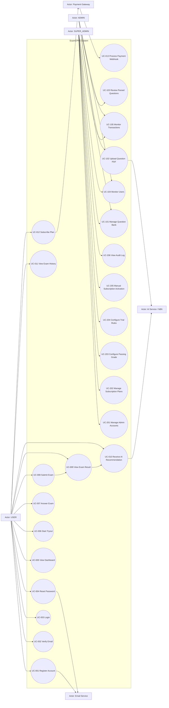

# Use Case Specification
# ExamCPNS — Platform Tryout CPNS Berbayar dengan AI Recommendation

---

| Field | Value |
|---|---|
| Document | Use Case Specification |
| Product | ExamCPNS — Platform Tryout CPNS Berbayar |
| Version | 1.3 |
| Date | 14 Mei 2026 |
| Author | System Analyst Pro |
| Status | Draft |
| Based On | BRD/PRD/SRS ExamCPNS v1.1 |

## Revision History

| Version | Date | Author | Description |
|---|---|---|---|
| 1.0 | 13 Mei 2026 | System Analyst | Initial PRD and N8N workflow draft |
| 1.1 | 14 Mei 2026 | System Analyst Pro | Use Case Specification aligned with MVP scope: paid tryout platform, AI Recommendation after exam, PDF Parsing AI, and roles SUPER_ADMIN, ADMIN, USER |
| 1.2 | 14 Mei 2026 | System Analyst Pro | Integrated expanded UC-010 AI Recommendation flow with fallback and validation. |
| 1.3 | 14 Mei 2026 | System Analyst Pro | Merged SaaS-ready Configurable Tryout Generation directly into existing sections; replaced simple Tryout Catalog with Tryout Catalog, Generation Rules, Manual Question Set, Question Selection Engine, and updated start exam flow. |

---

# 1. Overview

Dokumen ini mendefinisikan use case utama untuk ExamCPNS v1.1. Use case disusun berdasarkan aktor sistem dan scope MVP yang sudah dikonfirmasi.

ExamCPNS adalah platform tryout CPNS berbayar dengan fitur AI Recommendation setelah ujian. Sistem tidak menyediakan chatbot AI, learning module, atau pembahasan otomatis per soal pada MVP.

---

# 2. Actors

| Actor ID | Actor | Description |
|---|---|---|
| ACT-001 | USER | Peserta tryout CPNS yang menggunakan platform untuk daftar, login, trial, berlangganan, mengikuti ujian, melihat hasil, dan menerima rekomendasi AI. |
| ACT-002 | ADMIN | Pengelola operasional yang mengelola bank soal, upload PDF, review hasil parsing, melihat user, transaksi, dan monitoring platform. |
| ACT-003 | SUPER_ADMIN | Pengelola utama sistem dengan akses penuh terhadap admin, konfigurasi sistem, subscription plan, passing grade, payment, dan audit log. |
| ACT-004 | Payment Gateway | Sistem eksternal yang memproses pembayaran dan mengirim webhook status transaksi. |
| ACT-005 | AI Service / N8N Workflow | Sistem eksternal/internal workflow yang memproses PDF parsing dan AI Recommendation setelah ujian. |
| ACT-006 | Email Service | Sistem eksternal untuk mengirim email verifikasi, reset password, dan notifikasi. |

---

# 3. Use Case Diagram

---

# 4. Use Case List

| Use Case ID | Use Case Name | Primary Actor | Priority |
|---|---|---|---|
| UC-001 | Register Account | USER | Critical |
| UC-002 | Verify Email | USER | Critical |
| UC-003 | Login | USER / ADMIN / SUPER_ADMIN | Critical |
| UC-004 | Reset Password | USER / ADMIN / SUPER_ADMIN | High |
| UC-005 | View Dashboard | USER | Critical |
| UC-006 | Start Tryout | USER | Critical |
| UC-007 | Answer Exam | USER | Critical |
| UC-008 | Submit Exam | USER | Critical |
| UC-009 | View Exam Result | USER | Critical |
| UC-010 | Receive AI Recommendation | USER | Critical |
| UC-011 | View Exam History | USER | High |
| UC-012 | Subscribe Plan | USER | Critical |
| UC-013 | Process Payment Webhook | Payment Gateway | Critical |
| UC-101 | Manage Question Bank | ADMIN / SUPER_ADMIN | Critical |
| UC-102 | Upload Question PDF | ADMIN / SUPER_ADMIN | Critical |
| UC-103 | Review Parsed Questions | ADMIN / SUPER_ADMIN | Critical |
| UC-104 | Monitor Users | ADMIN / SUPER_ADMIN | High |
| UC-105 | Monitor Transactions | ADMIN / SUPER_ADMIN | High |
| UC-201 | Manage Admin Accounts | SUPER_ADMIN | Critical |
| UC-202 | Manage Subscription Plans | SUPER_ADMIN | Critical |
| UC-203 | Configure Passing Grade | SUPER_ADMIN | Critical |
| UC-204 | Configure Trial Rules | SUPER_ADMIN | High |
| UC-205 | Manual Subscription Activation | SUPER_ADMIN | High |
| UC-206 | View Audit Log | SUPER_ADMIN | Medium |
| UC-207 | Manage Tryout Catalog | SUPER_ADMIN | Critical |
| UC-208 | Configure Tryout Generation Rules | SUPER_ADMIN | Critical |
| UC-209 | Manage Manual Question Set | ADMIN / SUPER_ADMIN | High |
| UC-210 | Run Tryout Availability Check | SUPER_ADMIN | High |
| UC-106 | Manage Tryout Drafts | ADMIN | High |

---

# 5. USER Use Case Specifications

---

## UC-001 — Register Account

| Field | Description |
|---|---|
| Use Case ID | UC-001 |
| Use Case Name | Register Account |
| Primary Actor | USER |
| Supporting Actor | Email Service |
| Priority | Critical |
| Trigger | User memilih tombol daftar pada landing page. |

### Preconditions

1. User belum memiliki akun dengan email yang sama.
2. Sistem tersedia.

### Main Flow

1. User membuka halaman registrasi.
2. User mengisi nama lengkap, email, nomor telepon, dan password.
3. User mengirim form registrasi.
4. Sistem memvalidasi format email, kekuatan password, dan keunikan email.
5. Sistem membuat akun baru dengan status `email_unverified`.
6. Sistem mengirim email verification link melalui Email Service.
7. Sistem menampilkan pesan bahwa user harus melakukan verifikasi email.

### Alternative Flows

#### AF-001A — Email Sudah Terdaftar

1. Sistem mendeteksi email sudah digunakan.
2. Sistem menolak registrasi.
3. Sistem menampilkan pesan bahwa email sudah terdaftar.

#### AF-001B — Password Tidak Memenuhi Ketentuan

1. Sistem mendeteksi password tidak valid.
2. Sistem menampilkan pesan validasi password.
3. User memperbaiki password dan submit ulang.

### Postconditions

1. Akun user dibuat dengan status `email_unverified`.
2. Email verification dikirim.

### Business Rules

| Rule ID | Description |
|---|---|
| BR-001 | User baru harus melakukan verifikasi email sebelum login penuh. |
| BR-002 | Satu email hanya boleh digunakan oleh satu akun aktif. |

### Acceptance Criteria

| ID | Criteria |
|---|---|
| AC-001 | User dengan data valid berhasil terdaftar. |
| AC-002 | Email verification dikirim setelah registrasi. |
| AC-003 | User tidak dapat mendaftar dengan email yang sudah digunakan. |

---

## UC-002 — Verify Email

| Field | Description |
|---|---|
| Use Case ID | UC-002 |
| Use Case Name | Verify Email |
| Primary Actor | USER |
| Supporting Actor | Email Service |
| Priority | Critical |
| Trigger | User mengklik verification link dari email. |

### Preconditions

1. User sudah melakukan registrasi.
2. Verification token masih valid.

### Main Flow

1. User membuka verification link.
2. Sistem memvalidasi token.
3. Sistem mengubah status akun menjadi `active`.
4. Sistem mengaktifkan trial untuk user baru.
5. Sistem mengarahkan user ke halaman login.

### Alternative Flows

#### AF-002A — Token Expired

1. Sistem mendeteksi token expired.
2. Sistem menampilkan pesan token tidak valid atau kedaluwarsa.
3. User dapat meminta pengiriman ulang verification email.

### Postconditions

1. Akun user aktif.
2. Trial user aktif.

### Acceptance Criteria

| ID | Criteria |
|---|---|
| AC-001 | Token valid mengaktifkan akun user. |
| AC-002 | Trial otomatis dibuat setelah email verified. |
| AC-003 | Token expired tidak dapat digunakan. |

---

## UC-003 — Login

| Field | Description |
|---|---|
| Use Case ID | UC-003 |
| Use Case Name | Login |
| Primary Actor | USER / ADMIN / SUPER_ADMIN |
| Supporting Actor | None |
| Priority | Critical |
| Trigger | Actor membuka halaman login. |

### Preconditions

1. Actor memiliki akun aktif.
2. Actor mengetahui email dan password.

### Main Flow

1. Actor membuka halaman login.
2. Actor memasukkan email dan password.
3. Sistem memvalidasi kredensial.
4. Sistem membuat access token dan refresh token.
5. Sistem mengarahkan actor ke dashboard sesuai role.

### Alternative Flows

#### AF-003A — Kredensial Salah

1. Sistem menolak login.
2. Sistem menampilkan pesan email atau password salah.

#### AF-003B — Email Belum Diverifikasi

1. Sistem mendeteksi akun belum verified.
2. Sistem menolak login penuh.
3. Sistem menampilkan instruksi verifikasi email.

#### AF-003C — Akun Dinonaktifkan

1. Sistem mendeteksi akun inactive/suspended.
2. Sistem menolak login.
3. Sistem menampilkan pesan akun tidak aktif.

### Postconditions

1. Actor berhasil masuk ke sistem sesuai role.
2. Session aktif tercatat.

### Acceptance Criteria

| ID | Criteria |
|---|---|
| AC-001 | Actor dengan kredensial valid dapat login. |
| AC-002 | Actor diarahkan ke dashboard sesuai role. |
| AC-003 | Actor tanpa email verified tidak dapat login penuh. |

---

## UC-004 — Reset Password

| Field | Description |
|---|---|
| Use Case ID | UC-004 |
| Use Case Name | Reset Password |
| Primary Actor | USER / ADMIN / SUPER_ADMIN |
| Supporting Actor | Email Service |
| Priority | High |
| Trigger | Actor memilih menu lupa password. |

### Preconditions

1. Actor memiliki akun terdaftar.
2. Email service tersedia.

### Main Flow

1. Actor membuka halaman forgot password.
2. Actor memasukkan email.
3. Sistem membuat reset token.
4. Sistem mengirim link reset password ke email.
5. Actor membuka link reset.
6. Actor memasukkan password baru.
7. Sistem memvalidasi password baru.
8. Sistem memperbarui password.
9. Sistem menampilkan pesan reset password berhasil.

### Alternative Flows

#### AF-004A — Email Tidak Ditemukan

1. Sistem tetap menampilkan pesan generik untuk alasan keamanan.
2. Sistem tidak mengirim email reset.

#### AF-004B — Token Expired

1. Sistem menolak reset password.
2. Sistem meminta actor membuat permintaan reset baru.

### Postconditions

1. Password actor diperbarui.
2. Token reset tidak dapat digunakan kembali.

### Acceptance Criteria

| ID | Criteria |
|---|---|
| AC-001 | Reset token valid dapat digunakan untuk mengganti password. |
| AC-002 | Token expired tidak dapat digunakan. |
| AC-003 | Password baru harus memenuhi policy keamanan. |

---

## UC-005 — View Dashboard

| Field | Description |
|---|---|
| Use Case ID | UC-005 |
| Use Case Name | View Dashboard |
| Primary Actor | USER |
| Supporting Actor | None |
| Priority | Critical |
| Trigger | User berhasil login. |

### Preconditions

1. User sudah login.
2. User memiliki role USER.

### Main Flow

1. User membuka dashboard.
2. Sistem mengambil status trial/subscription.
3. Sistem mengambil ringkasan riwayat ujian.
4. Sistem menampilkan CTA mulai tryout jika akses aktif.
5. Sistem menampilkan paywall/upgrade prompt jika akses tidak aktif.
6. Sistem menampilkan rekomendasi terakhir jika tersedia.

### Alternative Flows

#### AF-005A — Belum Pernah Ujian

1. Sistem menampilkan empty state.
2. Sistem menampilkan CTA mulai tryout pertama.

#### AF-005B — Subscription Expired

1. Sistem menampilkan status expired.
2. Sistem menampilkan CTA berlangganan.

### Postconditions

1. User melihat status akses dan ringkasan aktivitas.

### Acceptance Criteria

| ID | Criteria |
|---|---|
| AC-001 | Dashboard menampilkan status trial/subscription. |
| AC-002 | Dashboard menampilkan CTA sesuai status akses. |
| AC-003 | Dashboard menampilkan riwayat atau empty state. |

---

## UC-006 — Start Tryout from Catalog

| Field | Description |
|---|---|
| Use Case ID | UC-006 |
| Use Case Name | Start Tryout from Catalog |
| Primary Actor | USER |
| Supporting Services | TryoutService, AccessService, QuestionSelectionEngine, ExamService |
| Priority | Critical |
| Trigger | User klik tombol `Mulai Ujian` pada Tryout Catalog card. |

### Preconditions

1. User sudah login.
2. Tryout Catalog status = `published`.
3. Tryout Catalog `is_public=true`.
4. User memiliki akses sesuai `accessType`.
5. Tryout memiliki rules/manual set yang valid.
6. Jumlah soal aktif mencukupi jika tryout generated.

### Main Flow

1. User membuka halaman `Tryout Tersedia`.
2. Sistem menampilkan daftar Tryout Catalog yang published dan sesuai akses user.
3. User memilih tryout.
4. User klik `Mulai Ujian`.
5. Frontend mengirim `POST /exams/start` dengan `tryoutCatalogId`.
6. Backend memvalidasi user access.
7. Backend memuat Tryout Catalog.
8. Backend memanggil Question Selection Engine.
9. Jika tryout generated, QSE memilih soal berdasarkan Generation Rules.
10. Jika tryout manual, QSE mengambil soal dari Manual Question Set.
11. Backend membuat Exam Session.
12. Backend menyimpan `tryout_snapshot`.
13. Backend menyimpan `exam_session_questions` sebagai snapshot.
14. Backend mengembalikan `examSessionId`.
15. Frontend mengarahkan user ke Exam Room.

### Alternative Flows

#### AF-006A — Access Tidak Valid

1. Backend mendeteksi user tidak memiliki akses.
2. Sistem mengembalikan HTTP 403.
3. Frontend menampilkan CTA Upgrade.

#### AF-006B — Tryout Not Ready

1. Backend mendeteksi soal aktif tidak mencukupi.
2. Sistem mengembalikan `TRYOUT_NOT_READY`.
3. Frontend menampilkan pesan tryout belum tersedia.

#### AF-006C — Active Session Exists

1. Backend mendeteksi user memiliki session `in_progress`.
2. Sistem mengembalikan `ACTIVE_SESSION_EXISTS`.
3. Frontend menampilkan opsi resume exam.

### Postconditions

1. Exam Session dibuat.
2. Soal terpilih dikunci dalam `exam_session_questions`.
3. Refresh halaman tidak random ulang.

## UC-007 — Answer Exam

| Field | Description |
|---|---|
| Use Case ID | UC-007 |
| Use Case Name | Answer Exam |
| Primary Actor | USER |
| Supporting Actor | None |
| Priority | Critical |
| Trigger | User berada pada halaman ujian. |

### Preconditions

1. User memiliki exam session berstatus `in_progress`.
2. Timer belum habis.

### Main Flow

1. User membaca soal.
2. User memilih salah satu opsi jawaban.
3. Sistem menyimpan jawaban secara otomatis.
4. User berpindah ke soal berikutnya atau sebelumnya.
5. Sistem menampilkan status soal pada panel navigasi.
6. User dapat menandai soal sebagai ragu-ragu.

### Alternative Flows

#### AF-007A — Koneksi Terputus

1. Sistem telah menyimpan jawaban terakhir melalui autosave.
2. User reconnect.
3. Sistem memuat kembali sesi ujian aktif.

#### AF-007B — User Berpindah Tab

1. Sistem mendeteksi tab switch event.
2. Sistem mencatat event pada exam integrity log.
3. Sistem dapat menampilkan warning kepada user.

### Postconditions

1. Jawaban user tersimpan.
2. Status soal diperbarui.

### Acceptance Criteria

| ID | Criteria |
|---|---|
| AC-001 | Jawaban tersimpan setiap kali user memilih opsi. |
| AC-002 | User dapat navigasi tanpa kehilangan jawaban. |
| AC-003 | User dapat menandai soal ragu-ragu. |

---

## UC-008 — Submit Exam

| Field | Description |
|---|---|
| Use Case ID | UC-008 |
| Use Case Name | Submit Exam |
| Primary Actor | USER |
| Supporting Actor | AI Service / N8N Workflow |
| Priority | Critical |
| Trigger | User klik submit atau timer habis. |

### Preconditions

1. User memiliki exam session berstatus `in_progress`.
2. Exam belum pernah disubmit.

### Main Flow

1. User klik submit.
2. Sistem menampilkan dialog konfirmasi.
3. User mengkonfirmasi submit.
4. Sistem mengunci exam session.
5. Sistem menghitung skor TWK, TIU, TKP, dan total.
6. Sistem mengevaluasi passing grade.
7. Sistem membuat breakdown performa.
8. Sistem menyimpan exam result.
9. Sistem memicu AI Recommendation workflow.
10. Sistem mengarahkan user ke result page.

### Alternative Flows

#### AF-008A — Timer Habis

1. Sistem mendeteksi timer habis.
2. Sistem melakukan auto-submit.
3. Sistem menghitung skor dengan jawaban yang sudah tersimpan.
4. Jawaban kosong diberi skor 0.

#### AF-008B — Submit Ganda

1. Sistem mendeteksi exam sudah submitted.
2. Sistem menolak submit kedua.
3. Sistem mengembalikan result yang sudah ada.

#### AF-008C — AI Workflow Gagal

1. Sistem tetap menampilkan hasil skor.
2. Sistem membuat fallback recommendation berbasis statistik.
3. Sistem menyimpan error log AI.

### Postconditions

1. Exam session berstatus `submitted`.
2. Exam result tersimpan.
3. AI Recommendation atau fallback dibuat.

### Acceptance Criteria

| ID | Criteria |
|---|---|
| AC-001 | Manual submit mengunci sesi ujian. |
| AC-002 | Auto-submit berjalan saat waktu habis. |
| AC-003 | Skor dihitung maksimal 3 detik setelah submit. |
| AC-004 | AI Recommendation diproses tanpa memblokir hasil skor. |

---

## UC-009 — View Exam Result

| Field | Description |
|---|---|
| Use Case ID | UC-009 |
| Use Case Name | View Exam Result |
| Primary Actor | USER |
| Supporting Actor | None |
| Priority | Critical |
| Trigger | User selesai submit ujian atau membuka history detail. |

### Preconditions

1. Exam result sudah tersedia.
2. User adalah pemilik exam result.

### Main Flow

1. User membuka result page.
2. Sistem menampilkan skor TWK, TIU, TKP, dan total.
3. Sistem menampilkan status passing grade.
4. Sistem menampilkan breakdown performa per kategori, sub-kategori, topicTag, dan difficulty.
5. Sistem menampilkan review jawaban benar/salah.
6. Sistem menampilkan AI Recommendation jika sudah tersedia.

### Alternative Flows

#### AF-009A — AI Recommendation Masih Diproses

1. Sistem menampilkan status rekomendasi sedang diproses.
2. Sistem memperbarui tampilan ketika rekomendasi tersedia.

#### AF-009B — AI Recommendation Gagal

1. Sistem menampilkan fallback recommendation berbasis statistik.
2. Sistem tidak menghapus hasil skor.

### Postconditions

1. User memahami skor dan area kelemahan.

### Acceptance Criteria

| ID | Criteria |
|---|---|
| AC-001 | Result page menampilkan skor lengkap. |
| AC-002 | Result page menampilkan breakdown performa. |
| AC-003 | Result page menampilkan AI Recommendation atau fallback. |

---

## UC-010 — Receive AI Recommendation

| Field | Description |
|---|---|
| Use Case ID | UC-010 |
| Use Case Name | Receive AI Recommendation |
| Primary Actor | USER |
| Supporting Actor | AI Service / N8N Workflow |
| Priority | Critical |
| Trigger | User menyelesaikan ujian dan ExamResult berhasil dibuat. |

### Preconditions

1. User sudah submit exam.
2. ExamResult sudah berhasil dibuat.
3. Performance breakdown tersedia.
4. Soal pada exam memiliki category, subCategory, topicTag, dan difficulty.
5. AI Recommendation belum selesai dibuat untuk ExamResult tersebut, kecuali regenerate dilakukan oleh ADMIN/SUPER_ADMIN.

### Main Flow

1. User submit exam.
2. Sistem mengunci exam session.
3. Sistem menghitung skor TWK, TIU, TKP, dan total.
4. Sistem mengevaluasi passing grade.
5. Sistem membuat performance breakdown berdasarkan category, subCategory, topicTag, dan difficulty.
6. Sistem menghitung accuracy dan wrongAnswerRate.
7. Sistem mendeteksi weak areas dengan rule `accuracy < 70` dan `totalQuestions >= 3`.
8. Sistem menghitung priorityScore.
9. Sistem menetapkan priorityLevel dan reasonCodes.
10. Sistem menganalisis trend dari histori ujian jika tersedia.
11. Sistem memilih top 3–5 weak areas.
12. Sistem mengirim payload ringkas ke AI/N8N.
13. AI/N8N menghasilkan recommendation JSON.
14. Sistem memvalidasi output AI.
15. Sistem menyimpan AIRecommendation dan AIRecommendationItems.
16. Sistem menampilkan rekomendasi pada Result Page.
17. Sistem menyimpan rekomendasi agar dapat muncul di Dashboard dan Exam History Detail.

### Alternative Flows

#### AF-010A — AI Recommendation Masih Diproses

1. User membuka result page sebelum AI selesai.
2. Sistem menampilkan status `processing`.
3. UI menampilkan pesan “AI sedang menganalisis pola jawaban kamu.”
4. Setelah selesai, user dapat refresh atau UI melakukan polling.

#### AF-010B — AI Timeout atau Gagal

1. AI/N8N tidak merespons dalam batas waktu.
2. Sistem membuat fallback recommendation berdasarkan weakAreas.
3. Sistem menyimpan recommendation dengan `isFallback = true`.
4. User tetap melihat rekomendasi berbasis statistik.

#### AF-010C — AI Output Invalid

1. AI mengembalikan JSON invalid atau topicTag di luar payload.
2. Sistem menolak output.
3. Sistem membuat fallback recommendation.
4. Sistem mencatat error_message untuk debugging.

#### AF-010D — Tidak Ada Weak Area Signifikan

1. Sistem tidak menemukan area dengan accuracy < 70 dan totalQuestions >= 3.
2. Sistem membuat positive maintenance recommendation.
3. User mendapat saran menjaga performa dan memperbaiki area minor.

### Postconditions

1. AIRecommendation tersimpan.
2. AIRecommendationItems tersimpan.
3. Recommendation dapat dilihat dari result page, dashboard, dan history detail.

### Business Rules

| Rule ID | Description |
|---|---|
| BR-AI-001 | Backend SHALL menjadi source of truth untuk scoring, weak area, priorityScore, dan validation. |
| BR-AI-002 | AI SHALL hanya menjadi narrative generator. |
| BR-AI-003 | AI SHALL NOT membuat topicTag yang tidak ada pada payload. |
| BR-AI-004 | AI SHALL NOT menjamin user pasti lulus. |
| BR-AI-005 | Jika AI gagal, fallback recommendation SHALL tersedia. |

### Acceptance Criteria

| ID | Criteria |
|---|---|
| AC-010-001 | Recommendation menggunakan topicTag-level analysis. |
| AC-010-002 | Backend menghitung weak areas sebelum mengirim payload ke AI. |
| AC-010-003 | Recommendation item memiliki priorityScore dan priorityLevel. |
| AC-010-004 | Recommendation item memiliki reasonCode/reasonCodes. |
| AC-010-005 | Fallback recommendation muncul jika AI gagal. |
| AC-010-006 | Recommendation dapat diakses ulang dari history detail. |

## UC-011 — View Exam History

| Field | Description |
|---|---|
| Use Case ID | UC-011 |
| Use Case Name | View Exam History |
| Primary Actor | USER |
| Supporting Actor | None |
| Priority | High |
| Trigger | User membuka menu riwayat ujian. |

### Preconditions

1. User sudah login.
2. User memiliki role USER.

### Main Flow

1. User membuka halaman riwayat.
2. Sistem mengambil daftar exam result milik user.
3. Sistem menampilkan tanggal ujian, skor, status passing grade, dan durasi.
4. User memilih salah satu riwayat.
5. Sistem menampilkan detail result dan rekomendasi.

### Alternative Flows

#### AF-011A — Belum Ada Riwayat

1. Sistem menampilkan empty state.
2. Sistem menampilkan CTA mulai tryout.

### Postconditions

1. User dapat melihat perkembangan hasil ujian.

### Acceptance Criteria

| ID | Criteria |
|---|---|
| AC-001 | Riwayat menampilkan daftar ujian user. |
| AC-002 | User hanya dapat melihat riwayat miliknya sendiri. |
| AC-003 | Detail riwayat memuat skor dan rekomendasi. |

---

## UC-012 — Subscribe Plan

| Field | Description |
|---|---|
| Use Case ID | UC-012 |
| Use Case Name | Subscribe Plan |
| Primary Actor | USER |
| Supporting Actor | Payment Gateway |
| Priority | Critical |
| Trigger | User memilih paket berlangganan. |

### Preconditions

1. User sudah login.
2. Subscription plan aktif tersedia.

### Main Flow

1. User membuka halaman pricing/paywall.
2. Sistem menampilkan daftar subscription plan aktif.
3. User memilih plan.
4. Sistem membuat payment transaction dengan status `pending`.
5. Sistem mengirim request payment ke Payment Gateway.
6. Payment Gateway mengembalikan payment URL atau payment instruction.
7. Sistem mengarahkan user ke halaman/instruksi pembayaran.
8. User menyelesaikan pembayaran.
9. Payment Gateway mengirim webhook ke sistem.
10. Sistem mengaktifkan subscription setelah payment success.

### Alternative Flows

#### AF-012A — Payment Failed

1. Payment Gateway mengirim status failed.
2. Sistem memperbarui transaksi menjadi failed.
3. User dapat mencoba pembayaran ulang.

#### AF-012B — Payment Pending

1. Payment Gateway mengirim status pending.
2. Sistem menampilkan status menunggu pembayaran.

#### AF-012C — Plan Tidak Aktif

1. Sistem mendeteksi plan tidak aktif.
2. Sistem menolak transaksi.
3. Sistem meminta user memilih plan lain.

### Postconditions

1. Payment transaction tercatat.
2. Subscription aktif jika pembayaran sukses.

### Acceptance Criteria

| ID | Criteria |
|---|---|
| AC-001 | User dapat memilih plan aktif. |
| AC-002 | Sistem membuat transaksi pending. |
| AC-003 | Subscription aktif setelah webhook success valid. |

---

# 6.

## UC-106 — Manage Tryout Drafts

Admin dapat membuat, mengubah, menduplikasi, dan submit draft tryout untuk direview Super Admin.

Admin SHALL NOT publish directly kecuali diberi permission khusus.
 External System Use Case Specification

---

## UC-013 — Process Payment Webhook

| Field | Description |
|---|---|
| Use Case ID | UC-013 |
| Use Case Name | Process Payment Webhook |
| Primary Actor | Payment Gateway |
| Supporting Actor | USER |
| Priority | Critical |
| Trigger | Payment Gateway mengirim webhook transaksi. |

### Preconditions

1. Payment transaction sudah dibuat.
2. Webhook berasal dari Payment Gateway valid.

### Main Flow

1. Payment Gateway mengirim webhook ke endpoint sistem.
2. Sistem memverifikasi signature webhook.
3. Sistem mencari payment transaction terkait.
4. Sistem memeriksa idempotency status.
5. Sistem memperbarui status transaksi.
6. Jika status success, sistem membuat atau memperpanjang user subscription.
7. Sistem mencatat event pada audit/payment log.
8. Sistem mengembalikan response success ke Payment Gateway.

### Alternative Flows

#### AF-013A — Signature Tidak Valid

1. Sistem menolak webhook.
2. Sistem mengembalikan HTTP 401/403.
3. Sistem mencatat security log.

#### AF-013B — Webhook Duplikat

1. Sistem mendeteksi event sudah pernah diproses.
2. Sistem tidak membuat subscription baru.
3. Sistem mengembalikan response success idempotent.

#### AF-013C — Transaction Tidak Ditemukan

1. Sistem tidak menemukan transaksi.
2. Sistem mencatat unmatched webhook.
3. Sistem mengembalikan response sesuai kebijakan provider.

### Postconditions

1. Status transaksi sinkron dengan Payment Gateway.
2. Subscription aktif jika pembayaran sukses.

### Acceptance Criteria

| ID | Criteria |
|---|---|
| AC-001 | Webhook valid mengubah status transaksi. |
| AC-002 | Webhook success mengaktifkan subscription. |
| AC-003 | Webhook duplikat tidak menyebabkan double activation. |

---

# 7.

## UC-207 — Manage Tryout Catalog

Super Admin dapat create, edit, duplicate, publish, archive, dan view Tryout Catalog.

## UC-208 — Configure Tryout Generation Rules

Super Admin mengatur tryoutType, randomizationMode, questionOrderMode, composition by category, topicDistribution, difficultyDistribution, dan avoidRecentQuestions.

## UC-209 — Manage Manual Question Set

Admin/Super Admin dapat memilih soal manual, reorder, remove, dan validate total soal.

## UC-210 — Run Tryout Availability Check

Super Admin menjalankan readiness check untuk memastikan soal aktif mencukupi sebelum publish/start.
 ADMIN Use Case Specifications

---

## UC-101 — Manage Question Bank

| Field | Description |
|---|---|
| Use Case ID | UC-101 |
| Use Case Name | Manage Question Bank |
| Primary Actor | ADMIN / SUPER_ADMIN |
| Supporting Actor | None |
| Priority | Critical |
| Trigger | Admin membuka menu Bank Soal. |

### Preconditions

1. Actor sudah login sebagai ADMIN atau SUPER_ADMIN.
2. Actor memiliki permission mengelola soal.

### Main Flow

1. Actor membuka daftar soal.
2. Sistem menampilkan soal dengan filter dan search.
3. Actor memilih tambah soal manual.
4. Actor mengisi questionText, options, scoring data, category, subCategory, topicTag, difficulty, dan status.
5. Sistem memvalidasi field wajib.
6. Sistem menyimpan soal.
7. Actor dapat mengedit atau soft delete soal yang sudah ada.

### Alternative Flows

#### AF-101A — Field Wajib Tidak Lengkap

1. Sistem menolak penyimpanan.
2. Sistem menampilkan field yang harus diperbaiki.

#### AF-101B — Soal Sedang Memiliki Histori Ujian

1. Actor mengedit soal.
2. Sistem menyimpan perubahan untuk ujian baru.
3. Sistem mempertahankan snapshot untuk histori ujian lama.

### Postconditions

1. Bank soal diperbarui.
2. Soal valid dapat digunakan pada sesi ujian baru.

### Acceptance Criteria

| ID | Criteria |
|---|---|
| AC-001 | Admin dapat membuat soal manual valid. |
| AC-002 | Soal active wajib memiliki metadata lengkap. |
| AC-003 | Soft delete tidak menghapus data historis. |

---

## UC-102 — Upload Question PDF

| Field | Description |
|---|---|
| Use Case ID | UC-102 |
| Use Case Name | Upload Question PDF |
| Primary Actor | ADMIN / SUPER_ADMIN |
| Supporting Actor | AI Service / N8N Workflow |
| Priority | Critical |
| Trigger | Admin memilih upload PDF soal. |

### Preconditions

1. Actor sudah login sebagai ADMIN atau SUPER_ADMIN.
2. File berupa PDF.
3. AI workflow tersedia.

### Main Flow

1. Actor membuka halaman Upload PDF.
2. Actor memilih file PDF.
3. Sistem memvalidasi file type dan ukuran.
4. Sistem membuat QuestionImportBatch.
5. Sistem mengirim file ke AI parsing workflow.
6. AI workflow mengekstrak soal dan metadata.
7. Sistem menyimpan hasil parsing sebagai pending review.
8. Sistem menampilkan ringkasan hasil parsing kepada actor.

### Alternative Flows

#### AF-102A — File Bukan PDF

1. Sistem menolak upload.
2. Sistem menampilkan pesan file tidak valid.

#### AF-102B — PDF Berupa Scan/Gambar

1. AI workflow gagal mengekstrak teks.
2. Sistem menampilkan pesan bahwa MVP hanya mendukung PDF teks.

#### AF-102C — AI Workflow Timeout

1. Sistem menandai batch sebagai failed atau partial_failed.
2. Sistem menampilkan pesan error.
3. Actor dapat mencoba upload ulang.

### Postconditions

1. Import batch tercatat.
2. Parsed questions tersedia untuk review jika parsing berhasil.

### Acceptance Criteria

| ID | Criteria |
|---|---|
| AC-001 | Admin dapat upload PDF valid. |
| AC-002 | Sistem membuat batch import. |
| AC-003 | Hasil parsing tidak langsung aktif. |

---

## UC-103 — Review Parsed Questions

| Field | Description |
|---|---|
| Use Case ID | UC-103 |
| Use Case Name | Review Parsed Questions |
| Primary Actor | ADMIN / SUPER_ADMIN |
| Supporting Actor | None |
| Priority | Critical |
| Trigger | Admin membuka hasil parsing PDF. |

### Preconditions

1. Ada parsed questions dengan status pending_review.
2. Actor memiliki permission review parsing.

### Main Flow

1. Actor membuka daftar parsed questions.
2. Sistem menampilkan questionText, options, answerKey/bobot, category, subCategory, topicTag, difficulty, confidenceScore, dan error jika ada.
3. Actor mereview setiap soal.
4. Actor dapat mengedit data hasil parsing.
5. Actor memilih approve, reject, atau simpan sebagai draft.
6. Sistem memvalidasi soal saat approve.
7. Sistem membuat question active dari parsed question yang approved.

### Alternative Flows

#### AF-103A — Data Parsed Tidak Valid

1. Actor memilih approve.
2. Sistem menolak karena field wajib belum valid.
3. Actor harus memperbaiki data atau reject.

#### AF-103B — Confidence Score Rendah

1. Sistem menandai soal sebagai perlu perhatian.
2. Actor wajib melakukan review manual lebih teliti.

### Postconditions

1. Parsed question berubah status menjadi approved, rejected, atau draft.
2. Approved question masuk bank soal.

### Acceptance Criteria

| ID | Criteria |
|---|---|
| AC-001 | Admin dapat approve parsed question valid. |
| AC-002 | Admin dapat edit sebelum approve. |
| AC-003 | Parsed question invalid tidak dapat active. |

---

## UC-104 — Monitor Users

| Field | Description |
|---|---|
| Use Case ID | UC-104 |
| Use Case Name | Monitor Users |
| Primary Actor | ADMIN / SUPER_ADMIN |
| Supporting Actor | None |
| Priority | High |
| Trigger | Actor membuka menu User Management. |

### Preconditions

1. Actor sudah login sebagai ADMIN atau SUPER_ADMIN.

### Main Flow

1. Actor membuka daftar user.
2. Sistem menampilkan user, status akun, status trial/subscription, dan last activity.
3. Actor melakukan search/filter.
4. Actor membuka detail user.
5. Sistem menampilkan profil ringkas, riwayat ujian, dan status subscription.

### Alternative Flows

#### AF-104A — User Tidak Ditemukan

1. Sistem menampilkan empty result sesuai filter.

### Postconditions

1. Actor dapat melakukan monitoring user.

### Acceptance Criteria

| ID | Criteria |
|---|---|
| AC-001 | Admin dapat melihat daftar user. |
| AC-002 | Admin dapat filter user berdasarkan status. |
| AC-003 | Admin tidak melihat data password atau data sensitif payment. |

---

## UC-105 — Monitor Transactions

| Field | Description |
|---|---|
| Use Case ID | UC-105 |
| Use Case Name | Monitor Transactions |
| Primary Actor | ADMIN / SUPER_ADMIN |
| Supporting Actor | Payment Gateway |
| Priority | High |
| Trigger | Actor membuka menu Transactions. |

### Preconditions

1. Actor sudah login sebagai ADMIN atau SUPER_ADMIN.

### Main Flow

1. Actor membuka daftar transaksi.
2. Sistem menampilkan transaksi dengan status pending, success, failed, expired, atau refunded jika tersedia.
3. Actor melakukan filter berdasarkan tanggal, status, user, atau plan.
4. Actor membuka detail transaksi.
5. Sistem menampilkan detail transaksi dan webhook history.

### Alternative Flows

#### AF-105A — Tidak Ada Transaksi

1. Sistem menampilkan empty state.

### Postconditions

1. Actor dapat memonitor pembayaran.

### Acceptance Criteria

| ID | Criteria |
|---|---|
| AC-001 | Actor dapat melihat daftar transaksi. |
| AC-002 | Actor dapat melihat status transaksi. |
| AC-003 | Actor tidak dapat melihat data kartu/payment sensitive data. |

---

# 8. SUPER_ADMIN Use Case Specifications

---

## UC-201 — Manage Admin Accounts

| Field | Description |
|---|---|
| Use Case ID | UC-201 |
| Use Case Name | Manage Admin Accounts |
| Primary Actor | SUPER_ADMIN |
| Supporting Actor | Email Service |
| Priority | Critical |
| Trigger | SUPER_ADMIN membuka menu Admin Management. |

### Preconditions

1. Actor sudah login sebagai SUPER_ADMIN.

### Main Flow

1. SUPER_ADMIN membuka daftar admin.
2. Sistem menampilkan admin aktif dan nonaktif.
3. SUPER_ADMIN membuat akun admin baru.
4. Sistem mengirim email setup password atau invitation.
5. SUPER_ADMIN dapat menonaktifkan admin.
6. Sistem mencatat aktivitas pada audit log.

### Alternative Flows

#### AF-201A — Email Admin Sudah Digunakan

1. Sistem menolak pembuatan admin.
2. Sistem menampilkan pesan email sudah digunakan.

### Postconditions

1. Akun admin dibuat atau diperbarui.
2. Audit log tercatat.

### Acceptance Criteria

| ID | Criteria |
|---|---|
| AC-001 | SUPER_ADMIN dapat membuat akun ADMIN. |
| AC-002 | SUPER_ADMIN dapat menonaktifkan ADMIN. |
| AC-003 | Semua aksi tercatat dalam audit log. |

---

## UC-202 — Manage Subscription Plans

| Field | Description |
|---|---|
| Use Case ID | UC-202 |
| Use Case Name | Manage Subscription Plans |
| Primary Actor | SUPER_ADMIN |
| Supporting Actor | None |
| Priority | Critical |
| Trigger | SUPER_ADMIN membuka menu Subscription Plans. |

### Preconditions

1. Actor sudah login sebagai SUPER_ADMIN.

### Main Flow

1. SUPER_ADMIN membuka daftar subscription plan.
2. SUPER_ADMIN membuat plan baru dengan nama, harga, durasi, deskripsi, dan status.
3. Sistem memvalidasi data plan.
4. Sistem menyimpan plan.
5. SUPER_ADMIN dapat mengubah atau menonaktifkan plan.
6. Sistem mencatat perubahan pada audit log.

### Alternative Flows

#### AF-202A — Plan Sedang Digunakan

1. SUPER_ADMIN mencoba menghapus plan.
2. Sistem tidak menghapus permanen plan.
3. Sistem hanya mengizinkan deaktivasi agar histori transaksi tetap valid.

### Postconditions

1. Subscription plan tersedia atau diperbarui.

### Acceptance Criteria

| ID | Criteria |
|---|---|
| AC-001 | SUPER_ADMIN dapat membuat plan. |
| AC-002 | SUPER_ADMIN dapat menonaktifkan plan. |
| AC-003 | Plan yang sudah digunakan tidak dihapus permanen. |

---

## UC-203 — Configure Passing Grade

| Field | Description |
|---|---|
| Use Case ID | UC-203 |
| Use Case Name | Configure Passing Grade |
| Primary Actor | SUPER_ADMIN |
| Supporting Actor | None |
| Priority | Critical |
| Trigger | SUPER_ADMIN membuka menu System Settings. |

### Preconditions

1. Actor sudah login sebagai SUPER_ADMIN.

### Main Flow

1. SUPER_ADMIN membuka konfigurasi passing grade.
2. Sistem menampilkan threshold aktif untuk TWK, TIU, TKP, dan total.
3. SUPER_ADMIN mengubah nilai threshold.
4. Sistem memvalidasi nilai.
5. Sistem menyimpan konfigurasi baru.
6. Sistem mencatat perubahan pada audit log.
7. Konfigurasi baru berlaku untuk ujian berikutnya.

### Alternative Flows

#### AF-203A — Nilai Tidak Valid

1. Sistem menolak perubahan.
2. Sistem menampilkan pesan validasi.

### Postconditions

1. Passing grade baru aktif untuk sesi ujian baru.
2. Histori ujian lama tetap menggunakan snapshot threshold saat ujian berlangsung.

### Acceptance Criteria

| ID | Criteria |
|---|---|
| AC-001 | SUPER_ADMIN dapat mengubah passing grade. |
| AC-002 | Nilai invalid ditolak. |
| AC-003 | Perubahan tidak mengubah hasil ujian historis. |

---

## UC-204 — Configure Trial Rules

| Field | Description |
|---|---|
| Use Case ID | UC-204 |
| Use Case Name | Configure Trial Rules |
| Primary Actor | SUPER_ADMIN |
| Supporting Actor | None |
| Priority | High |
| Trigger | SUPER_ADMIN membuka menu Trial Settings. |

### Preconditions

1. Actor sudah login sebagai SUPER_ADMIN.

### Main Flow

1. SUPER_ADMIN membuka konfigurasi trial.
2. Sistem menampilkan jumlah tryout gratis dan durasi hari trial.
3. SUPER_ADMIN mengubah konfigurasi.
4. Sistem memvalidasi nilai.
5. Sistem menyimpan konfigurasi.
6. Sistem mencatat audit log.

### Alternative Flows

#### AF-204A — Nilai Trial Tidak Valid

1. Sistem menolak konfigurasi.
2. Sistem menampilkan pesan validasi.

### Postconditions

1. Konfigurasi trial baru berlaku untuk user baru atau sesuai kebijakan yang ditentukan.

### Acceptance Criteria

| ID | Criteria |
|---|---|
| AC-001 | SUPER_ADMIN dapat mengubah jumlah tryout trial. |
| AC-002 | SUPER_ADMIN dapat mengubah durasi trial. |
| AC-003 | Perubahan tercatat dalam audit log. |

---

## UC-205 — Manual Subscription Activation

| Field | Description |
|---|---|
| Use Case ID | UC-205 |
| Use Case Name | Manual Subscription Activation |
| Primary Actor | SUPER_ADMIN |
| Supporting Actor | None |
| Priority | High |
| Trigger | Payment bermasalah atau ada kebutuhan aktivasi manual. |

### Preconditions

1. Actor sudah login sebagai SUPER_ADMIN.
2. User target tersedia.
3. Subscription plan tersedia.

### Main Flow

1. SUPER_ADMIN membuka detail user atau transaksi.
2. SUPER_ADMIN memilih manual activation.
3. SUPER_ADMIN memilih plan dan durasi.
4. SUPER_ADMIN memasukkan alasan aktivasi manual.
5. Sistem memvalidasi input.
6. Sistem membuat atau memperbarui user subscription.
7. Sistem mencatat audit log dengan alasan.

### Alternative Flows

#### AF-205A — Alasan Tidak Diisi

1. Sistem menolak aktivasi manual.
2. Sistem meminta SUPER_ADMIN mengisi alasan.

### Postconditions

1. Subscription user aktif.
2. Aktivasi manual tercatat dalam audit log.

### Acceptance Criteria

| ID | Criteria |
|---|---|
| AC-001 | SUPER_ADMIN dapat mengaktifkan subscription manual. |
| AC-002 | Alasan aktivasi manual wajib diisi. |
| AC-003 | Aktivasi manual tercatat dalam audit log. |

---

## UC-206 — View Audit Log

| Field | Description |
|---|---|
| Use Case ID | UC-206 |
| Use Case Name | View Audit Log |
| Primary Actor | SUPER_ADMIN |
| Supporting Actor | None |
| Priority | Medium |
| Trigger | SUPER_ADMIN membuka menu Audit Log. |

### Preconditions

1. Actor sudah login sebagai SUPER_ADMIN.

### Main Flow

1. SUPER_ADMIN membuka audit log.
2. Sistem menampilkan daftar aktivitas penting.
3. SUPER_ADMIN melakukan filter berdasarkan actor, action, date, atau module.
4. SUPER_ADMIN membuka detail log.

### Alternative Flows

#### AF-206A — Log Tidak Ditemukan

1. Sistem menampilkan empty state.

### Postconditions

1. SUPER_ADMIN dapat meninjau aktivitas administratif.

### Acceptance Criteria

| ID | Criteria |
|---|---|
| AC-001 | Audit log menampilkan actor, action, target, timestamp, dan metadata. |
| AC-002 | SUPER_ADMIN dapat filter audit log. |
| AC-003 | Audit log tidak dapat diedit dari UI. |

---

# 9. Relationship to Requirements

| Use Case ID | Related Functional Requirements |
|---|---|
| UC-001 | FR-AUTH-001, FR-AUTH-002 |
| UC-002 | FR-AUTH-002, FR-SUB-001 |
| UC-003 | FR-AUTH-004, FR-RBAC-001 |
| UC-004 | FR-AUTH-006 |
| UC-005 | FR-SUB-001, FR-RESULT-005 |
| UC-006 | FR-EXAM-001, FR-EXAM-002, FR-SUB-003 |
| UC-007 | FR-EXAM-005, FR-EXAM-006, FR-EXAM-007, FR-EXAM-008 |
| UC-008 | FR-EXAM-009, FR-EXAM-010, FR-SCORE-001 to FR-SCORE-007 |
| UC-009 | FR-RESULT-001 to FR-RESULT-006 |
| UC-010 | FR-AI-001 to FR-AI-009 |
| UC-011 | FR-RESULT-005, FR-RESULT-006 |
| UC-012 | FR-SUB-004 to FR-SUB-010 |
| UC-013 | FR-SUB-007, FR-SUB-008 |
| UC-101 | FR-QBANK-001 to FR-QBANK-008 |
| UC-102 | FR-PDF-001 to FR-PDF-004 |
| UC-103 | FR-PDF-005 to FR-PDF-009 |
| UC-104 | FR-ADMIN-001, FR-ADMIN-002 |
| UC-105 | FR-ADMIN-003 |
| UC-201 | FR-SADMIN-001 |
| UC-202 | FR-SADMIN-002 |
| UC-203 | FR-SADMIN-003 |
| UC-204 | FR-SADMIN-004 |
| UC-205 | FR-SADMIN-005 |
| UC-206 | FR-SADMIN-006 |

---

# 10. Completeness Check

| Check Item | Status | Notes |
|---|---|---|
| All actors identified | Complete | USER, ADMIN, SUPER_ADMIN, Payment Gateway, AI Service/N8N, Email Service |
| Main user flow covered | Complete | Register, login, trial, tryout, result, AI recommendation, subscription |
| Admin flow covered | Complete | Manage question, upload PDF, review parsing, monitor user/transaction |
| Super admin flow covered | Complete | Admin account, subscription plan, passing grade, trial, manual activation, audit log |
| Error scenarios covered | Complete | Payment failure, AI failure, PDF invalid, token expired, access expired |
| AI scope constrained | Complete | No chatbot, no learning module, no auto explanation per question |
| Traceability included | Complete | Use cases mapped to functional requirements |

---

# 11. Recommended Next Document

Dokumen berikutnya yang direkomendasikan adalah:

1. ERD + Entity Definition.
2. System Architecture Document.
3. API Specification.
4. Product Backlog / User Stories.
5. Test Scenario & Acceptance Test Plan.

---

*Document generated: 14 Mei 2026 | Version 1.1 | Status: Draft*

